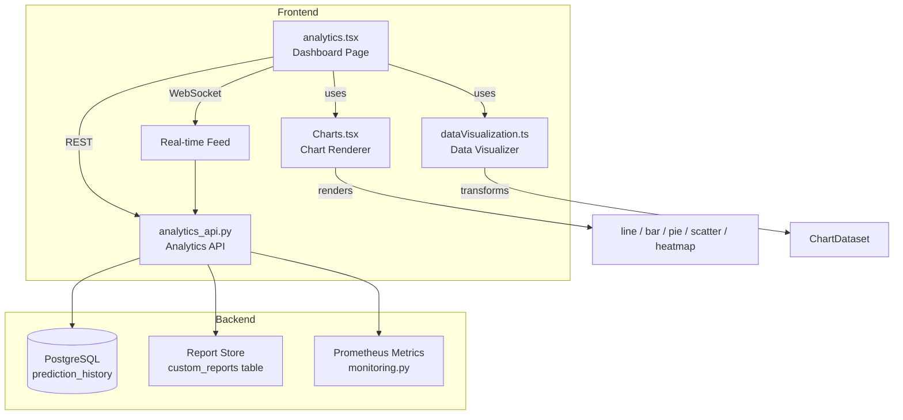
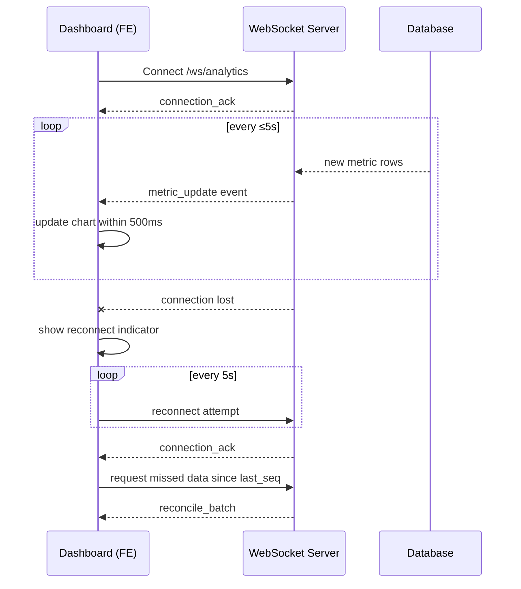

# Design Document: Advanced Analytics Dashboard

## Overview

The advanced analytics dashboard extends the existing `analytics.tsx` page and `analytics.py` backend into a fully-featured, real-time analytics platform. The design introduces WebSocket-based streaming, an interactive chart layer built on Recharts, a custom report builder, multi-format data export, performance metric monitoring, user behavior analytics, and a responsive mobile layout.

The system is composed of four primary modules that map directly to the files listed in scope:

| Module | File | Role |
|---|---|---|
| Dashboard Page | `frontend/pages/analytics.tsx` | Orchestrates layout, state, and user interactions |
| Chart Renderer | `frontend/components/Charts.tsx` | Renders all chart types with interactivity |
| Analytics API | `ml-model-api/analytics_api.py` | Serves metrics, reports, and streaming data |
| Data Visualizer | `frontend/utils/dataVisualization.ts` | Transforms raw API data into chart-ready formats |

---

## Architecture



### Real-Time Data Flow



---

## Components and Interfaces

### `analytics_api.py` — New Endpoints

The existing `analytics.py` class is extended and a new `analytics_api.py` module is introduced to house the additional endpoints required by this feature.

```
GET  /analytics/performance-metrics        → PerformanceMetrics
GET  /analytics/behavior                   → BehaviorMetrics
POST /analytics/reports                    → { report_id: string }
GET  /analytics/reports/:id                → ReportConfig
PUT  /analytics/reports/:id                → ReportConfig
GET  /analytics/reports/:id  (404)         → { error: string }
GET  /analytics/export/csv                 → CSV file stream
GET  /analytics/export/json               → JSON file stream
WS   /ws/analytics                         → metric_update stream
```

**PerformanceMetrics response shape:**
```json
{
  "api_response_time": { "p50": 120, "p95": 340, "p99": 890 },
  "error_rate": 0.012,
  "request_throughput": 47.3,
  "timestamp": "2024-01-15T10:30:00Z"
}
```

**BehaviorMetrics response shape:**
```json
{
  "session_count": 1240,
  "avg_session_duration_seconds": 183,
  "page_views": { "/analytics": 540, "/predict": 700 },
  "feature_interactions": { "export": 88, "report_builder": 45 },
  "funnel": [
    { "step": "Visit", "count": 1240, "drop_off_rate": 0.0 },
    { "step": "Predict", "count": 700, "drop_off_rate": 0.435 },
    { "step": "Export", "count": 88, "drop_off_rate": 0.874 }
  ]
}
```

**ReportConfig shape:**
```json
{
  "report_id": "rpt_abc123",
  "name": "Weekly Performance",
  "metrics": ["accuracy", "throughput"],
  "filters": { "model_version": "ResNet18" },
  "date_range": { "start": "2024-01-01", "end": "2024-01-07" },
  "chart_types": { "accuracy": "line", "throughput": "bar" }
}
```

### `Charts.tsx` — Chart Renderer Component

Built on top of the existing Recharts dependency (`recharts ^2.15.0`).

```typescript
interface ChartProps {
  type: 'line' | 'bar' | 'pie' | 'scatter' | 'heatmap';
  dataset: ChartDataset;
  onDrillDown?: (dimension: string, value: unknown) => void;
  onDateRangeSelect?: (start: Date, end: Date) => void;
  thresholds?: Record<string, number>;  // for alert indicators
  minHeight?: number;                   // mobile: 250px minimum
}
```

The `Charts.tsx` component wraps Recharts primitives and adds:
- Unified tooltip rendering (metric name, value, timestamp)
- Touch event handlers for mobile pan/zoom via Recharts' `allowDataOverflow` and pointer events
- PNG export via `html2canvas` (added as a dependency)
- Threshold-based alert overlay on metric widgets

### `dataVisualization.ts` — Data Visualizer

```typescript
export interface ChartDataset {
  labels: string[];
  series: Array<{ name: string; data: number[]; color?: string }>;
  meta?: Record<string, unknown>;
}

export function transformToChartDataset(raw: ApiMetricResponse, dateRange?: DateRange): ChartDataset
export function filterDataset(dataset: ChartDataset, filters: FilterMap): ChartDataset
export function computeFunnelSteps(behavior: BehaviorMetrics): FunnelStep[]
export function formatForCSV(dataset: ChartDataset): string
export function formatForJSON(dataset: ChartDataset, schema: ApiSchema): object
```

### `analytics.tsx` — Dashboard Page

The page is refactored into distinct view modes managed by a top-level `mode` state:

```typescript
type DashboardMode = 'overview' | 'performance' | 'behavior' | 'report-builder';
```

Key state additions:
- `wsRef: WebSocket` — persistent WebSocket connection
- `connectionStatus: 'connected' | 'reconnecting' | 'disconnected'`
- `activeReport: ReportConfig | null`
- `thresholds: Record<string, number>` — user-configured alert thresholds

---

## Data Models

### `custom_reports` table (new, PostgreSQL)

```sql
CREATE TABLE custom_reports (
    report_id   TEXT PRIMARY KEY,          -- e.g. "rpt_<uuid>"
    name        TEXT NOT NULL,
    config      JSONB NOT NULL,            -- serialized ReportConfig
    created_at  TIMESTAMPTZ DEFAULT NOW(),
    updated_at  TIMESTAMPTZ DEFAULT NOW()
);
```

### `behavior_events` table (new, PostgreSQL)

```sql
CREATE TABLE behavior_events (
    id          BIGSERIAL PRIMARY KEY,
    event_type  TEXT NOT NULL,             -- 'page_view' | 'feature_interaction' | 'session_start' | 'session_end'
    page        TEXT,
    feature     TEXT,
    session_id  TEXT NOT NULL,             -- anonymized session token (no PII)
    duration_ms INTEGER,
    created_at  TIMESTAMPTZ DEFAULT NOW()
);
```

No user-identifying columns are stored. `session_id` is a server-generated opaque token.

### WebSocket Message Schema

```typescript
// Server → Client
type WsMessage =
  | { type: 'metric_update'; payload: MetricUpdate; seq: number }
  | { type: 'connection_ack'; seq: number }
  | { type: 'reconcile_batch'; payload: MetricUpdate[]; from_seq: number };

// Client → Server
type WsClientMessage =
  | { type: 'subscribe'; topics: string[] }
  | { type: 'request_reconcile'; since_seq: number };
```

---

## Correctness Properties

*A property is a characteristic or behavior that should hold true across all valid executions of a system — essentially, a formal statement about what the system should do. Properties serve as the bridge between human-readable specifications and machine-verifiable correctness guarantees.*

### Property 1: Streaming update interval invariant

*For any* sequence of timestamped metric_update messages emitted by the WebSocket server, no two consecutive messages shall be separated by more than 5 seconds.

**Validates: Requirements 1.1**

---

### Property 2: Connection state transitions on disconnect

*For any* WebSocket session, when the connection fires a close event, the Dashboard's `connectionStatus` state shall transition to `'reconnecting'` and a reconnect attempt shall be scheduled at a 5-second interval.

**Validates: Requirements 1.3**

---

### Property 3: Reconciliation after reconnect

*For any* sequence of metric updates that occurred while the connection was down, after reconnection the Dashboard shall send a `request_reconcile` message with the correct `since_seq` value equal to the last acknowledged sequence number before disconnection.

**Validates: Requirements 1.4**

---

### Property 4: All chart types render without error

*For any* valid `ChartDataset`, rendering the `Charts.tsx` component with each of the five supported `type` values (`line`, `bar`, `pie`, `scatter`, `heatmap`) shall produce non-empty output and not throw an exception.

**Validates: Requirements 2.1**

---

### Property 5: Date range scoping correctness

*For any* dataset and any selected date range `[start, end]`, all data points in the re-rendered chart output shall have timestamps satisfying `start ≤ timestamp ≤ end`.

**Validates: Requirements 2.2**

---

### Property 6: Tooltip contains required fields

*For any* data point in any chart, the rendered tooltip shall contain the metric name, the numeric value, and the timestamp of that data point.

**Validates: Requirements 2.3**

---

### Property 7: Drill-down callback correctness

*For any* chart and any clicked data point, the `onDrillDown` callback shall be invoked with the dimension key and the exact value of the clicked point.

**Validates: Requirements 2.4**

---

### Property 8: Filter correctness

*For any* `ChartDataset` and any `FilterMap`, every data point in the output of `filterDataset` shall satisfy all predicates in the filter map, and no data point that satisfies all predicates shall be excluded.

**Validates: Requirements 2.5**

---

### Property 9: Report save-load round trip

*For any* valid `ReportConfig`, saving it via `POST /analytics/reports` and then loading it via `GET /analytics/reports/:id` shall return a config that is deeply equal to the original, and updating it via `PUT /analytics/reports/:id` with a modified config shall result in the modified config being returned on the next GET without creating a new report entry.

**Validates: Requirements 3.2, 3.3, 3.4**

---

### Property 10: Missing report returns 404

*For any* string that is not a persisted report identifier, `GET /analytics/reports/:id` shall return HTTP 404 with a non-empty descriptive error message.

**Validates: Requirements 3.5**

---

### Property 11: CSV export completeness

*For any* `ChartDataset`, the output of `formatForCSV` shall contain exactly one row per data point in the dataset, and no data point shall be omitted.

**Validates: Requirements 4.1**

---

### Property 12: JSON export schema conformance

*For any* `ChartDataset`, the output of `formatForJSON` shall be valid JSON whose top-level field names are a subset of the Analytics_API response schema field names.

**Validates: Requirements 4.2**

---

### Property 13: Large dataset export guard

*For any* dataset with more than 100,000 rows, invoking the export action shall not initiate a download but shall instead trigger a user confirmation prompt before proceeding.

**Validates: Requirements 4.4**

---

### Property 14: Performance metric polling interval invariant

*For any* sequence of performance metric fetches while the Dashboard is in performance monitoring mode, no two consecutive fetches shall be separated by more than 10 seconds.

**Validates: Requirements 5.2**

---

### Property 15: Threshold alert indicator

*For any* performance metric value and any user-configured threshold for that metric, if the value exceeds the threshold then the corresponding metric widget shall include an alert indicator; if the value does not exceed the threshold, no alert indicator shall be shown.

**Validates: Requirements 5.3**

---

### Property 16: 24-hour rolling history retention

*For any* sequence of performance metric updates, all updates with a timestamp within the last 24 hours shall be present in the Dashboard's displayed history state.

**Validates: Requirements 5.4**

---

### Property 17: Funnel conversion rate correctness

*For any* list of funnel steps with associated user counts, the computed `drop_off_rate` for each step `i` shall equal `1 - (count[i+1] / count[i])`, and the final step shall have a drop-off rate of 0.

**Validates: Requirements 6.3, 6.4**

---

### Property 18: Behavior API response contains no PII

*For any* response from `GET /analytics/behavior`, no field in the response body shall contain a value that matches patterns for known PII types (email addresses, phone numbers, full names), and `session_id` values shall be opaque tokens with no structural relationship to user identity.

**Validates: Requirements 6.5**

---

### Property 19: Mobile single-column layout

*For any* viewport width less than 768px, the Dashboard's layout computation shall assign a single-column grid class to the chart container, resulting in each chart occupying 100% of the available width.

**Validates: Requirements 7.1**

---

### Property 20: Mobile chart minimum height

*For any* viewport width less than 768px, the `minHeight` prop passed to each `Charts.tsx` instance shall be at least 250px.

**Validates: Requirements 7.2**

---

### Property 21: Data preservation on resize

*For any* Dashboard state containing loaded chart datasets, after a viewport resize event (simulating device rotation), all chart datasets shall remain unchanged.

**Validates: Requirements 7.4**

---

## Error Handling

### WebSocket Errors

| Condition | Behavior |
|---|---|
| Initial connection failure | Show `'disconnected'` banner; retry every 5s |
| Mid-session disconnect | Transition to `'reconnecting'`; show indicator; retry every 5s |
| Reconnect success | Send `request_reconcile`; hide indicator |
| Server sends malformed message | Log warning; skip update; do not crash |

### API Errors

| Condition | HTTP Status | Frontend Behavior |
|---|---|---|
| Report not found | 404 | Show inline error message |
| Invalid report config | 400 | Show validation errors in report builder |
| Export timeout | 504 | Show toast: "Export timed out, try a smaller range" |
| Server error | 500 | Show generic error toast; log to console |

### Export Errors

- If `formatForCSV` or `formatForJSON` throws, the download is aborted and a toast is shown.
- If the dataset row count exceeds 100,000, a confirmation modal is shown before any file generation begins.
- PNG export failures (e.g., `html2canvas` error) surface a toast with a retry option.

### Data Validation

- `dataVisualization.ts` functions validate that input arrays are non-empty and that date fields are parseable before processing; invalid inputs return empty datasets rather than throwing.
- The API validates `ReportConfig` fields on save; missing required fields return 400 with per-field error details.

---

## Testing Strategy

### Dual Testing Approach

Both unit tests and property-based tests are required. Unit tests cover specific examples, integration points, and error conditions. Property-based tests verify universal correctness across randomized inputs.

**Property-based testing library**: `fast-check` (frontend, TypeScript) and `hypothesis` (backend, Python).

### Property-Based Tests

Each property from the Correctness Properties section maps to exactly one property-based test. Tests run a minimum of 100 iterations each.

Tag format: `Feature: advanced-analytics-dashboard, Property {N}: {property_text}`

| Property | Test Location | Generator Strategy |
|---|---|---|
| P1: Streaming interval | `__tests__/analytics.pbt.test.ts` | Generate arrays of timestamps with random gaps |
| P2: Connection state on disconnect | `__tests__/analytics.pbt.test.ts` | Generate WebSocket close events |
| P3: Reconciliation after reconnect | `__tests__/analytics.pbt.test.ts` | Generate sequences of updates with random disconnect points |
| P4: All chart types render | `__tests__/Charts.pbt.test.ts` | Generate random ChartDatasets for each type |
| P5: Date range scoping | `__tests__/Charts.pbt.test.ts` | Generate datasets and random date ranges |
| P6: Tooltip fields | `__tests__/Charts.pbt.test.ts` | Generate random data points |
| P7: Drill-down callback | `__tests__/Charts.pbt.test.ts` | Generate random chart data and click targets |
| P8: Filter correctness | `__tests__/dataVisualization.pbt.test.ts` | Generate datasets and random filter maps |
| P9: Report round trip | `test_analytics_api.py` (hypothesis) | Generate random ReportConfig objects |
| P10: Missing report 404 | `test_analytics_api.py` | Generate random non-existent IDs |
| P11: CSV completeness | `__tests__/dataVisualization.pbt.test.ts` | Generate random datasets |
| P12: JSON schema conformance | `__tests__/dataVisualization.pbt.test.ts` | Generate random datasets |
| P13: Large dataset export guard | `__tests__/analytics.pbt.test.ts` | Generate datasets with row count > 100,000 |
| P14: Performance polling interval | `__tests__/analytics.pbt.test.ts` | Generate sequences of poll timestamps |
| P15: Threshold alert | `__tests__/analytics.pbt.test.ts` | Generate metric values and thresholds |
| P16: 24h history retention | `__tests__/analytics.pbt.test.ts` | Generate sequences of timestamped updates |
| P17: Funnel conversion rates | `__tests__/dataVisualization.pbt.test.ts` | Generate random funnel step counts |
| P18: No PII in behavior API | `test_analytics_api.py` | Generate behavior event sequences |
| P19: Mobile single-column | `__tests__/analytics.pbt.test.ts` | Generate viewport widths < 768 |
| P20: Mobile chart min-height | `__tests__/Charts.pbt.test.ts` | Generate mobile viewport widths |
| P21: Data preservation on resize | `__tests__/analytics.pbt.test.ts` | Generate datasets and resize events |

### Unit Tests

Unit tests focus on:
- Specific export format examples (CSV header row, JSON field names)
- Integration between `dataVisualization.ts` and `Charts.tsx` (correct prop passing)
- API error response shapes (404 body, 400 validation errors)
- Report builder form rendering (all four configuration fields present)
- PNG export resolution check (1920×1080 minimum)

Unit tests live alongside existing tests in `frontend/__tests__/` and `ml-model-api/test_analytics_api.py`.

### Configuration

```typescript
// fast-check configuration
fc.configureGlobal({ numRuns: 100 });
```

```python
# hypothesis configuration
settings(max_examples=100)
```
