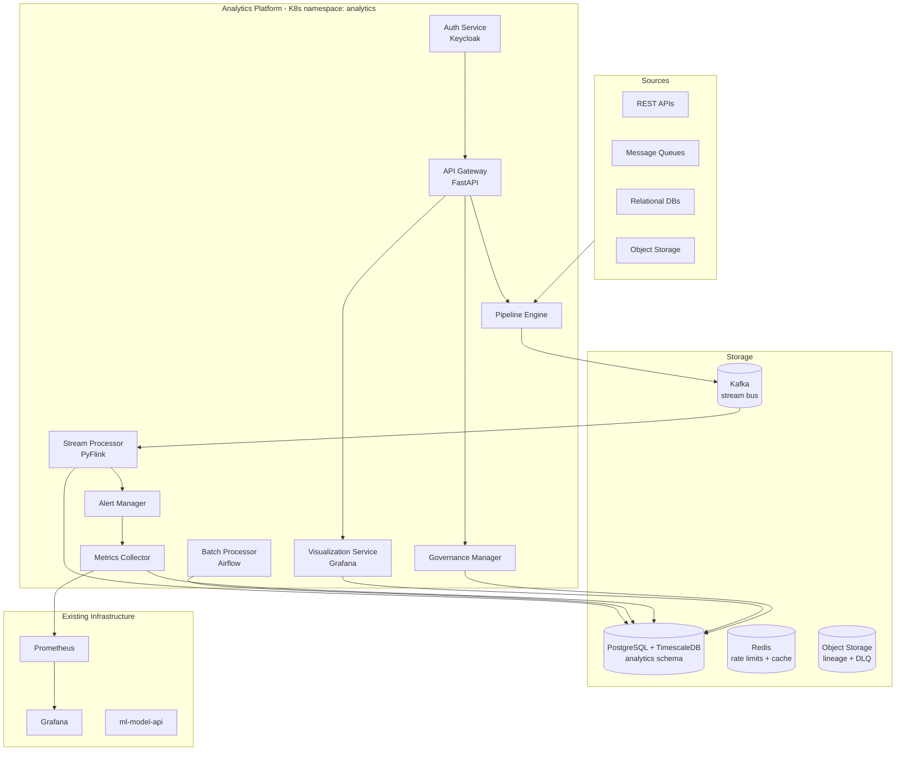

# Design Document: Advanced Analytics Platform

## Overview

The Advanced Analytics Platform is a comprehensive data processing and analytics system built on top of the existing FlavorSnap infrastructure. It runs as a set of Kubernetes workloads in a dedicated `analytics` namespace alongside the existing `flavorsnap` namespace, sharing the PostgreSQL and Redis instances already deployed there and extending the existing Prometheus/Grafana monitoring stack.

The platform is implemented in Python to stay consistent with the `ml-model-api` codebase. It integrates with the existing `ml-model-api/analytics.py` (extended as `analytics_platform.py`) and exposes a versioned REST API via a dedicated API Gateway. All components emit structured JSON logs to stdout and Prometheus metrics to `/metrics`.

### Key Design Decisions

- **Apache Kafka** for stream ingestion: durable, high-throughput message queue with at-least-once delivery and consumer group offset management for stateful stream processing.
- **Apache Flink (PyFlink)** for stream processing: native windowed aggregation, stateful operators, and checkpoint-to-durable-storage support out of the box.
- **Apache Airflow** for batch scheduling: cron scheduling, DAG dependency ordering, and checkpointing.
- **TimescaleDB extension on PostgreSQL** for time-series metric storage: leverages the existing PostgreSQL instance with hypertable partitioning for efficient range queries and automatic downsampling via continuous aggregates.
- **Grafana** (existing) for visualization dashboards: extended with analytics-specific dashboards and tenant branding via Grafana Organizations.
- **OAuth 2.0 / OIDC via Keycloak** for authentication: standard token-based auth with RBAC roles mapped to Keycloak realm roles.
- **OpenAPI 3.0 + FastAPI** for the API Gateway: automatic spec generation at `/v1/openapi.json`, async request handling, and built-in rate limiting via `slowapi`.
- **Row-Level Security (RLS) in PostgreSQL** for tenant isolation: enforced at the database layer so no application-level bypass is possible.

---

## Architecture



### Deployment Layout

```
k8s/analytics/
  namespace.yaml
  pipeline-engine.yaml
  stream-processor.yaml
  batch-processor.yaml
  metrics-collector.yaml
  visualization-service.yaml
  governance-manager.yaml
  api-gateway.yaml
  auth-service.yaml
  alert-manager.yaml
  rbac.yaml
  configmap.yaml
  secrets.yaml

analytics-platform/
  pipeline_engine.py
  stream_processor.py
  batch_processor.py
  metrics_collector.py
  visualization_service.py
  governance_manager.py
  api_gateway.py
  auth_service.py
  alert_manager.py
  models.py
  db.py
  event_bus.py

ml-model-api/
  analytics_platform.py    # extended analytics endpoint

scripts/analytics/
  run_pipeline.py
  run_batch.py
  export_dashboard.py
  audit_report.py
```

---

## Components and Interfaces

### Pipeline Engine (`pipeline_engine.py`)

Orchestrates ingestion from all source types, validates connectivity and schema, applies transformations, routes failed records to the dead-letter store, and reports job metrics.

```python
class PipelineEngine:
    def ingest(self, source: DataSourceConfig) -> str: ...           # returns job_id
    def validate_source(self, source: DataSourceConfig) -> ValidationResult: ...
    def get_job_status(self, job_id: str) -> JobStatus: ...
    def list_jobs(self) -> list[JobStatus]: ...
```

Supported `SourceType` values: `REST_API`, `MESSAGE_QUEUE`, `RDBMS`, `OBJECT_STORAGE`.
Retry policy: exponential backoff, base 1s, max 60s, max 3 attempts.

### Stream Processor (`stream_processor.py`)

Wraps a PyFlink job. Consumes from Kafka, computes windowed aggregations, emits results to PostgreSQL and alert events to the Alert Manager. Checkpoints state to S3 at ≤60-second intervals.

```python
class StreamProcessor:
    def start(self, config: StreamConfig) -> None: ...
    def stop(self) -> None: ...
    def get_lag_seconds(self) -> float: ...
    def get_throughput_rps(self) -> float: ...
```

Supported window sizes: 60s, 300s, 900s, 3600s (1 min, 5 min, 15 min, 1 hour).

### Batch Processor (`batch_processor.py`)

Wraps Airflow DAG execution for scheduled and on-demand batch jobs.

```python
class BatchProcessor:
    def submit_job(self, config: BatchJobConfig) -> str: ...         # returns job_id
    def get_job_status(self, job_id: str) -> JobStatus: ...
    def cancel_job(self, job_id: str) -> bool: ...
```

### Metrics Collector (`metrics_collector.py`)

Scrapes all platform components at ≤15-second intervals, stores raw metrics in TimescaleDB, exposes a Prometheus-compatible `/metrics` endpoint, and notifies the Alert Manager on threshold breaches or component unreachability.

```python
class MetricsCollector:
    def scrape_all(self) -> list[MetricSample]: ...
    def get_metrics_response(self) -> str: ...                       # Prometheus text format
    def get_component_health(self, component: str) -> HealthStatus: ...
```

Retention: raw data 30 days, hourly aggregates 1 year (TimescaleDB continuous aggregates + retention policy).

### Visualization Service (`visualization_service.py`)

Manages Grafana dashboards via the Grafana HTTP API. Handles tenant branding via Grafana Organizations and enforces Auth Service access controls on the embeddable iframe endpoint.

```python
class VisualizationService:
    def create_dashboard(self, config: DashboardConfig, tenant_id: str) -> Dashboard: ...
    def get_dashboard(self, dashboard_id: str, user: AuthUser) -> Dashboard: ...
    def apply_filter(self, dashboard_id: str, filters: dict) -> Dashboard: ...
    def export(self, dashboard_id: str, fmt: ExportFormat) -> bytes: ...
    def get_embed_url(self, dashboard_id: str) -> str: ...
```

Supported `ExportFormat` values: `CSV`, `JSON`.

### Governance Manager (`governance_manager.py`)

Enforces dataset classification, access policies, retention rules, and audit logging. Provides the Lineage Tracker query interface.

```python
class GovernanceManager:
    def classify_dataset(self, dataset_id: str, label: SensitivityLabel) -> None: ...
    def check_access(self, user: AuthUser, dataset_id: str) -> bool: ...
    def log_access(self, event: AccessEvent) -> None: ...
    def enforce_retention(self) -> RetentionReport: ...
    def get_lineage(self, record_id: str) -> list[LineageEntry]: ...
    def search_catalog(self, query: str) -> list[DatasetEntry]: ...
```

`SensitivityLabel` enum: `PUBLIC`, `INTERNAL`, `CONFIDENTIAL`, `RESTRICTED`.

### API Gateway (`api_gateway.py`)

FastAPI application exposing all platform capabilities under `/v1`. Handles rate limiting (1,000 req/min per API key via `slowapi` + Redis), async job submission, and webhook registration.

```python
# Key route signatures
@app.post("/v1/ingest")           # submit ingestion job
@app.get("/v1/jobs/{job_id}")     # poll job status
@app.get("/v1/dashboards/{id}")   # get dashboard
@app.post("/v1/webhooks")         # register webhook
@app.get("/v1/openapi.json")      # OpenAPI spec (auto-generated)
```

### Auth Service (`auth_service.py`)

Thin wrapper around Keycloak OIDC. Validates JWT tokens, enforces RBAC roles, blocks IPs after 100 failed auth attempts in 1 hour, and records all auth decisions to the Governance Manager audit log.

```python
class AuthService:
    def validate_token(self, token: str) -> AuthUser: ...
    def check_role(self, user: AuthUser, required_role: Role) -> bool: ...
    def record_auth_event(self, event: AuthEvent) -> None: ...
    def block_ip(self, ip: str, reason: str) -> None: ...
    def is_blocked(self, ip: str) -> bool: ...
```

`Role` enum: `VIEWER`, `ANALYST`, `ENGINEER`, `ADMINISTRATOR`.

### Alert Manager (`alert_manager.py`)

Evaluates metric thresholds, deduplicates alerts within a 60-second window, and dispatches notifications via email, webhook, and PagerDuty.

```python
class AlertManager:
    def evaluate(self, metric: MetricSample) -> list[Alert]: ...
    def dispatch(self, alert: Alert) -> list[DeliveryResult]: ...
    def register_webhook(self, url: str, events: list[str]) -> str: ...
```

Supported channels: `EMAIL`, `WEBHOOK`, `PAGERDUTY`.

---

## Data Models

```python
from dataclasses import dataclass, field
from datetime import datetime
from enum import Enum
from typing import Optional, Any

class SourceType(str, Enum):
    REST_API       = "rest_api"
    MESSAGE_QUEUE  = "message_queue"
    RDBMS          = "rdbms"
    OBJECT_STORAGE = "object_storage"

class SensitivityLabel(str, Enum):
    PUBLIC       = "Public"
    INTERNAL     = "Internal"
    CONFIDENTIAL = "Confidential"
    RESTRICTED   = "Restricted"

class Role(str, Enum):
    VIEWER        = "Viewer"
    ANALYST       = "Analyst"
    ENGINEER      = "Engineer"
    ADMINISTRATOR = "Administrator"

class JobState(str, Enum):
    PENDING    = "pending"
    RUNNING    = "running"
    COMPLETED  = "completed"
    FAILED     = "failed"

@dataclass
class DataSourceConfig:
    source_id: str
    source_type: SourceType
    connection_params: dict[str, Any]
    schema: dict[str, Any]
    mode: str                          # "stream" | "batch"
    max_retries: int = 3

@dataclass
class JobStatus:
    job_id: str
    state: JobState
    records_processed: int
    records_failed: int
    elapsed_seconds: float
    started_at: datetime
    completed_at: Optional[datetime] = None
    error: Optional[str] = None

@dataclass
class LineageEntry:
    record_id: str
    source_id: str
    transformation: str
    destination: str
    timestamp: datetime

@dataclass
class DeadLetterRecord:
    dlq_id: str
    record_id: str
    source_id: str
    payload: dict[str, Any]
    failure_reason: str
    failed_at: datetime
    expires_at: datetime

@dataclass
class MetricSample:
    component: str
    metric_name: str
    value: float
    labels: dict[str, str]
    collected_at: datetime

@dataclass
class Alert:
    alert_id: str
    component: str
    metric_name: str
    threshold: float
    observed_value: float
    triggered_at: datetime
    channel: str

@dataclass
class DatasetEntry:
    dataset_id: str
    name: str
    schema: dict[str, Any]
    owner: str
    sensitivity: SensitivityLabel
    retention_days: int
    registered_at: datetime

@dataclass
class AccessEvent:
    user_id: str
    dataset_id: str
    operation: str                     # "read" | "write" | "delete"
    timestamp: datetime
    granted: bool

@dataclass
class AuthUser:
    user_id: str
    tenant_id: str
    roles: list[Role]
    token_exp: datetime

@dataclass
class AuthEvent:
    user_id: str
    resource: str
    decision: str                      # "allow" | "deny"
    timestamp: datetime
    ip_address: str

@dataclass
class DashboardConfig:
    name: str
    tenant_id: str
    visualizations: list[dict[str, Any]]
    refresh_interval_seconds: int      # 10 | 30 | 60 | 300

@dataclass
class Dashboard:
    dashboard_id: str
    name: str
    tenant_id: str
    embed_url: str
    config: DashboardConfig
    created_at: datetime
```

### Prometheus Metrics

| Metric | Type | Labels |
|---|---|---|
| `analytics_records_ingested_total` | Counter | `source_id`, `mode` |
| `analytics_records_failed_total` | Counter | `source_id`, `reason` |
| `analytics_pipeline_latency_seconds` | Histogram | `source_id`, `stage` |
| `analytics_stream_lag_seconds` | Gauge | `processor_id` |
| `analytics_stream_throughput_rps` | Gauge | `processor_id` |
| `analytics_component_health` | Gauge | `component` (1=healthy, 0=degraded) |
| `analytics_api_request_duration_seconds` | Histogram | `endpoint`, `method` |
| `analytics_api_rate_limit_hits_total` | Counter | `api_key_id` |
| `analytics_alert_dispatched_total` | Counter | `channel`, `component` |
| `analytics_dlq_size` | Gauge | `source_id` |


---

## Correctness Properties

*A property is a characteristic or behavior that should hold true across all valid executions of a system — essentially, a formal statement about what the system should do. Properties serve as the bridge between human-readable specifications and machine-verifiable correctness guarantees.*

### Property 1: Source type acceptance

*For any* data source configuration with a valid `SourceType` (REST_API, MESSAGE_QUEUE, RDBMS, OBJECT_STORAGE), the Pipeline Engine must accept the configuration without error and initiate an ingestion job.

**Validates: Requirements 1.1**

---

### Property 2: Validation before extraction

*For any* data source configuration, if connectivity or schema validation fails, the Pipeline Engine must not extract any records — the job must be marked failed before any records are produced.

**Validates: Requirements 1.2**

---

### Property 3: Retry with exponential backoff

*For any* data source that is consistently unavailable, the Pipeline Engine must attempt reconnection exactly 3 times, and each successive retry delay must be at least double the previous delay, before marking the job as failed.

**Validates: Requirements 1.3**

---

### Property 4: Mode routing

*For any* data source configuration with `mode="stream"`, the Pipeline Engine must route ingestion to the Stream Processor; with `mode="batch"`, it must route to the Batch Processor — never the wrong processor.

**Validates: Requirements 1.4**

---

### Property 5: Failed records routed to DLQ with failure metric

*For any* record that fails transformation validation, the record must appear in the dead-letter store and a failure metric must be emitted to the Metrics Collector — both must occur, never just one.

**Validates: Requirements 1.5**

---

### Property 6: Lineage entry completeness

*For any* record processed by the Pipeline Engine, a lineage entry must exist containing non-null values for source identifier, transformation steps applied, and destination.

**Validates: Requirements 1.6**

---

### Property 7: Job completion metrics completeness

*For any* completed pipeline job, the reported metrics must contain non-negative values for records processed, records failed, and elapsed duration — all three fields must be present and non-negative.

**Validates: Requirements 1.7**

---

### Property 8: Stream aggregation result emission

*For any* data record arriving at the Stream Processor, an aggregation result must be emitted within 5 seconds of record receipt under nominal load conditions.

**Validates: Requirements 2.1**

---

### Property 9: Window size configuration acceptance

*For any* stream configuration specifying a window size of 60s, 300s, 900s, or 3600s, the Stream Processor must accept the configuration and produce windowed aggregation results.

**Validates: Requirements 2.2**

---

### Property 10: Threshold breach triggers alert

*For any* computed metric value that crosses a configured threshold, the Stream Processor must publish an alert event to the Alert Manager.

**Validates: Requirements 2.3**

---

### Property 11: Lag alert on sustained stream lag

*For any* Stream Processor instance whose lag exceeds 30 seconds, a lag alert must be emitted to the Alert Manager containing the lag duration.

**Validates: Requirements 2.5**

---

### Property 12: Checkpoint state survival

*For any* Stream Processor that is stopped and restarted, the processor must resume from a checkpoint that is no more than 60 seconds old — no state older than 60 seconds may be lost.

**Validates: Requirements 2.6**

---

### Property 13: Dashboard export round-trip

*For any* dashboard with data, exporting to CSV and then parsing the result must produce a record set equivalent to the original dashboard data; the same must hold for JSON export.

**Validates: Requirements 3.5**

---

### Property 14: Tenant branding applied to all tenant dashboards

*For any* tenant with a defined branding configuration, every dashboard belonging to that tenant must include the tenant's color scheme and logo fields in its rendered output.

**Validates: Requirements 3.6**

---

### Property 15: Embed endpoint enforces same auth as native UI

*For any* dashboard, a request to the embed endpoint that would be rejected by the native UI (invalid or missing token) must also be rejected by the embed endpoint with the same HTTP status code.

**Validates: Requirements 3.7**

---

### Property 16: Metrics scrape completeness

*For any* set of running Analytics Platform components, a scrape cycle must produce at least one sample for each of: throughput, latency percentiles (p50, p95, p99), error rate, and resource utilization per component.

**Validates: Requirements 4.1**

---

### Property 17: Threshold alert dispatch

*For any* metric sample whose value exceeds the configured threshold, the Alert Manager must dispatch a notification to all configured notification channels.

**Validates: Requirements 4.2**

---

### Property 18: Metric retention policy configuration

*For any* metric written to the Metrics Collector, the storage configuration must enforce a raw retention of at least 30 days and a downsampled hourly aggregate retention of at least 1 year.

**Validates: Requirements 4.3**

---

### Property 19: Unreachable component marked degraded

*For any* Analytics Platform component that becomes unreachable, the Metrics Collector must mark that component's health status as degraded and emit an alert to the Alert Manager.

**Validates: Requirements 4.5**

---

### Property 20: Alert delivery to all channel types

*For any* alert dispatched by the Alert Manager, delivery must be attempted to every configured channel (email, webhook, PagerDuty) — no configured channel may be silently skipped.

**Validates: Requirements 4.7**

---

### Property 21: Dataset sensitivity label validity

*For any* dataset registered in the Data Catalog, its sensitivity label must be one of: Public, Internal, Confidential, or Restricted — no dataset may be registered without a valid label.

**Validates: Requirements 5.1**

---

### Property 22: Role-based dataset access enforcement

*For any* user and dataset combination, access must be granted if and only if the user's role permits access to the dataset's sensitivity label — no role may access a sensitivity level above its permission.

**Validates: Requirements 5.2**

---

### Property 23: Access event audit log completeness

*For any* data access event, the audit log must contain an entry with non-null values for user identity, dataset identifier, access time, and operation type.

**Validates: Requirements 5.3**

---

### Property 24: Retention enforcement and purge audit

*For any* record whose retention period has expired, the Governance Manager must purge the record and record a purge event in the audit log — both the purge and the audit entry must occur.

**Validates: Requirements 5.4, 5.5**

---

### Property 25: Lineage query round-trip

*For any* record that was processed by the Pipeline Engine, querying the Lineage Tracker by that record's unique identifier must return all lineage entries associated with that record.

**Validates: Requirements 5.6**

---

### Property 26: Data Catalog search completeness

*For any* registered dataset, searching the Data Catalog must return an entry containing non-null values for schema, owner, sensitivity label, and retention policy.

**Validates: Requirements 5.7**

---

### Property 27: Malformed request returns structured 400

*For any* malformed API request (missing required fields, invalid types), the API Gateway must return HTTP 400 with a structured JSON error body containing at least an `error` field.

**Validates: Requirements 6.3**

---

### Property 28: Rate limit enforcement returns 429 with Retry-After

*For any* API key that submits more than 1,000 requests within a 60-second window, all requests beyond the limit must receive HTTP 429 with a `Retry-After` header.

**Validates: Requirements 6.3, 6.4**

---

### Property 29: Async job submission round-trip

*For any* long-running analytics query submitted to the API Gateway, the response must contain a non-null `job_id`, and polling `/v1/jobs/{job_id}` must return a valid status object.

**Validates: Requirements 6.6**

---

### Property 30: Webhook delivery on job completion

*For any* registered webhook and any completed job or triggered alert, the Alert Manager must attempt delivery to the webhook URL.

**Validates: Requirements 6.7**

---

### Property 31: Unauthenticated requests denied

*For any* API or UI request without a valid OAuth 2.0 / OIDC token, the Auth Service must deny access before any platform resource is accessed.

**Validates: Requirements 7.1**

---

### Property 32: RBAC role enforcement

*For any* resource and any user, access must be granted if and only if the user holds a role that is permitted to access that resource — no role may access resources above its permission level.

**Validates: Requirements 7.2**

---

### Property 33: Expired token returns 401 with WWW-Authenticate

*For any* request bearing an expired token, the Auth Service must return HTTP 401 with a `WWW-Authenticate` header specifying the required authentication scheme.

**Validates: Requirements 7.3**

---

### Property 34: IP blocking after failed auth attempts

*For any* IP address that has accumulated more than 100 failed authentication attempts within 1 hour, all subsequent requests from that IP must be blocked and a block event must be recorded in the audit log.

**Validates: Requirements 7.5**

---

### Property 35: Auth decision audit log completeness

*For any* authentication or authorization decision, the audit log must contain an entry with non-null values for user identity, resource accessed, decision outcome, and timestamp.

**Validates: Requirements 7.6**

---

### Property 36: Tenant data isolation

*For any* two distinct tenants A and B, a user authenticated as a member of tenant A must never be able to retrieve, modify, or delete data belonging to tenant B — regardless of the user's role.

**Validates: Requirements 7.7**

---

## Error Handling

| Component | Failure Mode | Behavior |
|---|---|---|
| Pipeline Engine | Source unavailable during ingestion | Retry up to 3× with exponential backoff (1s, 2s, 4s); mark job failed after exhaustion; emit failure metric |
| Pipeline Engine | Record fails transformation validation | Route record to DLQ; emit failure metric; continue processing remaining records |
| Pipeline Engine | Schema incompatibility on connect | Fail validation; do not begin ingestion; return structured error to caller |
| Stream Processor | Kafka consumer lag > 30s | Emit lag alert to Alert Manager; log lag duration; continue processing |
| Stream Processor | Checkpoint write failure | Log error; retry checkpoint on next interval; do not halt processing |
| Metrics Collector | Component unreachable | Mark component health as degraded; emit alert; continue scraping other components |
| Alert Manager | Notification channel delivery failure | Log failure with channel and reason; retry once; continue to next channel |
| API Gateway | Malformed request | Return HTTP 400 with structured JSON error body |
| API Gateway | Rate limit exceeded | Return HTTP 429 with `Retry-After` header |
| Auth Service | Invalid/missing token | Return HTTP 401; do not access any resource |
| Auth Service | Expired token | Return HTTP 401 with `WWW-Authenticate` header |
| Auth Service | IP blocked | Return HTTP 403; log block event |
| Governance Manager | Retention purge failure | Log failure with dataset_id and reason; retry at next scheduled interval; emit alert |
| Any component | Database unavailable | Surface error to caller; emit health alert; do not silently drop data |

All components emit structured JSON logs with fields: `timestamp`, `component`, `level`, `event`, and `context`. Errors are also emitted as Prometheus counters (`analytics_errors_total` labeled by `component` and `error_type`).

---

## Testing Strategy

### Dual Testing Approach

Both unit tests and property-based tests are required and complementary:

- **Unit tests** cover specific examples, integration points, and edge cases (e.g., each source type connects, each chart type renders, the `/metrics` endpoint returns valid Prometheus format, the `/v1/openapi.json` endpoint returns a valid OpenAPI 3.0 document, the system health dashboard exists).
- **Property-based tests** verify universal invariants across randomly generated inputs, catching edge cases that hand-written examples miss.

### Property-Based Testing Library

**Python: [Hypothesis](https://hypothesis.readthedocs.io/)** — mature, well-maintained, integrates with pytest.

Each property test must:
- Run a minimum of **100 iterations** (configured via `@settings(max_examples=100)`).
- Include a comment tag in the format: `# Feature: advanced-analytics-platform, Property N: <property_text>`
- Reference the design property number it implements.
- Each correctness property above must be implemented by exactly one Hypothesis test.

Example:

```python
from hypothesis import given, settings, strategies as st
from analytics_platform.pipeline_engine import PipelineEngine
from analytics_platform.models import DataSourceConfig, SourceType

# Feature: advanced-analytics-platform, Property 3: Retry with exponential backoff
@settings(max_examples=100)
@given(st.just(None))  # always-failing source
def test_retry_exponential_backoff(_):
    engine = PipelineEngine(source_factory=always_failing_source)
    delays = []
    engine.on_retry = lambda d: delays.append(d)
    result = engine.ingest(DataSourceConfig(source_id="s1", source_type=SourceType.REST_API, ...))
    assert result.state == "failed"
    assert len(delays) == 3
    for i in range(1, len(delays)):
        assert delays[i] >= delays[i - 1] * 2
```

### Unit Test Focus Areas

- Each source type (REST_API, MESSAGE_QUEUE, RDBMS, OBJECT_STORAGE) connects and returns records — one test per type.
- Each chart type (time-series, bar, pie, heatmap, tabular) renders without error.
- The `/metrics` endpoint returns a response parseable by the Prometheus client library.
- The `/v1/openapi.json` endpoint returns a valid OpenAPI 3.0 document.
- The system health dashboard exists and contains all required metric panels.
- Dashboard auto-refresh intervals (10s, 30s, 60s, 300s) are accepted by the Visualization Service.
- Expired token returns HTTP 401 with `WWW-Authenticate` header.
- IP blocking triggers after exactly 100 failed attempts.

### Test File Layout

```
analytics-platform/
  tests/
    unit/
      test_pipeline_engine.py
      test_stream_processor.py
      test_batch_processor.py
      test_metrics_collector.py
      test_visualization_service.py
      test_governance_manager.py
      test_api_gateway.py
      test_auth_service.py
      test_alert_manager.py
    property/
      test_pipeline_properties.py       # Properties 1-7
      test_stream_properties.py         # Properties 8-12
      test_visualization_properties.py  # Properties 13-15
      test_metrics_properties.py        # Properties 16-20
      test_governance_properties.py     # Properties 21-26
      test_api_properties.py            # Properties 27-30
      test_auth_properties.py           # Properties 31-36
```
