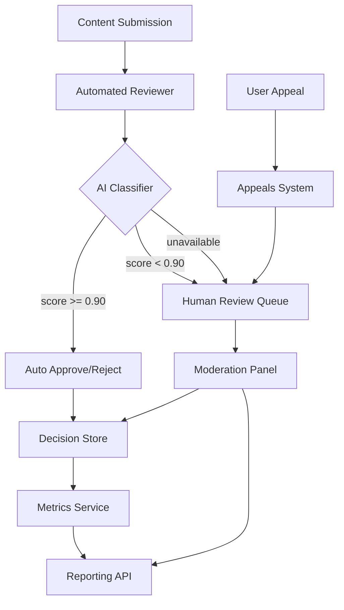

# Design Document: Advanced Content Moderation

## Overview

The Advanced Content Moderation system is an AI-powered platform that automates content review decisions, routes uncertain cases to human reviewers, handles user appeals, and exposes performance metrics and reporting. It integrates a Python ML model API backend with a React/TypeScript frontend moderation panel.

The system is designed around a confidence-threshold routing model: the AI classifier handles high-confidence decisions autonomously, while low-confidence and appealed content flows to a human review queue with locking semantics to prevent concurrent edits.

## Architecture



The backend is a Python service (FastAPI) exposing REST endpoints. The frontend is a React/TypeScript SPA consuming those endpoints. The ML model is loaded in-process and supports zero-downtime version swaps via a model registry pattern.

## Components and Interfaces

### AI Classifier (`content_moderation.py`)

Wraps the ML model. Accepts text, image, or combined inputs and returns a classification result.

```python
class ClassificationResult:
    decision: Literal["approved", "rejected", "escalated"]
    confidence_score: float  # 0.0–1.0
    category: Literal["hate_speech", "spam", "explicit_content", "harassment", "safe"]

class AIClassifier:
    def classify(self, content_item: ContentItem) -> ClassificationResult: ...
    def load_model(self, version: str) -> None: ...  # hot-swap support
```

### Automated Reviewer (`automated_review.py`)

Orchestrates the classification pipeline. Calls the AI Classifier, applies the confidence threshold, persists decisions, and handles classifier failures.

```python
class AutomatedReviewer:
    def review(self, content_item: ContentItem) -> ModerationDecision: ...
    # Routes to approved/rejected if score >= 0.90, else escalated
    # On classifier failure: escalates and logs error code
```

### Appeals System (`appeals_system.py`)

Manages appeal lifecycle. Enforces one-appeal-per-item, enqueues for human review, and handles resolution notifications.

```python
class AppealsSystem:
    def submit_appeal(self, content_id: str, reason: str | None) -> AppealRecord: ...
    def resolve_appeal(self, appeal_id: str, decision: Literal["approved", "denied"], reviewer_id: str) -> None: ...
```

### Metrics Service

Collects latency, decision rates, and per-reviewer stats. Exposes a health endpoint and a reporting API.

```
GET /health          → { status, queue_depth, avg_latency_ms }
GET /metrics/summary → { automated_rate_24h, avg_classifier_latency_ms }
GET /reports         → { decisions_by_category, decisions_by_type, decisions_by_date }
GET /reports/reviewers → { reviewer_id, total_decisions, avg_decision_time_ms }
```

### Moderation Panel (`ModerationPanel.tsx`)

React component providing the human review UI: queue view, content detail, decision submission, filtering, dashboard, and CSV export.

Key sub-components:
- `ReviewQueue` — ordered list, filterable by category/status/date
- `ContentDetail` — displays content, AI classification, confidence, appeal reason
- `DecisionForm` — approve/reject with optional note (≤500 chars), inline validation
- `Dashboard` — summary stats and date-range selector
- `ExportButton` — triggers CSV generation

## Data Models

```python
class ContentItem:
    id: str
    content_type: Literal["text", "image", "combined"]
    payload: dict          # text and/or image bytes/url
    submitted_at: datetime

class ModerationDecision:
    content_id: str
    decision: Literal["approved", "rejected", "escalated"]
    confidence_score: float
    category: str
    decided_at: datetime
    reviewer_id: str | None   # None for automated decisions
    note: str | None          # human reviewer note, ≤500 chars
    source: Literal["automated", "human"]

class AppealRecord:
    id: str                   # unique appeal identifier
    content_id: str
    reason: str | None        # ≤1000 chars
    status: Literal["pending", "approved", "denied"]
    submitted_at: datetime
    resolved_at: datetime | None
    resolved_by: str | None

class QueueItem:
    content_id: str
    enqueued_at: datetime
    locked_by: str | None     # reviewer_id holding the lock
    locked_at: datetime | None
    appeal_id: str | None
```

Database: PostgreSQL. Indexes on `content_id`, `decided_at`, `status`, and `reviewer_id` for query performance. Appeal records and raw metrics retained per retention requirements (90 days and 30 days respectively).

### Model Version Registry

```python
class ModelRegistry:
    _current: AIClassifier
    _next: AIClassifier | None

    def begin_swap(self, version: str) -> None:
        # Load new model into _next without stopping _current
    def complete_swap(self) -> None:
        # Atomically promote _next to _current
```

This enables zero-downtime model updates (Requirement 2.5).

## Correctness Properties

*A property is a characteristic or behavior that should hold true across all valid executions of a system — essentially, a formal statement about what the system should do. Properties serve as the bridge between human-readable specifications and machine-verifiable correctness guarantees.*

### Property 1: High-confidence decisions are never escalated

*For any* Content_Item where the AI Classifier returns a Confidence_Score ≥ 0.90, the Automated_Reviewer SHALL assign a decision of `approved` or `rejected`, never `escalated`.

**Validates: Requirements 1.2**

### Property 2: Low-confidence decisions are always escalated

*For any* Content_Item where the AI Classifier returns a Confidence_Score < 0.90, the Automated_Reviewer SHALL assign a decision of `escalated`.

**Validates: Requirements 1.3**

### Property 3: Every processed item has a persisted decision record

*For any* Content_Item submitted to the Automated_Reviewer, a ModerationDecision record with a non-null decision, confidence_score, and timestamp SHALL exist in the store after processing completes.

**Validates: Requirements 1.4**

### Property 4: Classifier failure always escalates

*For any* Content_Item submitted when the AI Classifier is unavailable, the Automated_Reviewer SHALL assign `escalated` and a failure log entry with an error code SHALL exist.

**Validates: Requirements 1.5**

### Property 5: Classifier returns a valid category for every input

*For any* Content_Item (text, image, or combined), the AI Classifier SHALL return a ClassificationResult whose category is one of `hate_speech`, `spam`, `explicit_content`, `harassment`, or `safe`.

**Validates: Requirements 2.1, 2.2, 2.3**

### Property 6: Multi-signal items return highest-severity category

*For any* Content_Item containing signals for multiple violation categories, the returned category SHALL be the one with the highest severity rank among all detected signals.

**Validates: Requirements 2.4**

### Property 7: Appeal submission creates a pending record with unique ID

*For any* rejected Content_Item, submitting an appeal SHALL create an AppealRecord with status `pending` and return a unique, non-null appeal identifier.

**Validates: Requirements 3.1**

### Property 8: Duplicate appeals are rejected

*For any* Content_Item that already has an appeal record in `pending` status, submitting a second appeal SHALL return an error and SHALL NOT create a new AppealRecord.

**Validates: Requirements 3.4**

### Property 9: Appeal reason length is enforced

*For any* appeal submission with a reason string exceeding 1000 characters, the Appeals_System SHALL reject the submission.

**Validates: Requirements 3.2**

### Property 10: Queue ordering is oldest-first

*For any* snapshot of the human review queue, every item SHALL have an `enqueued_at` timestamp less than or equal to the `enqueued_at` of all items that appear after it.

**Validates: Requirements 4.1**

### Property 11: Locking prevents concurrent edits

*For any* Content_Item currently locked by a Human_Reviewer, any attempt by a different reviewer to acquire the lock SHALL be rejected until the lock is released.

**Validates: Requirements 4.4**

### Property 12: Stale locks are released after 30 minutes

*For any* QueueItem where `locked_at` is more than 30 minutes in the past, the system SHALL release the lock and return the item to the queue.

**Validates: Requirements 4.5**

### Property 13: Decision note length is enforced

*For any* decision submission with a note exceeding 500 characters, the Moderation_Panel SHALL display a validation error and SHALL NOT submit the decision.

**Validates: Requirements 4.6**

### Property 14: Whitespace-only notes are treated as empty

*For any* decision note composed entirely of whitespace characters, the system SHALL treat it as no note provided.

**Validates: Requirements 4.6** (edge case)

### Property 15: Health endpoint responds within 500ms

*For any* call to `GET /health`, the response SHALL be returned within 500 milliseconds under normal operating conditions.

**Validates: Requirements 5.4**

### Property 16: CSV export contains all filtered records

*For any* set of filter parameters applied in the Moderation_Panel, the generated CSV SHALL contain exactly the records that match those filters — no more, no fewer.

**Validates: Requirements 6.3**

### Property 17: Queue filter reduces or preserves result set

*For any* filter applied to the review queue (category, status, or date range), the filtered result set SHALL be a subset of the unfiltered queue.

**Validates: Requirements 7.4**

### Property 18: Validation blocks submission on missing required fields

*For any* decision submission attempt where a required field is absent, the Moderation_Panel SHALL display an inline validation error and SHALL NOT dispatch the submission request.

**Validates: Requirements 7.6**

## Error Handling

| Scenario | Behavior |
|---|---|
| AI Classifier unavailable | Escalate item, log error code, continue processing other items |
| Duplicate appeal submission | Return 409 Conflict with error message |
| Appeal reason > 1000 chars | Return 400 Bad Request |
| Decision note > 500 chars | Frontend validation error, no request sent |
| Lock acquisition conflict | Return 423 Locked with current holder info |
| Stale lock (>30 min) | Background job releases lock, logs timeout event |
| Classifier response > 2s | Log SLA breach; item still processed |
| Classifier avg latency > 3s over 5 min | Metrics Service emits alert to configured channel |
| Report export > 10s | Return 504 with retry guidance |
| Missing required decision field | Frontend inline validation, no submission |

All backend errors return structured JSON: `{ "error": "<code>", "message": "<human-readable>" }`.

## Testing Strategy

### Unit Tests

Focus on specific examples, edge cases, and integration points:

- `AutomatedReviewer.review()` with mocked classifier returning scores at boundary values (0.89, 0.90, 0.91)
- `AutomatedReviewer.review()` when classifier raises an exception
- `AppealsSystem.submit_appeal()` for a non-rejected item (should fail)
- `AppealsSystem.submit_appeal()` duplicate detection
- `ModelRegistry.complete_swap()` atomicity — in-flight requests use old model, new requests use new model after swap
- `DecisionForm` validation rendering when required fields are missing
- Queue ordering with items having identical timestamps

### Property-Based Tests

Use [Hypothesis](https://hypothesis.readthedocs.io/) (Python) and [fast-check](https://fast-check.io/) (TypeScript). Each property test runs a minimum of 100 iterations.

Each test is tagged with a comment in the format:
`# Feature: advanced-content-moderation, Property <N>: <property_text>`

**Python property tests (`pytest` + `hypothesis`):**

- **Property 1 & 2**: Generate random ContentItems with random confidence scores; assert routing matches threshold rule.
  `# Feature: advanced-content-moderation, Property 1 & 2: confidence threshold routing`

- **Property 3**: For any ContentItem processed, assert a ModerationDecision record exists with all required fields non-null.
  `# Feature: advanced-content-moderation, Property 3: every item has a persisted decision`

- **Property 4**: Simulate classifier failure for any ContentItem; assert escalation and error log entry.
  `# Feature: advanced-content-moderation, Property 4: classifier failure always escalates`

- **Property 5**: Generate random ContentItems of all three types; assert returned category is always in the valid set.
  `# Feature: advanced-content-moderation, Property 5: classifier returns valid category`

- **Property 6**: Generate ContentItems with multiple injected violation signals; assert highest-severity category is returned.
  `# Feature: advanced-content-moderation, Property 6: multi-signal highest severity`

- **Property 7 & 8**: Generate random rejected ContentItems; assert first appeal creates pending record, second returns error.
  `# Feature: advanced-content-moderation, Property 7 & 8: appeal creation and duplicate rejection`

- **Property 9**: Generate reason strings of varying lengths; assert strings > 1000 chars are rejected.
  `# Feature: advanced-content-moderation, Property 9: appeal reason length enforcement`

- **Property 10**: Generate random sets of queue items; assert sorted order is always oldest-first.
  `# Feature: advanced-content-moderation, Property 10: queue ordering`

- **Property 11 & 12**: Simulate concurrent lock acquisition and stale lock scenarios across random reviewer IDs and timestamps.
  `# Feature: advanced-content-moderation, Property 11 & 12: locking semantics`

- **Property 15**: Generate random valid system states; assert health endpoint latency is within 500ms.
  `# Feature: advanced-content-moderation, Property 15: health endpoint latency`

**TypeScript property tests (`vitest` + `fast-check`):**

- **Property 13 & 14**: Generate random note strings; assert notes > 500 chars or all-whitespace trigger validation errors and block submission.
  `// Feature: advanced-content-moderation, Property 13 & 14: note validation`

- **Property 16**: Generate random decision sets and filter parameters; assert CSV row count matches filtered record count.
  `// Feature: advanced-content-moderation, Property 16: CSV export completeness`

- **Property 17**: Generate random queue states and filter combinations; assert filtered set is always a subset of unfiltered.
  `// Feature: advanced-content-moderation, Property 17: filter reduces result set`

- **Property 18**: Generate random form states with missing required fields; assert validation error is shown and no fetch is dispatched.
  `// Feature: advanced-content-moderation, Property 18: validation blocks submission`
