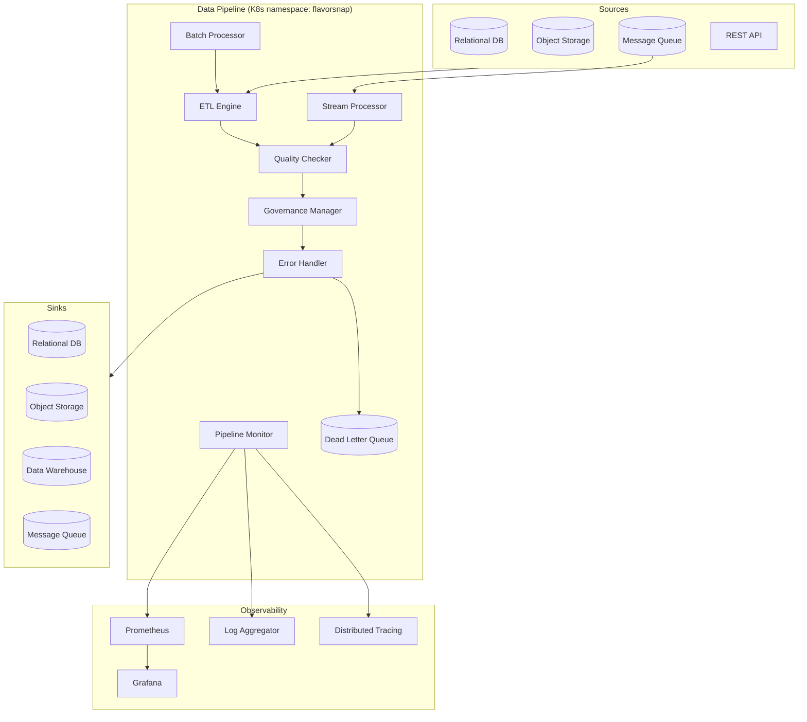

# Design Document: Advanced Data Pipeline

## Overview

The advanced data pipeline is a modular ETL and stream-processing system built on top of the existing FlavorSnap infrastructure. It runs as a set of Kubernetes workloads in the `flavorsnap` namespace alongside the existing ML model API, sharing the PostgreSQL and Redis instances already deployed there.

The pipeline exposes a Prometheus-compatible `/metrics` endpoint and emits structured JSON logs to stdout, integrating directly with the existing Prometheus scrape config and log aggregation stack. All components are implemented in Python to stay consistent with the `ml-model-api` codebase.

### Key Design Decisions

- **Python + Apache Kafka** for stream processing: Kafka is the de-facto standard for durable, high-throughput message queues and integrates well with the existing Redis/Postgres stack.
- **Apache Airflow** for batch DAG scheduling: provides cron scheduling, dependency ordering, checkpointing, and a UI out of the box.
- **Great Expectations** for data quality rules: declarative, configurable rule sets with built-in reporting.
- **OpenLineage / Marquez** for data lineage: open standard that integrates with Airflow and emits lineage events without custom code.
- **Declarative YAML configuration** for transformation rules: keeps pipeline logic auditable and version-controlled.

---

## Architecture



### Deployment Topology

The pipeline runs as three Kubernetes Deployments and one CronJob controller within the existing `flavorsnap` namespace:

| Workload | Kind | Purpose |
|---|---|---|
| `pipeline-etl` | Deployment | ETL Engine + Quality Checker + Governance Manager |
| `pipeline-stream` | Deployment | Stream Processor |
| `pipeline-monitor` | Deployment | Pipeline Monitor sidecar / metrics server |
| `pipeline-batch-*` | Job (Airflow-managed) | Batch Processor jobs |

---

## Components and Interfaces

### ETL Engine (`etl_engine.py`)

Orchestrates extract → transform → quality-check → load for batch and on-demand runs.

```python
class ETLEngine:
    def extract(self, source: DataSource, strategy: ExtractionStrategy) -> RecordStream: ...
    def transform(self, records: RecordStream, config: TransformConfig) -> RecordStream: ...
    def load(self, records: RecordStream, sink: DataSink, mode: WriteMode) -> LoadResult: ...
    def run_pipeline(self, pipeline_config: PipelineConfig) -> PipelineResult: ...
```

Supported `ExtractionStrategy` values: `FULL`, `WATERMARK`, `CDC`.
Supported `WriteMode` values: `APPEND`, `UPSERT`, `OVERWRITE`.

### Stream Processor (`stream_processor.py`)

Consumes from Kafka topics, applies the transformation pipeline, and writes to sinks with at-least-once semantics.

```python
class StreamProcessor:
    def start(self, topic: str, sink: DataSink, transform_config: TransformConfig) -> None: ...
    def stop(self) -> None: ...
    def get_throughput_rps(self) -> float: ...
    def create_window(self, window_type: WindowType, size_seconds: int) -> Window: ...
```

Supported `WindowType` values: `TUMBLING`, `SLIDING`, `SESSION`.

### Batch Processor (`pipeline_batch_processor.py`)

Wraps Airflow DAG execution. Each batch job is an Airflow DAG with checkpoint support.

```python
class PipelineBatchProcessor:
    def submit_job(self, job_config: BatchJobConfig) -> str: ...          # returns job_id
    def get_checkpoint(self, job_id: str) -> Optional[Checkpoint]: ...
    def save_checkpoint(self, job_id: str, checkpoint: Checkpoint) -> None: ...
    def resume_from_checkpoint(self, job_id: str) -> None: ...
```

### Quality Checker (`quality_checker.py`)

Evaluates records against a rule set before the load stage.

```python
class QualityChecker:
    def check_record(self, record: Record, rules: List[QualityRule]) -> QualityResult: ...
    def check_batch(self, records: List[Record], rules: List[QualityRule]) -> QualityReport: ...
    def enforce_pass_rate(self, report: QualityReport, threshold: float) -> None: ...
```

Supported `QualityRule` types: `NULL_CHECK`, `RANGE`, `REGEX`, `REFERENTIAL_INTEGRITY`, `STATISTICAL_OUTLIER`.

### Governance Manager (`governance_manager.py`)

Enforces field-level access controls, maintains lineage, and produces audit logs.

```python
class GovernanceManager:
    def record_lineage(self, record_id: str, event: LineageEvent) -> None: ...
    def mask_fields(self, record: Record, sink: DataSink) -> Record: ...
    def classify_source(self, source_id: str, label: DataClassification) -> None: ...
    def handle_deletion_request(self, subject_id: str) -> DeletionReport: ...
    def audit_log(self, actor: str, change: ConfigChange) -> None: ...
```

`DataClassification` enum: `PUBLIC`, `INTERNAL`, `CONFIDENTIAL`, `RESTRICTED`.

### Pipeline Monitor (`pipeline_monitor.py`)

Exposes Prometheus metrics, health endpoints, structured logs, and trace context propagation.

```python
class PipelineMonitor:
    def record_event(self, event: PipelineEvent) -> None: ...
    def update_health(self, component: str, status: HealthStatus) -> None: ...
    def emit_alert(self, alert: PipelineAlert) -> None: ...
    def get_metrics_response(self) -> str: ...          # Prometheus text format
```

### Error Handler (`pipeline_error_handler.py`)

Classifies errors, manages retries with exponential backoff, routes to DLQ, and manages circuit breakers.

```python
class ErrorHandler:
    def classify(self, error: Exception) -> ErrorCategory: ...
    def handle(self, error: Exception, context: ErrorContext) -> ErrorAction: ...
    def route_to_dlq(self, record: Record, reason: str) -> None: ...
    def check_circuit_breaker(self, stage: str) -> CircuitState: ...
```

`ErrorCategory` enum: `TRANSIENT`, `PERMANENT`, `CONFIGURATION`.
`CircuitState` enum: `CLOSED`, `OPEN`, `HALF_OPEN`.

---

## Data Models

### PipelineConfig

```python
@dataclass
class PipelineConfig:
    pipeline_id: str
    source: DataSourceConfig
    sink: DataSinkConfig
    transform: TransformConfig
    quality_rules: List[QualityRule]
    write_mode: WriteMode
    extraction_strategy: ExtractionStrategy
    schedule: Optional[str]          # cron expression for batch
    max_retries: int = 3
    max_retry_delay_seconds: int = 60
    quality_pass_rate_threshold: float = 0.95
```

### DataSourceConfig / DataSinkConfig

```python
@dataclass
class DataSourceConfig:
    source_id: str
    source_type: SourceType          # RDBMS | S3 | KAFKA | REST_API
    connection_params: Dict[str, Any]
    classification: DataClassification
    watermark_field: Optional[str] = None
    cdc_enabled: bool = False

@dataclass
class DataSinkConfig:
    sink_id: str
    sink_type: SinkType              # RDBMS | S3 | DATA_WAREHOUSE | KAFKA
    connection_params: Dict[str, Any]
    classification: DataClassification
    authorized_fields: List[str]     # fields this sink is allowed to receive
```

### Record

```python
@dataclass
class Record:
    record_id: str
    source_id: str
    payload: Dict[str, Any]
    original_payload: Dict[str, Any]   # preserved for lineage
    schema_version: str
    extracted_at: datetime
    lineage: List[LineageEvent] = field(default_factory=list)
    quality_tags: List[QualityTag] = field(default_factory=list)
```

### QualityRule / QualityTag

```python
@dataclass
class QualityRule:
    rule_id: str
    rule_type: RuleType
    field: str
    params: Dict[str, Any]
    severity: Severity               # WARNING | ERROR
    blocking: bool = False           # if True, WARNING is treated as ERROR

@dataclass
class QualityTag:
    rule_id: str
    severity: Severity
    message: str
```

### Checkpoint

```python
@dataclass
class Checkpoint:
    job_id: str
    created_at: datetime
    last_processed_offset: Any       # watermark value or record range end
    records_completed: int
    stage: str
```

### LineageEvent

```python
@dataclass
class LineageEvent:
    event_id: str
    timestamp: datetime
    event_type: str                  # EXTRACT | TRANSFORM | LOAD | MASK | REJECT
    actor: str                       # component name
    source_id: Optional[str]
    sink_id: Optional[str]
    transformation_applied: Optional[str]
    record_id: str
```

### DeadLetterRecord

```python
@dataclass
class DeadLetterRecord:
    dlq_id: str
    original_record: Record
    error_category: ErrorCategory
    error_reason: str
    stack_trace: str
    failed_at: datetime
    expires_at: datetime             # configurable retention, default 7 days
    replayed: bool = False
```

### PipelineMetrics (Prometheus)

| Metric | Type | Labels |
|---|---|---|
| `pipeline_records_processed_total` | Counter | `pipeline_id`, `stage` |
| `pipeline_records_failed_total` | Counter | `pipeline_id`, `stage`, `error_category` |
| `pipeline_processing_latency_seconds` | Histogram | `pipeline_id`, `stage` |
| `pipeline_lag_seconds` | Gauge | `pipeline_id` |
| `pipeline_active_workers_count` | Gauge | `pipeline_id` |
| `pipeline_throughput_rps` | Gauge | `pipeline_id` |
| `pipeline_quality_pass_rate` | Gauge | `pipeline_id` |
| `pipeline_dlq_size` | Gauge | `pipeline_id` |
| `pipeline_circuit_breaker_state` | Gauge | `pipeline_id`, `stage` |

---

## Correctness Properties

*A property is a characteristic or behavior that should hold true across all valid executions of a system — essentially, a formal statement about what the system should do. Properties serve as the bridge between human-readable specifications and machine-verifiable correctness guarantees.*


### Property 1: Connectivity validation before extraction

*For any* data source configuration, the ETL Engine must successfully validate connectivity before any records are extracted; if connectivity validation fails, no extraction attempt should be made.

**Validates: Requirements 1.2**

---

### Property 2: Retry with exponential backoff

*For any* transient failure (source unavailability during extraction or load operation), the system shall retry the failed operation no more than the configured maximum retry count (default 3), and each successive retry delay must be at least double the previous delay.

**Validates: Requirements 1.3, 9.2**

---

### Property 3: Extraction event completeness

*For any* extraction start event, the Pipeline Monitor record must contain the extraction start time, source identifier, and estimated record count — all three fields must be non-null.

**Validates: Requirements 1.4**

---

### Property 4: Incremental extraction watermark monotonicity

*For any* two consecutive incremental extraction runs using watermark strategy, the second run must only extract records whose watermark field value is strictly greater than the watermark recorded at the end of the first run.

**Validates: Requirements 1.5**

---

### Property 5: Transformation config applied to every record

*For any* record stream and valid transformation configuration, every record in the output stream must reflect all transformation rules defined in the configuration (no rules silently skipped).

**Validates: Requirements 2.1**

---

### Property 6: Missing field handling

*For any* record that is missing a field referenced by a transformation rule, the output record must either contain the configured default value for that field, or the record must appear in the Dead Letter Queue — never both, never neither.

**Validates: Requirements 2.2**

---

### Property 7: Schema violation rejection

*For any* record that does not conform to the target schema after transformation, the record must be passed to the Error Handler and must not appear in the data sink.

**Validates: Requirements 2.4**

---

### Property 8: Lineage preserves original payload

*For any* record that undergoes transformation, the lineage log must contain an entry with the original source payload unchanged alongside the transformed payload.

**Validates: Requirements 2.5, 7.1**

---

### Property 9: Transactional all-or-nothing load

*For any* batch of records loaded to a transactional sink, either all records in the batch are committed or none are — a partial write must never be observable in the sink.

**Validates: Requirements 3.2**

---

### Property 10: Failed load routes to DLQ

*For any* load operation that fails after exhausting all retry attempts, all affected records must appear in the Dead Letter Queue and a failure event must be present in the Pipeline Monitor.

**Validates: Requirements 3.3**

---

### Property 11: Write mode semantics

*For any* sink and set of records:
- APPEND mode: the sink record count increases by exactly the number of loaded records.
- UPSERT mode: existing records with matching keys are updated; new records are inserted; total key-distinct count is non-decreasing.
- OVERWRITE mode: after the load, the sink contains exactly the loaded records and no others.

**Validates: Requirements 3.4**

---

### Property 12: Load completion event completeness

*For any* completed load operation, the Pipeline Monitor must contain a record with record count, byte size, and elapsed duration — all three fields must be non-null and non-negative.

**Validates: Requirements 3.5**

---

### Property 13: Stream processing end-to-end latency

*For any* record consumed by the Stream Processor under normal load conditions, the elapsed time from record arrival to successful sink write must not exceed 500 milliseconds.

**Validates: Requirements 4.1, 4.2**

---

### Property 14: At-least-once delivery via offset commit ordering

*For any* record where the downstream sink write fails, the consumer offset for that record must not be committed, ensuring the record will be redelivered on the next poll.

**Validates: Requirements 4.3**

---

### Property 15: Throughput metric emission frequency

*For any* 10-second interval during which the Stream Processor is running, at least one throughput (records-per-second) metric update must be recorded in the Pipeline Monitor.

**Validates: Requirements 4.4**

---

### Property 16: Backpressure alert on sustained lag

*For any* Stream Processor instance that has been continuously behind the incoming record rate for more than 60 seconds, a backpressure alert must be present in the Pipeline Monitor.

**Validates: Requirements 4.5**

---

### Property 17: Windowed aggregation correctness

*For any* stream of records and configured window (tumbling, sliding, or session), the aggregated output must contain exactly the records that fall within each window boundary according to the window type's definition — no records outside the window boundary, no records inside the boundary omitted.

**Validates: Requirements 4.6**

---

### Property 18: Checkpoint created on batch job start

*For any* batch job start event, a checkpoint record must exist containing a non-null job ID, start time, and input record range before any records are processed.

**Validates: Requirements 5.2**

---

### Property 19: Checkpoint resume avoids duplicate processing

*For any* batch job that is interrupted and then resumed, the resumed run must process only records with offsets strictly greater than the last committed checkpoint offset — no record processed before the checkpoint should be processed again.

**Validates: Requirements 5.3**

---

### Property 20: Batch completion event completeness

*For any* completed batch job, the Pipeline Monitor must contain a completion event with total records processed, records failed, and elapsed time — all three fields must be non-null.

**Validates: Requirements 5.5**

---

### Property 21: DAG dependency ordering

*For any* pipeline DAG, no downstream batch job must begin execution before all of its declared upstream dependencies have reached a successful completion state.

**Validates: Requirements 5.6**

---

### Property 22: Quality check applied to every record

*For any* record and quality rule set, the Quality Checker must produce a result entry for every rule in the set — no rule may be silently skipped.

**Validates: Requirements 6.1**

---

### Property 23: Error-tagged records routed to DLQ

*For any* record that receives an error-severity quality tag (directly, or via a blocking warning), the record must appear in the Dead Letter Queue and must not appear in the data sink.

**Validates: Requirements 6.3, 6.4**

---

### Property 24: Quality report completeness

*For any* completed batch or stream window, the quality report emitted to the Pipeline Monitor must contain the pass rate, per-rule failure counts, and at least one sample failing record for each rule that had failures.

**Validates: Requirements 6.6**

---

### Property 25: Pass rate threshold enforcement

*For any* batch or stream window where the quality pass rate falls below the configured threshold, the pipeline must be halted and an alert must be emitted to the Pipeline Monitor before any further records are loaded.

**Validates: Requirements 6.7**

---

### Property 26: Field-level access control masking

*For any* record written to a sink, fields that are not in the sink's authorized field list must be absent or masked in the written record — the original sensitive field values must not be observable at the sink.

**Validates: Requirements 7.2**

---

### Property 27: Classification required for source/sink registration

*For any* attempt to register a data source or data sink without a data classification label, the Governance Manager must reject the registration and the pipeline configuration must not be accepted.

**Validates: Requirements 7.3**

---

### Property 28: Lineage retention invariant

*For any* lineage record, it must remain retrievable for at least the configured retention period (minimum 90 days) from its creation timestamp.

**Validates: Requirements 7.4**

---

### Property 29: Deletion request completeness

*For any* data subject deletion request, every lineage record associated with that subject must be flagged in the system — no associated lineage record may remain unflagged after the request is processed.

**Validates: Requirements 7.5**

---

### Property 30: Audit log completeness

*For any* pipeline configuration change, the audit log must contain an entry with a non-null actor identity, timestamp, and both the before and after configuration values.

**Validates: Requirements 7.6**

---

### Property 31: Standard metrics presence

*For any* pipeline run, all five standard metrics (`pipeline_records_processed_total`, `pipeline_records_failed_total`, `pipeline_processing_latency_seconds`, `pipeline_lag_seconds`, `pipeline_active_workers_count`) must be present and non-negative in the `/metrics` response.

**Validates: Requirements 8.2**

---

### Property 32: Health status update latency

*For any* component that transitions to an unhealthy state, the `/health` endpoint must reflect the updated status within 5 seconds of the transition.

**Validates: Requirements 8.3**

---

### Property 33: Structured lifecycle log format

*For any* pipeline lifecycle event (start, checkpoint, completion, failure), the log line emitted to stdout must be valid JSON and must contain the event type field.

**Validates: Requirements 8.5**

---

### Property 34: W3C TraceContext propagation

*For any* pipeline stage transition when distributed tracing is enabled, the outgoing context must contain a valid W3C `traceparent` header that preserves the trace ID from the incoming context.

**Validates: Requirements 8.6**

---

### Property 35: Error classification exhaustiveness

*For any* exception raised within the pipeline, the Error Handler must classify it as exactly one of: TRANSIENT, PERMANENT, or CONFIGURATION — no exception may go unclassified.

**Validates: Requirements 9.1**

---

### Property 36: Permanent error DLQ routing with metadata

*For any* permanent error, the affected record must appear in the Dead Letter Queue with a non-null error reason and stack trace, and the next record in the stream or batch must still be processed (no cascading halt).

**Validates: Requirements 9.3**

---

### Property 37: Configuration error preserves checkpoint

*For any* configuration error that halts a pipeline stage, the most recent checkpoint must remain intact and retrievable after the halt, and an alert must be present in the Pipeline Monitor.

**Validates: Requirements 9.4**

---

### Property 38: DLQ record retention and replayability

*For any* record in the Dead Letter Queue, it must be retrievable via the reprocessing API until its expiry timestamp (default: 7 days after insertion).

**Validates: Requirements 9.5**

---

### Property 39: Single record failure isolation

*For any* batch or stream window where exactly one record fails, all other records in the same batch or window must be successfully processed — the failure must not propagate to sibling records.

**Validates: Requirements 9.6**

---

### Property 40: Circuit breaker triggers on high error rate

*For any* pipeline stage where the error rate exceeds the configured threshold within a rolling 5-minute window, the circuit breaker for that stage must transition to OPEN state and an alert must be emitted to the Pipeline Monitor.

**Validates: Requirements 9.7**

---

## Error Handling

### Error Classification

| Category | Examples | Action |
|---|---|---|
| TRANSIENT | Network timeout, DB connection drop, rate limit | Retry with exponential backoff (max 3 attempts, max 60s delay) |
| PERMANENT | Schema validation failure, type cast error, malformed record | Route to DLQ, log reason + stack trace, continue processing |
| CONFIGURATION | Missing required config field, invalid cron expression, unregistered source | Halt stage, preserve checkpoint, emit alert, await operator action |

### Exponential Backoff Formula

```
delay(attempt) = min(base_delay * 2^(attempt-1), max_delay)
```

Default: `base_delay=1s`, `max_delay=60s`, `max_retries=3`.

### Circuit Breaker

The circuit breaker uses a sliding 5-minute window. When `errors / total_records > threshold` (configurable, default 0.1), the breaker opens. After a configurable cool-down period (default 60s), it transitions to HALF_OPEN and allows one probe request. On success it closes; on failure it reopens.

### Dead Letter Queue

DLQ records are stored in a dedicated PostgreSQL table (`pipeline_dlq`) with a TTL enforced by a scheduled cleanup job. The reprocessing API (`POST /pipeline/dlq/{dlq_id}/replay`) re-injects the original record into the pipeline head.

---

## Testing Strategy

### Dual Testing Approach

Both unit tests and property-based tests are required. They are complementary:

- **Unit tests** cover specific examples, integration points, and edge cases (e.g., each source type connects, each transformation type produces the correct output, the `/metrics` endpoint returns valid Prometheus format).
- **Property-based tests** verify universal correctness across randomly generated inputs (all 40 properties above).

### Property-Based Testing Library

**Python: [Hypothesis](https://hypothesis.readthedocs.io/)** — mature, well-maintained, integrates with pytest.

Each property test must:
- Run a minimum of **100 iterations** (configured via `@settings(max_examples=100)`).
- Include a comment tag in the format: `# Feature: advanced-data-pipeline, Property N: <property_text>`
- Reference the design property number it implements.

Example:

```python
from hypothesis import given, settings, strategies as st

# Feature: advanced-data-pipeline, Property 2: Retry with exponential backoff
@settings(max_examples=100)
@given(st.integers(min_value=1, max_value=3))
def test_retry_exponential_backoff(max_retries):
    delays = collect_retry_delays(simulate_transient_failure, max_retries)
    assert len(delays) <= max_retries
    for i in range(1, len(delays)):
        assert delays[i] >= delays[i - 1] * 2
```

### Unit Test Focus Areas

- Each source type (RDBMS, S3, Kafka, REST API) connects and returns records — one test per type.
- Each transformation type (field mapping, type casting, string normalization, value enrichment, record filtering) produces correct output.
- The `/metrics` endpoint returns a response parseable by the Prometheus client library.
- The `/health` endpoint returns valid JSON with a `status` field.
- DLQ reprocessing API replays a record end-to-end.
- Each quality rule type (null check, range, regex, referential integrity, outlier) correctly tags a violating record.

### Test File Layout

```
data-pipeline/
  tests/
    unit/
      test_etl_engine.py
      test_stream_processor.py
      test_batch_processor.py
      test_quality_checker.py
      test_governance_manager.py
      test_error_handler.py
      test_pipeline_monitor.py
    property/
      test_etl_properties.py        # Properties 1-12
      test_stream_properties.py     # Properties 13-17
      test_batch_properties.py      # Properties 18-21
      test_quality_properties.py    # Properties 22-25
      test_governance_properties.py # Properties 26-30
      test_monitor_properties.py    # Properties 31-34
      test_error_properties.py      # Properties 35-40
```
