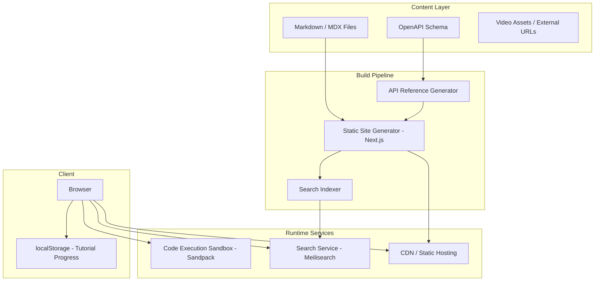

# Design Document: Advanced Documentation System

## Overview

The Advanced Documentation System is a content platform that serves interactive guides, API reference pages, tutorials, code examples, video guides, and versioned documentation with full-text search. It is designed as a statically-generated site with a thin dynamic layer for search, progress tracking, and inline code execution.

The system separates content authoring (Markdown/MDX files in `docs/`) from rendering (a Next.js-based frontend) and indexing (a build-time search index). Version control is handled by maintaining separate content directories per version, with a version selector component routing users to the correct content tree.

Key design decisions:
- Static generation for performance and reliability, with incremental regeneration on content changes
- Client-side progress tracking via localStorage to avoid requiring authentication for tutorial state
- Algolia DocSearch (or a self-hosted Meilisearch instance) for sub-500ms search
- Sandpack or a similar in-browser sandbox for runnable code examples
- Content versioning via directory structure (`docs/v1/`, `docs/v2/`) rather than git branches, enabling simultaneous multi-version builds

---

## Architecture



The build pipeline runs on every content commit. The search index is updated within 5 minutes of a build completing. The client communicates directly with the search service and the code execution sandbox; all other content is served from the CDN.

---

## Components and Interfaces

### DocumentationPage

Renders any documentation page (guide, tutorial step, API reference, or landing page). Accepts a `PageProps` object and delegates to specialized sub-components.

```ts
interface PageProps {
  slug: string[];
  version: string;
  content: SerializedMDX;
  frontmatter: Frontmatter;
  pageType: 'guide' | 'tutorial' | 'api-reference' | 'index';
}
```

### InteractiveGuide

Manages step-by-step interactive content. Maintains local step state and renders the current step's MDX content.

```ts
interface InteractiveGuideProps {
  steps: GuideStep[];
  onComplete: () => void;
}

interface GuideStep {
  id: string;
  title: string;
  content: SerializedMDX;
  fallbackUrl: string;
}
```

### TutorialPlayer

Wraps tutorial content with progress tracking. Reads/writes progress to localStorage keyed by tutorial ID.

```ts
interface TutorialPlayerProps {
  tutorial: Tutorial;
  initialStep?: number; // restored from localStorage
}
```

### CodeBlock

Renders syntax-highlighted code with a copy button. Optionally renders a Sandpack sandbox for runnable examples.

```ts
interface CodeBlockProps {
  code: string;
  language: SupportedLanguage;
  runnable?: boolean;
  filename?: string;
}

type SupportedLanguage = 'javascript' | 'typescript' | 'python' | 'curl' | 'json';
```

### VideoPlayer

Embeds a responsive video with transcript fallback.

```ts
interface VideoPlayerProps {
  src: string;           // URL (external or self-hosted)
  provider: 'youtube' | 'vimeo' | 'self-hosted';
  transcript?: string;
  fallbackMessage?: string;
}
```

### SearchBar

Queries the search service and renders ranked results with excerpts.

```ts
interface SearchResult {
  pageTitle: string;
  excerpt: string;
  url: string;
  score: number;
}
```

### VersionSelector

Dropdown that routes the user to the equivalent page in the selected version.

```ts
interface VersionSelectorProps {
  versions: VersionMeta[];
  currentVersion: string;
  currentSlug: string;
}

interface VersionMeta {
  label: string;       // e.g. "v2.1"
  value: string;
  isLatest: boolean;
  isDeprecated: boolean;
}
```

### APIReferenceRenderer

Renders a single API endpoint from a parsed OpenAPI operation object.

```ts
interface APIEndpoint {
  method: HttpMethod;
  path: string;
  parameters: Parameter[];
  requestBody?: RequestBodySchema;
  responses: Record<string, ResponseSchema>;
  examples: CodeExample[];
}
```

---

## Data Models

### Frontmatter

Every documentation page carries YAML frontmatter:

```ts
interface Frontmatter {
  title: string;
  description: string;
  pageType: 'guide' | 'tutorial' | 'api-reference' | 'index';
  version: string;
  tags?: string[];
  videoSrc?: string;
  videoProvider?: 'youtube' | 'vimeo' | 'self-hosted';
}
```

### Tutorial

```ts
interface Tutorial {
  id: string;
  title: string;
  estimatedMinutes: number;
  difficulty: 'beginner' | 'intermediate' | 'advanced';
  topic: string;
  prerequisites: string[];   // tutorial IDs
  steps: TutorialStep[];
}

interface TutorialStep {
  id: string;
  title: string;
  content: SerializedMDX;
}
```

### TutorialProgress (localStorage)

```ts
interface TutorialProgress {
  tutorialId: string;
  lastCompletedStepIndex: number;
  completedAt?: string; // ISO timestamp, set when all steps done
}
```

### SearchIndexEntry

```ts
interface SearchIndexEntry {
  id: string;
  url: string;
  title: string;
  body: string;           // plain text, stripped of MDX
  pageType: string;
  version: string;
  tags: string[];
}
```

### VersionManifest

```ts
interface VersionManifest {
  versions: VersionMeta[];
  latestVersion: string;
  deprecatedVersions: string[];
}
```

### CodeExample

```ts
interface CodeExample {
  language: SupportedLanguage;
  code: string;
  runnable: boolean;
  label?: string;
}
```

---

## Correctness Properties

*A property is a characteristic or behavior that should hold true across all valid executions of a system — essentially, a formal statement about what the system should do. Properties serve as the bridge between human-readable specifications and machine-verifiable correctness guarantees.*

### Property 1: Tutorial progress round-trip

*For any* tutorial and any step index within that tutorial, saving progress to localStorage and then restoring it should yield the same step index.

**Validates: Requirements 3.4**

### Property 2: Copy action delivers full code content

*For any* CodeBlock with any code string, triggering the copy action should result in the clipboard containing the complete, unmodified code string.

**Validates: Requirements 4.2**

### Property 3: Search results contain required display fields

*For any* search query that returns results, every result object should contain a non-empty page title, a non-empty excerpt, and a valid URL.

**Validates: Requirements 6.3**

### Property 4: Search index completeness

*For any* documentation page that has been published or modified, after the next index update cycle the Search_Engine should return that page when queried with terms from its title.

**Validates: Requirements 6.1, 6.5**

### Property 5: Version selector ordering invariant

*For any* version manifest, the list of versions rendered by the VersionSelector should be in strictly descending order, and the latest version should be the default selected value.

**Validates: Requirements 7.5**

### Property 6: Versioned page routing consistency

*For any* version value and slug, selecting that version via the VersionSelector should navigate to a URL whose path contains both the version identifier and the slug.

**Validates: Requirements 7.2**

### Property 7: API reference render time

*For any* API_Reference page, the time from navigation to fully rendered endpoint details should be at most 2 seconds.

**Validates: Requirements 2.2**

### Property 8: Search response time

*For any* search query of at least 2 characters, the Search_Engine should return results within 500ms.

**Validates: Requirements 6.2**

### Property 9: Code example language support

*For any* CodeBlock whose declared language is one of {javascript, typescript, python, curl, json}, the renderer should apply syntax highlighting without error.

**Validates: Requirements 4.1, 4.3**

### Property 10: Interactive guide step state update

*For any* InteractiveGuide and any valid step transition, after the user interacts with a step the displayed content should reflect the new step state and not the previous one.

**Validates: Requirements 1.2**

---

## Error Handling

| Scenario | Behavior |
|---|---|
| InteractiveGuide fails to load | Display error message + link to static fallback page (Req 1.4) |
| API Reference page not found | Return 404 page with link to API Reference index (Req 2.5) |
| Inline code execution fails | Display error output from execution environment inline (Req 4.5) |
| Video source unavailable | Show placeholder message + link to transcript (Req 5.4) |
| Search service unavailable | Show "search unavailable" message + link to site map (Req 6.6) |
| Versioned URL references deprecated version | Redirect to archived version page + deprecation notice (Req 7.6) |
| Page not found in selected version | Show "unavailable for this version" message + link to version index (Req 7.4) |

All error states are rendered as static fallback UI — no spinners that never resolve. Error boundaries wrap InteractiveGuide and CodeBlock components so a failure in one component does not crash the entire page.

---

## Testing Strategy

### Unit Tests

Focus on specific examples, edge cases, and integration points:

- `VersionSelector` renders versions in descending order with latest selected by default
- `CodeBlock` copy button writes correct content to clipboard and shows confirmation for 2 seconds
- `TutorialPlayer` restores correct step from localStorage on mount
- `SearchBar` renders title, excerpt, and URL for each result
- `VideoPlayer` renders transcript when video source is unavailable
- `APIReferenceRenderer` renders all required fields (method, path, parameters, responses, examples)
- 404 and deprecation redirect pages render correct messages and links

### Property-Based Tests

Using **fast-check** (TypeScript/JavaScript property-based testing library). Each test runs a minimum of 100 iterations.

**Property 1: Tutorial progress round-trip**
Generate random tutorial IDs and step indices. Save to localStorage via `saveTutorialProgress`, restore via `loadTutorialProgress`, assert the step index is identical.
`// Feature: advanced-documentation-system, Property 1: Tutorial progress round-trip`

**Property 2: Copy action delivers full code content**
Generate random code strings (including unicode, whitespace, special characters). Trigger `handleCopy`, assert clipboard value equals the original string exactly.
`// Feature: advanced-documentation-system, Property 2: Copy action delivers full code content`

**Property 3: Search results contain required display fields**
Generate random search result arrays. Assert every result has a non-empty `pageTitle`, non-empty `excerpt`, and a string `url` starting with `/`.
`// Feature: advanced-documentation-system, Property 3: Search results contain required display fields`

**Property 5: Version selector ordering invariant**
Generate random arrays of `VersionMeta` objects. Pass to `sortVersions`, assert the output is in strictly descending semver order and the item with `isLatest: true` is first.
`// Feature: advanced-documentation-system, Property 5: Version selector ordering invariant`

**Property 6: Versioned page routing consistency**
Generate random version strings and slugs. Call `buildVersionedUrl(version, slug)`, assert the returned URL contains both the version string and the slug as path segments.
`// Feature: advanced-documentation-system, Property 6: Versioned page routing consistency`

**Property 9: Code example language support**
Generate random code strings for each supported language. Pass to `renderCodeBlock`, assert no exception is thrown and the output contains a syntax-highlighted element.
`// Feature: advanced-documentation-system, Property 9: Code example language support`

**Property 10: Interactive guide step state update**
Generate random guide step sequences. Simulate a step interaction, assert the rendered step ID matches the next step ID and not the previous one.
`// Feature: advanced-documentation-system, Property 10: Interactive guide step state update`

Properties 4, 7, and 8 involve timing and external services (search index propagation, render latency, search response time) and are validated through integration/performance tests rather than unit-level property tests.
