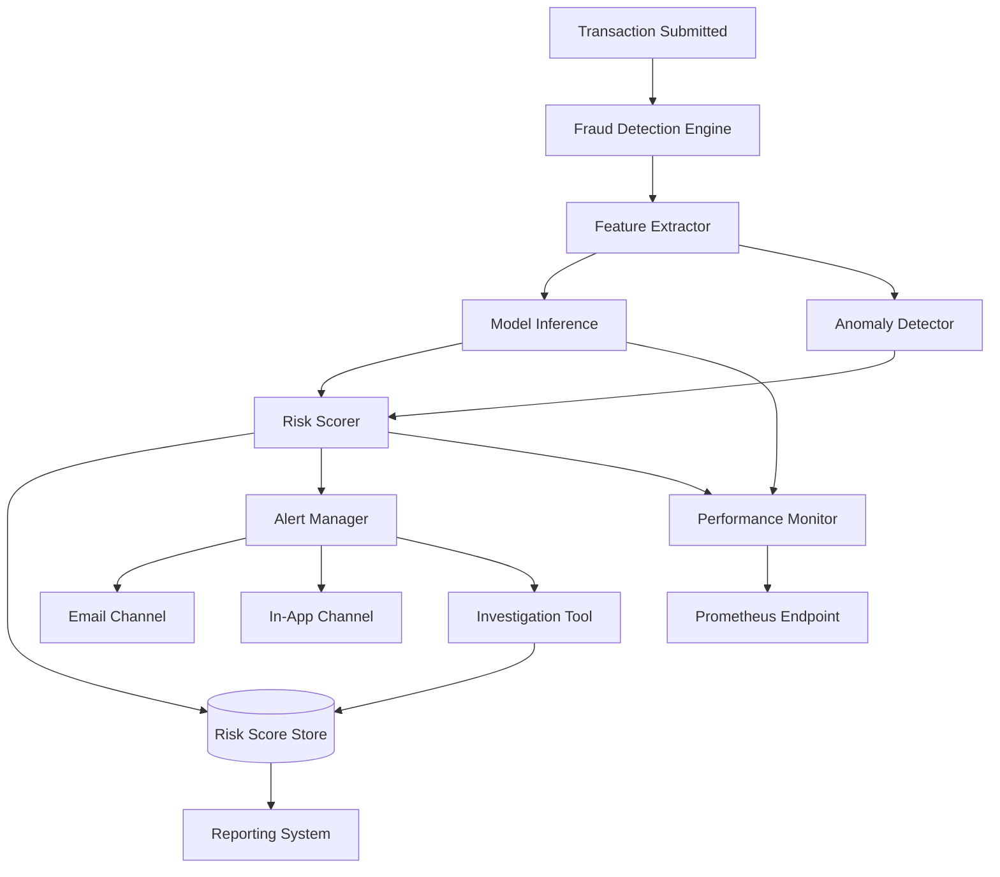

# Design Document: Advanced Fraud Detection

## Overview

The advanced fraud detection system combines ML model inference, behavioral anomaly detection, and real-time risk scoring to evaluate every transaction before it completes. High-risk transactions trigger automated alerts routed to fraud analysts via in-app and email channels. Analysts use investigation tooling to review cases, annotate outcomes, and resolve them. A reporting system aggregates metrics for compliance, and a performance monitor tracks model quality and system health.

The system is designed around a pipeline: transaction → feature extraction → ML inference + anomaly detection → risk scoring → alert routing → investigation. Each stage is independently scalable and observable.

## Architecture



The Fraud Detection Engine is the synchronous entry point. It must return a risk score within 300ms. Anomaly detection and alert creation happen within that window or asynchronously with a fallback score applied if the deadline is missed.

## Components and Interfaces

### Fraud Detection Engine

Entry point for transaction evaluation. Orchestrates feature extraction, model inference, anomaly detection, and risk scoring.

```python
class FraudDetectionEngine:
    def evaluate(self, transaction: Transaction) -> RiskResult:
        """Evaluate a transaction and return a risk result within 300ms."""

    def load_model(self, model_version: str) -> None:
        """Hot-swap a model version without service restart."""

    def get_active_models(self) -> list[ModelVersion]:
        """Return all currently loaded model versions."""
```

### Feature Extractor

Transforms raw transaction data into a normalized feature vector for model input.

```python
class FeatureExtractor:
    def extract(self, transaction: Transaction, account_history: AccountHistory) -> FeatureVector:
        """Produce a feature vector from transaction and account context."""
```

### Anomaly Detector

Maintains per-user behavioral baselines and flags deviations.

```python
class AnomalyDetector:
    def update_baseline(self, user_id: str, transaction: Transaction) -> None:
        """Update the rolling 30-day baseline for a user."""

    def score(self, user_id: str, transaction: Transaction) -> AnomalySignal:
        """Return an anomaly signal for the transaction against the user's baseline."""
```

### Risk Scorer

Combines ML model output and anomaly signals into a unified 0–100 score.

```python
class RiskScorer:
    def compute(self, model_output: ModelOutput, anomaly_signal: AnomalySignal) -> RiskScore:
        """Compute a weighted risk score and classify into low/medium/high tier."""

    def persist(self, transaction_id: str, result: RiskScore) -> None:
        """Persist score, tier, signals, and timestamp."""
```

REST endpoint: `GET /risk-score/{transaction_id}` → `{ score, tier, signals, timestamp }`

### Alert Manager

Creates, deduplicates, routes, and escalates alerts.

```python
class AlertManager:
    def create_alert(self, transaction_id: str, risk_score: RiskScore) -> Alert:
        """Create an alert for a high-tier transaction (idempotent per transaction)."""

    def acknowledge(self, alert_id: str, analyst_id: str) -> None:
        """Mark alert acknowledged with analyst and timestamp."""

    def apply_suppression_rules(self, alert: Alert) -> bool:
        """Return True if the alert should be suppressed."""
```

### Investigation Tool (API layer)

```typescript
// REST endpoints consumed by the frontend
GET  /cases/{case_id}                  // Case detail with signals, history
GET  /cases/{case_id}/transactions     // 90-day account transaction history
POST /cases/{case_id}/resolution       // Submit resolution + notes
GET  /cases?filters=...                // Search/filter cases
```

Frontend component `FraudAlerts.tsx` renders the alert list and links to case detail views.

### Reporting System

```python
class ReportingSystem:
    def generate_daily_report(self, date: date) -> Report:
        """Aggregate daily fraud metrics and deliver to configured recipients."""

    def on_demand_report(self, start: date, end: date, format: str) -> bytes:
        """Return aggregated metrics for a date range in CSV or JSON."""
```

### Performance Monitor

Collects latency, throughput, and model quality metrics with <5ms overhead per transaction.

```python
class PerformanceMonitor:
    def record_evaluation(self, transaction_id: str, latency_ms: float) -> None:
        """Record per-transaction evaluation latency."""

    def compute_model_quality(self) -> ModelQualityMetrics:
        """Compute precision, recall, FPR on rolling 24h resolved cases."""
```

Prometheus scrape endpoint: `GET /metrics`

## Data Models

```python
@dataclass
class Transaction:
    id: str
    user_id: str
    amount: float
    currency: str
    timestamp: datetime
    metadata: dict

@dataclass
class FeatureVector:
    transaction_id: str
    features: list[float]
    extracted_at: datetime

@dataclass
class ModelOutput:
    transaction_id: str
    model_version: str
    fraud_probability: float  # 0.0–1.0
    inference_latency_ms: float

@dataclass
class AnomalySignal:
    transaction_id: str
    user_id: str
    deviation_score: float
    velocity_flag: bool
    baseline_source: Literal["per_user", "global_population"]

@dataclass
class RiskScore:
    transaction_id: str
    score: int               # 0–100
    tier: Literal["low", "medium", "high"]
    model_weight: float
    anomaly_weight: float
    signals: dict
    computed_at: datetime

@dataclass
class Alert:
    id: str
    transaction_id: str
    risk_score: RiskScore
    status: Literal["open", "acknowledged", "suppressed", "escalated"]
    created_at: datetime
    acknowledged_by: str | None
    acknowledged_at: datetime | None

@dataclass
class Case:
    id: str
    alert_id: str
    transaction_id: str
    user_id: str
    resolution: Literal["confirmed_fraud", "false_positive", "under_review"] | None
    notes: str | None
    resolved_by: str | None
    resolved_at: datetime | None

@dataclass
class ModelVersion:
    version: str
    loaded_at: datetime
    is_active: bool
    ab_traffic_fraction: float  # 0.0–1.0, sum across versions <= 1.0
```


## Correctness Properties

*A property is a characteristic or behavior that should hold true across all valid executions of a system — essentially, a formal statement about what the system should do. Properties serve as the bridge between human-readable specifications and machine-verifiable correctness guarantees.*

### Property 1: Feature extraction always produces a vector

*For any* valid transaction submitted to the Fraud Detection Engine, the feature extraction step shall produce a non-empty feature vector before model inference is invoked.

**Validates: Requirements 2.3**

---

### Property 2: Model hot-swap activates new version

*For any* loaded model version, loading a new model version should result in the new version being active and the previous version remaining accessible, without a service restart.

**Validates: Requirements 2.2, 2.4**

---

### Property 3: Baseline excludes data older than 30 days

*For any* user and any set of transactions, the behavioral baseline used by the Anomaly Detector should reflect only transactions within the last 30 days; transactions older than 30 days should have no influence on the baseline.

**Validates: Requirements 3.1**

---

### Property 4: Anomaly flagging and signal emission

*For any* user baseline and transaction whose deviation score exceeds the configured threshold, the Anomaly Detector should both flag the transaction as anomalous and produce a non-null AnomalySignal for the Risk Scorer.

**Validates: Requirements 3.2, 3.3**

---

### Property 5: Velocity anomaly detection

*For any* sequence of transactions for a user, if the transaction frequency or volume within the configured time window exceeds the configured threshold, the AnomalySignal's `velocity_flag` should be `true`.

**Validates: Requirements 3.4**

---

### Property 6: Risk score is always bounded 0–100

*For any* combination of model output and anomaly signal inputs, the Risk Scorer shall produce a score in the closed interval [0, 100].

**Validates: Requirements 4.1**

---

### Property 7: Risk score is a weighted combination of inputs

*For any* model output fraud probability, anomaly deviation score, and configured weights, the computed risk score should equal the result of the configured weighted formula applied to those inputs.

**Validates: Requirements 4.2**

---

### Property 8: Tier classification is correct and exhaustive

*For any* integer score in [0, 100], the tier classification should be exactly: low for 0–39, medium for 40–69, and high for 70–100, with no score falling outside a tier.

**Validates: Requirements 4.3**

---

### Property 9: Risk score persistence round-trip

*For any* computed risk score, after persisting it, the REST API endpoint should return the same score value, tier, signals, and a non-null timestamp for that transaction identifier.

**Validates: Requirements 4.4, 4.5**

---

### Property 10: High-tier transactions always produce an alert

*For any* transaction whose computed risk score falls in the high tier (70–100), the Alert Manager should create exactly one alert for that transaction.

**Validates: Requirements 5.1**

---

### Property 11: Alert creation is idempotent per transaction

*For any* transaction, calling alert creation multiple times should result in exactly one alert record — no duplicate alerts for the same transaction.

**Validates: Requirements 5.3**

---

### Property 12: Alert acknowledgment is persisted

*For any* open alert and any analyst identifier, acknowledging the alert should result in the alert status being "acknowledged" with the correct analyst identifier and a non-null timestamp.

**Validates: Requirements 5.4**

---

### Property 13: Suppression rules are applied correctly

*For any* alert and any suppression rule whose conditions match the alert's transaction properties or user account attributes, the alert should be suppressed and not routed to notification channels.

**Validates: Requirements 5.5**

---

### Property 14: Case detail contains all required fields

*For any* case, the case detail API response should include transaction details, risk score, contributing signals, anomaly flags, and account history — no required field should be absent.

**Validates: Requirements 6.1**

---

### Property 15: Case transaction history is scoped to 90 days

*For any* case, all transactions returned in the account history should belong to the same user account and have timestamps within the 90 days preceding the case creation date.

**Validates: Requirements 6.2**

---

### Property 16: Case resolution round-trip

*For any* case and any valid resolution (confirmed_fraud, false_positive, under_review) with notes and analyst identifier, after submitting the resolution, querying the case should return the same resolution, notes, analyst identifier, and a non-null timestamp.

**Validates: Requirements 6.3, 6.4**

---

### Property 17: Case search filters are correct

*For any* combination of filter parameters (date range, tier, resolution status, user account identifier), all cases returned by the search interface should satisfy every applied filter, and no matching case should be omitted.

**Validates: Requirements 6.5**

---

### Property 18: RBAC restricts case access by role

*For any* user without the fraud analyst or administrator role, any attempt to access a case should be denied; for any user with either role, access should be granted.

**Validates: Requirements 6.6**

---

### Property 19: Daily report contains all required metrics

*For any* day's transaction and alert data, the generated daily report should contain total transactions evaluated, alert counts broken down by tier, confirmed fraud count, and false positive rate — all computed correctly from the underlying data.

**Validates: Requirements 7.1**

---

### Property 20: On-demand report aggregates only the requested date range

*For any* date range, the on-demand report API should return metrics that aggregate only data with timestamps within that range; data outside the range should not influence the result.

**Validates: Requirements 7.2**

---

### Property 21: Report export formats are equivalent

*For any* report, exporting in CSV and JSON should produce representations of the same underlying data — no fields should be present in one format but absent in the other.

**Validates: Requirements 7.5**

---

### Property 22: Performance metrics expose all required dimensions

*For any* set of recorded transaction evaluations, the metrics endpoint should expose p50, p95, and p99 evaluation latency, alert creation latency, model inference latency, and Risk Scorer throughput — all dimensions must be present.

**Validates: Requirements 8.1, 8.4**

---

### Property 23: Model quality metrics are mathematically correct

*For any* set of resolved cases within a 24-hour window, the computed precision, recall, and false positive rate should match their standard mathematical definitions applied to the ground-truth labels from those resolved cases.

**Validates: Requirements 8.2**

---

### Property 24: Metric threshold breach triggers alert

*For any* tracked metric and configurable threshold, when the metric value exceeds the threshold, the Performance Monitor should emit exactly one alert to the configured operations notification channel.

**Validates: Requirements 8.3**

---

## Error Handling

| Scenario | Behavior |
|---|---|
| FDE timeout (>300ms) | Apply configurable fallback risk score; log timeout with transaction ID and elapsed time |
| Model inference failure | Fall back to previous model version; emit error log entry with model version and error details |
| New user with no history | Anomaly Detector uses global population baseline; `baseline_source` = `"global_population"` |
| Risk score persistence failure | Retry up to 3 times with exponential backoff; emit failure alert if all retries exhausted |
| Alert creation for duplicate transaction | Return existing alert ID; do not create a second alert |
| Unacknowledged alert past escalation window | Escalate to secondary notification channel; update alert status to `"escalated"` |
| Report generation failure | Log failure with descriptive error; retry up to 3 times; emit failure alert after final retry |
| Unauthorized case access | Return HTTP 403; log access attempt with user identifier and case identifier |
| Invalid risk score API request | Return HTTP 404 if transaction not found; HTTP 400 for malformed identifiers |

## Testing Strategy

### Unit Tests

Focus on specific examples, edge cases, and error conditions:

- Feature extraction produces correct vector shape for known transaction types
- Tier classification boundary values: scores 0, 39, 40, 69, 70, 100
- Fallback score is applied when FDE times out (inject mock timeout)
- Model fallback activates when inference throws (inject mock failure)
- New user receives global population baseline (zero history)
- Alert deduplication: second call for same transaction returns existing alert
- RBAC: non-analyst role receives 403 on case access
- Report retry: failure injected 3 times triggers failure alert on 4th attempt
- Prometheus endpoint returns valid text format

### Property-Based Tests

Use a property-based testing library (e.g., `hypothesis` for Python, `fast-check` for TypeScript). Each test runs a minimum of 100 iterations.

Each test is tagged with:
`# Feature: advanced-fraud-detection, Property {N}: {property_text}`

| Property | Test Description |
|---|---|
| P1 | For random transactions, assert feature vector is non-empty before model call |
| P2 | Load random model versions in sequence, assert latest is active without restart |
| P3 | Generate transaction histories with random timestamps, assert baseline excludes >30d data |
| P4 | Generate random deviation scores above/below threshold, assert flag and signal match |
| P5 | Generate random transaction sequences with velocity spikes, assert velocity_flag correctness |
| P6 | Generate random model outputs and anomaly signals, assert score ∈ [0, 100] |
| P7 | Generate random weights and inputs, assert score equals weighted formula result |
| P8 | Generate random integers 0–100, assert tier classification is correct and exhaustive |
| P9 | Generate random risk scores, persist, query API, assert round-trip equality |
| P10 | Generate random high-tier scores, assert exactly one alert created per transaction |
| P11 | Generate random transactions, call create_alert N times, assert exactly one alert exists |
| P12 | Generate random alerts and analyst IDs, acknowledge, assert status and metadata |
| P13 | Generate random suppression rules and transactions, assert matching alerts are suppressed |
| P14 | Generate random cases, assert all required fields present in detail response |
| P15 | Generate random cases with account histories, assert all returned transactions are within 90d |
| P16 | Generate random resolutions and notes, submit, query, assert round-trip equality |
| P17 | Generate random filter combinations and case sets, assert all results satisfy all filters |
| P18 | Generate random users with random roles, assert access granted/denied correctly |
| P19 | Generate random daily transaction/alert datasets, assert report fields are correct |
| P20 | Generate random date ranges and datasets, assert on-demand report excludes out-of-range data |
| P21 | Generate random reports, export CSV and JSON, assert equivalent data |
| P22 | Generate random evaluation recordings, assert all metric dimensions present in output |
| P23 | Generate random resolved case sets, assert precision/recall/FPR match mathematical definitions |
| P24 | Generate random metric values and thresholds, assert breach triggers exactly one alert |
