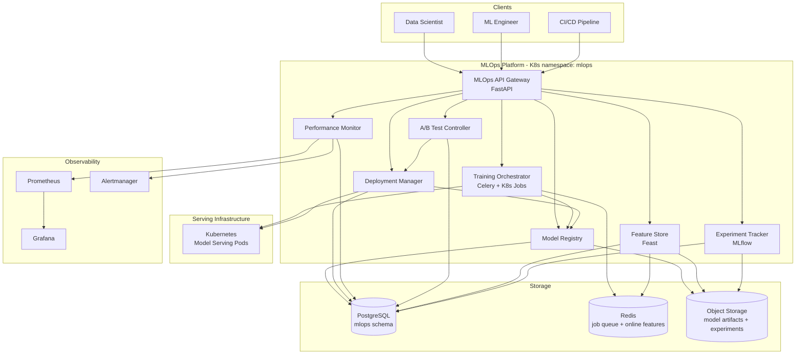

# Design Document: Advanced MLOps Platform

## Overview

The Advanced MLOps Platform is a comprehensive ML lifecycle management system built on top of the existing FlavorSnap infrastructure. It runs as a set of Kubernetes workloads in a dedicated `mlops` namespace, extending the existing `ml-model-api` codebase (which already contains `model_registry.py`, `deployment_manager.py`, `ab_testing.py`, and `monitoring.py`) with production-grade orchestration, feature management, and experiment tracking capabilities.

All components are implemented in Python, emit structured JSON logs to stdout, and expose Prometheus metrics to `/metrics`. The platform integrates with the existing PostgreSQL and Redis instances and uses object storage (S3-compatible) for model artifacts and experiment data.

### Key Design Decisions

- **FastAPI** for all service APIs: async, OpenAPI spec auto-generation, consistent with the existing `ml-model-api` stack.
- **Celery + Redis** for training job orchestration: leverages the existing Redis instance, provides distributed task queues, retry logic, and cron scheduling via Celery Beat.
- **MLflow** as the experiment tracking backend: mature, open-source, integrates with the existing Python stack, supports pluggable artifact stores.
- **Feast** as the feature store engine: open-source, supports both online (Redis) and offline (PostgreSQL) stores, point-in-time correct batch retrieval out of the box.
- **PostgreSQL** for all persistent metadata (model registry, deployment events, A/B test records): consistent with the existing `ml-model-api` database.
- **Prometheus + Grafana** (existing) for performance monitoring: extended with MLOps-specific dashboards and alert rules.
- **Kubernetes Jobs** for training workloads: isolated compute, resource limits, and native cancellation via the K8s API.

---

## Architecture



### Deployment Layout

```
k8s/mlops/
  namespace.yaml
  model-registry.yaml
  training-orchestrator.yaml
  deployment-manager.yaml
  performance-monitor.yaml
  ab-test-controller.yaml
  feature-store.yaml
  experiment-tracker.yaml
  api-gateway.yaml
  rbac.yaml
  configmap.yaml
  secrets.yaml

mlops/
  model_registry.py
  training_orchestrator.py
  deployment_manager.py
  performance_monitor.py
  ab_test_controller.py
  feature_store.py
  experiment_tracker.py
  api_gateway.py
  models.py
  db.py

ml-model-api/
  mlops_platform.py    # thin integration shim extending existing app.py

scripts/mlops/
  register_model.py
  submit_training_job.py
  deploy_model.py
  run_ab_test.py
  backfill_features.py
```

---

## Components and Interfaces

### Model Registry (`mlops/model_registry.py`)

Extends the existing `ml-model-api/model_registry.py` with lifecycle stage management, transition auditing, and tag-based search. Backed by PostgreSQL.

```python
class ModelRegistry:
    def register(self, spec: ModelRegistrationSpec) -> ModelVersion: ...
    def get(self, name: str, version: int) -> ModelVersion: ...
    def query(self, filters: ModelQueryFilters) -> list[ModelVersion]: ...
    def transition_stage(self, name: str, version: int, stage: LifecycleStage,
                         user: str, reason: str = None) -> StageTransition: ...
    def tag(self, name: str, version: int, tags: dict[str, str]) -> None: ...
    def get_transitions(self, name: str, version: int) -> list[StageTransition]: ...
```

`LifecycleStage` enum: `DEVELOPMENT`, `STAGING`, `PRODUCTION`, `ARCHIVED`.

### Training Orchestrator (`mlops/training_orchestrator.py`)

Submits training jobs as Kubernetes Jobs, manages scheduling via Celery Beat, handles retries with exponential backoff, and auto-registers completed model artifacts.

```python
class TrainingOrchestrator:
    def submit(self, spec: TrainingJobSpec) -> str: ...              # returns job_id
    def cancel(self, job_id: str) -> None: ...
    def get_status(self, job_id: str) -> TrainingJobStatus: ...
    def schedule(self, spec: TrainingJobSpec, cron: str) -> str: ...  # returns schedule_id
    def list_jobs(self, filters: JobQueryFilters = None) -> list[TrainingJobStatus]: ...
```

Retry policy: exponential backoff, `delay(n) = min(base * 2^(n-1), max_delay)`, default `base=30s`, `max_delay=300s`, `max_retries` from spec.

### Deployment Manager (`mlops/deployment_manager.py`)

Extends the existing `ml-model-api/deployment_manager.py` with blue-green deployment support, pre-deployment health checks, rollback recording, and deployment manifests.

```python
class DeploymentManager:
    def deploy(self, spec: DeploymentSpec) -> Deployment: ...
    def rollback(self, deployment_id: str, user: str) -> Deployment: ...
    def get_health(self, deployment_id: str) -> DeploymentHealth: ...
    def get_manifest(self, deployment_id: str) -> DeploymentManifest: ...
    def list_deployments(self, environment: str = None) -> list[Deployment]: ...
```

Blue-green flow: deploy new version to inactive slot → run validation period → if errors < threshold, promote; else rollback.

### Performance Monitor (`mlops/performance_monitor.py`)

Collects inference metrics from deployed model pods, computes drift scores against baselines, emits alerts, and generates daily quality reports.

```python
class PerformanceMonitor:
    def record_inference(self, event: InferenceEvent) -> None: ...
    def compute_drift(self, model_name: str, version: int) -> DriftResult: ...
    def get_metrics(self, query: MetricsQuery) -> list[MetricSample]: ...
    def get_daily_report(self, model_name: str, date: date) -> QualityReport: ...
    def set_baseline(self, model_name: str, version: int, baseline: PredictionDistribution) -> None: ...
```

Drift computation: Population Stability Index (PSI) against the registered baseline distribution, computed at the configured interval (minimum 1 minute).

### A/B Test Controller (`mlops/ab_test_controller.py`)

Extends the existing `ml-model-api/ab_testing.py` with statistical significance computation, automatic safety halting, and test report generation.

```python
class ABTestController:
    def start_test(self, config: ABTestConfig) -> ABTest: ...
    def stop_test(self, test_id: str, user: str) -> ABTestReport: ...
    def get_status(self, test_id: str) -> ABTestStatus: ...
    def route_request(self, endpoint: str) -> str: ...               # returns model_version
    def record_result(self, test_id: str, result: InferenceResult) -> None: ...
    def evaluate_safety(self, test_id: str) -> SafetyEvaluation: ...
```

Statistical significance: two-sample Welch's t-test via `scipy.stats.ttest_ind(equal_var=False)` at the configured significance level (default α=0.05).

### Feature Store (`mlops/feature_store.py`)

Wraps Feast for feature registration, online serving (Redis), offline batch retrieval (PostgreSQL), and lineage tracking.

```python
class FeatureStore:
    def register_feature(self, spec: FeatureSpec) -> FeatureDefinition: ...
    def deprecate_feature(self, name: str, version: int) -> None: ...
    def get_online_features(self, entity_key: str, features: list[str]) -> dict[str, Any]: ...
    def get_offline_features(self, entity_keys: list[str], features: list[str],
                              point_in_time: datetime) -> pd.DataFrame: ...
    def get_lineage(self, name: str, version: int) -> FeatureLineage: ...
    def search_catalog(self, query: str = None) -> list[FeatureDefinition]: ...
```

### Experiment Tracker (`mlops/experiment_tracker.py`)

Wraps MLflow for run management, metric/parameter logging, artifact storage, and search.

```python
class ExperimentTracker:
    def start_run(self, experiment_name: str, tags: dict[str, str] = None) -> str: ...  # returns run_id
    def log_param(self, run_id: str, key: str, value: Any) -> None: ...
    def log_metric(self, run_id: str, key: str, value: float, step: int = None) -> None: ...
    def log_artifact(self, run_id: str, local_path: str) -> ArtifactRef: ...
    def end_run(self, run_id: str, status: RunStatus) -> None: ...
    def delete_run(self, run_id: str) -> None: ...
    def search_runs(self, filters: RunSearchFilters) -> list[ExperimentRun]: ...
    def compare_runs(self, run_ids: list[str]) -> RunComparison: ...
```

`RunStatus` enum: `RUNNING`, `FINISHED`, `FAILED`, `KILLED`.

---

## Data Models

```python
from dataclasses import dataclass, field
from datetime import datetime, date
from enum import Enum
from typing import Optional, Any
import pandas as pd


class LifecycleStage(str, Enum):
    DEVELOPMENT = "development"
    STAGING     = "staging"
    PRODUCTION  = "production"
    ARCHIVED    = "archived"


class RunStatus(str, Enum):
    RUNNING  = "running"
    FINISHED = "finished"
    FAILED   = "failed"
    KILLED   = "killed"


class JobStatus(str, Enum):
    PENDING   = "pending"
    RUNNING   = "running"
    COMPLETED = "completed"
    FAILED    = "failed"
    CANCELLED = "cancelled"


@dataclass
class ModelRegistrationSpec:
    name: str
    artifact_uri: str                        # S3 URI to model artifact
    author: str
    description: str
    tags: dict[str, str] = field(default_factory=dict)
    metadata: dict[str, Any] = field(default_factory=dict)


@dataclass
class ModelVersion:
    name: str
    version: int                             # monotonically increasing per name
    artifact_uri: str
    author: str
    description: str
    stage: LifecycleStage
    created_at: datetime
    tags: dict[str, str]
    metadata: dict[str, Any]


@dataclass
class StageTransition:
    name: str
    version: int
    from_stage: LifecycleStage
    to_stage: LifecycleStage
    user: str
    timestamp: datetime
    reason: Optional[str]


@dataclass
class TrainingJobSpec:
    dataset_uri: str
    architecture: str
    hyperparameters: dict[str, Any]
    compute: ComputeSpec
    max_retries: int = 3
    experiment_name: Optional[str] = None


@dataclass
class ComputeSpec:
    cpu_request: str                         # e.g. "4"
    memory_request: str                      # e.g. "16Gi"
    gpu_count: int = 0


@dataclass
class TrainingJobStatus:
    job_id: str
    status: JobStatus
    submitted_at: datetime
    started_at: Optional[datetime]
    completed_at: Optional[datetime]
    model_version: Optional[int]             # set on successful completion
    failure_reason: Optional[str]
    exit_code: Optional[int]
    log_tail: Optional[str]                  # last 1000 lines on failure
    retry_count: int = 0


@dataclass
class DeploymentSpec:
    model_name: str
    model_version: int
    environment: str
    validation_period_seconds: int = 300
    error_threshold: float = 0.05


@dataclass
class Deployment:
    deployment_id: str
    model_name: str
    model_version: int
    environment: str
    status: str                              # "active" | "validating" | "rolled_back"
    deployed_at: datetime
    deployed_by: str
    previous_version: Optional[int]


@dataclass
class DeploymentManifest:
    deployment_id: str
    model_name: str
    model_version: int
    environment: str
    configuration: dict[str, Any]
    created_at: datetime


@dataclass
class DeploymentHealth:
    deployment_id: str
    model_name: str
    model_version: int
    status: str
    uptime_seconds: float
    checked_at: datetime


@dataclass
class InferenceEvent:
    model_name: str
    model_version: int
    latency_ms: float
    prediction: Any
    error: Optional[str]
    timestamp: datetime


@dataclass
class DriftResult:
    model_name: str
    model_version: int
    drift_score: float
    threshold: float
    computed_at: datetime
    exceeded: bool


@dataclass
class MetricsQuery:
    model_name: str
    metric: str
    start_time: datetime
    end_time: datetime


@dataclass
class MetricSample:
    model_name: str
    model_version: int
    metric: str
    value: float
    timestamp: datetime


@dataclass
class QualityReport:
    model_name: str
    model_version: int
    report_date: date
    latency_p50_ms: float
    latency_p95_ms: float
    latency_p99_ms: float
    throughput_rps: float
    error_rate: float
    drift_score: float


@dataclass
class ABTestConfig:
    endpoint: str
    champion_model: str
    champion_version: int
    challenger_model: str
    challenger_version: int
    traffic_split_pct: float                 # 0-100, % to challenger
    success_metrics: list[str]
    min_duration_seconds: int
    significance_level: float = 0.05
    safety_error_threshold: float = 0.10


@dataclass
class ABTest:
    test_id: str
    config: ABTestConfig
    started_at: datetime
    status: str                              # "active" | "completed" | "halted"


@dataclass
class ABTestStatus:
    test_id: str
    status: str
    traffic_split_pct: float
    champion_metrics: dict[str, float]
    challenger_metrics: dict[str, float]
    significance: dict[str, float]           # metric -> p-value


@dataclass
class ABTestReport:
    test_id: str
    config: ABTestConfig
    started_at: datetime
    ended_at: datetime
    champion_metrics: dict[str, float]
    challenger_metrics: dict[str, float]
    significance: dict[str, float]
    recommendation: str                      # "promote_challenger" | "keep_champion" | "inconclusive"


@dataclass
class FeatureSpec:
    name: str
    namespace: str
    version: int
    data_type: str                           # "float", "int", "string", "bool", "list"
    transformation_ref: str
    owner: str
    description: str = ""


@dataclass
class FeatureDefinition:
    name: str
    namespace: str
    version: int
    data_type: str
    transformation_ref: str
    owner: str
    description: str
    registered_at: datetime
    deprecated: bool = False
    deprecated_at: Optional[datetime] = None


@dataclass
class FeatureLineage:
    name: str
    version: int
    source_dataset: str
    transformation_code_version: str
    compute_job_id: str
    created_at: datetime


@dataclass
class ExperimentRun:
    run_id: str
    experiment_name: str
    status: RunStatus
    started_at: datetime
    ended_at: Optional[datetime]
    params: dict[str, Any]
    metrics: dict[str, list[tuple[int, float]]]  # key -> [(step, value)]
    tags: dict[str, str]
    artifacts: list[ArtifactRef]
    deleted: bool = False


@dataclass
class ArtifactRef:
    path: str
    size_bytes: int
    logged_at: datetime


@dataclass
class RunComparison:
    run_ids: list[str]
    params: dict[str, dict[str, Any]]        # run_id -> {param_key: value}
    metrics: dict[str, dict[str, float]]     # run_id -> {metric_key: last_value}
```

### Prometheus Metrics

| Metric | Type | Labels |
|---|---|---|
| `mlops_model_versions_total` | Counter | `model_name`, `stage` |
| `mlops_training_jobs_total` | Counter | `status` |
| `mlops_training_job_duration_seconds` | Histogram | `architecture` |
| `mlops_deployment_total` | Counter | `environment`, `status` |
| `mlops_inference_latency_ms` | Histogram | `model_name`, `model_version` |
| `mlops_inference_errors_total` | Counter | `model_name`, `model_version` |
| `mlops_drift_score` | Gauge | `model_name`, `model_version` |
| `mlops_ab_test_traffic_split` | Gauge | `test_id`, `model` |
| `mlops_feature_serve_latency_ms` | Histogram | `feature_name` |
| `mlops_experiment_runs_total` | Counter | `experiment_name`, `status` |

---

## Correctness Properties

*A property is a characteristic or behavior that should hold true across all valid executions of a system — essentially, a formal statement about what the system should do. Properties serve as the bridge between human-readable specifications and machine-verifiable correctness guarantees.*

### Property 1: Model version record completeness

*For any* model registered in the Model Registry, querying it by name and version must return a record with non-null values for version identifier, creation timestamp, author, artifact URI, and stage.

**Validates: Requirements 1.1**

---

### Property 2: Version number monotonicity

*For any* sequence of model registrations under the same model name, the assigned version numbers must be strictly increasing — no two registrations under the same name may share a version number, and each new registration must receive a version number greater than all previous ones.

**Validates: Requirements 1.2**

---

### Property 3: Lifecycle stage validity

*For any* model stage transition, the target stage must be one of `development`, `staging`, `production`, or `archived`; any attempt to transition to an unlisted stage must be rejected with a structured error.

**Validates: Requirements 1.3**

---

### Property 4: Stage transition record completeness

*For any* model stage transition, the transition record must contain non-null values for the transition timestamp, the initiating user, the source stage, and the target stage.

**Validates: Requirements 1.4**

---

### Property 5: Archived model retention

*For any* model transitioned to the `archived` stage, the model artifact URI and all associated metadata must remain retrievable immediately after archival and must not be purged before 90 days have elapsed since the archival timestamp.

**Validates: Requirements 1.5**

---

### Property 6: Model query round-trip

*For any* registered model, querying the Model Registry by each of its attributes (name, version, stage, author) must include that model in the result set.

**Validates: Requirements 1.6, 1.8**

---

### Property 7: Missing model returns 404

*For any* model name and version combination that has not been registered, the Model Registry API must return HTTP 404 with a structured JSON error body containing a descriptive message.

**Validates: Requirements 1.7**

---

### Property 8: Training job ID uniqueness

*For any* set of submitted training jobs, all assigned job IDs must be globally unique — no two jobs may share the same job ID.

**Validates: Requirements 2.2**

---

### Property 9: Successful training auto-registers model

*For any* training job that completes with a successful exit code, the resulting model artifact must appear in the Model Registry before the job status transitions to `completed`.

**Validates: Requirements 2.3**

---

### Property 10: Failed training job record completeness

*For any* training job that fails, the job record must contain non-null values for failure reason, exit code, and a log tail of up to 1000 lines, and the job status must be `failed`.

**Validates: Requirements 2.4**

---

### Property 11: Training retry exponential backoff

*For any* training job configured with `max_retries > 0` that encounters a transient failure, the orchestrator must retry no more than `max_retries` times, and each successive retry delay must be at least double the previous delay.

**Validates: Requirements 2.7**

---

### Property 12: Training job cancellation terminates job

*For any* running training job, issuing a cancellation request must result in the job status transitioning to `cancelled` — the job must not remain in `running` state after cancellation is acknowledged.

**Validates: Requirements 2.9**

---

### Property 13: Pre-deployment health check gates deployment

*For any* deployment request, a health check of the target environment must be recorded before any deployment action is taken; if the health check result is unhealthy, the deployment must be aborted and a structured error must be returned — no deployment may proceed past a failed health check.

**Validates: Requirements 3.2, 3.3**

---

### Property 14: Blue-green traffic promotion requires validation period

*For any* blue-green deployment, 100% of traffic must not be routed to the new model version until the configured validation period has elapsed without the error rate exceeding the configured threshold.

**Validates: Requirements 3.4, 3.5**

---

### Property 15: Rollback record completeness

*For any* executed rollback, the rollback event record must contain non-null values for the triggering user or system, the source model version, and the target model version.

**Validates: Requirements 3.7**

---

### Property 16: Deployment manifest completeness

*For any* completed deployment, a manifest must exist containing non-null values for model version, environment, configuration, and timestamp.

**Validates: Requirements 3.8**

---

### Property 17: Health endpoint field completeness

*For any* deployed model, the health endpoint must return a response containing non-null values for model version, status, and uptime.

**Validates: Requirements 3.9**

---

### Property 18: Inference metric collection completeness

*For any* deployed model that has received at least one inference request, the Performance Monitor must have recorded non-null values for latency, throughput, error rate, and prediction distribution for that model.

**Validates: Requirements 4.1**

---

### Property 19: Drift alert field completeness

*For any* drift score that exceeds the configured threshold, the emitted alert must contain non-null values for model name, model version, metric name, current drift score, and threshold value.

**Validates: Requirements 4.3**

---

### Property 20: Metrics time-series round-trip

*For any* inference event recorded by the Performance Monitor, querying the metrics API for the corresponding model, metric, and time range must return a result set that includes that event's value.

**Validates: Requirements 4.5**

---

### Property 21: Sustained error rate triggers critical alert

*For any* deployed model whose error rate continuously exceeds the configured threshold, a critical alert must be emitted after 5 minutes of sustained breach — no critical alert may be emitted before 5 minutes, and one must be emitted no later than 5 minutes after the breach begins.

**Validates: Requirements 4.6**

---

### Property 22: Alert delivery to all configured channels

*For any* alert emitted by the Performance Monitor, delivery must be attempted to every configured channel (webhook, email, PagerDuty) — no configured channel may be silently skipped.

**Validates: Requirements 4.7**

---

### Property 23: A/B test traffic routing matches configured split

*For any* active A/B test with a configured challenger traffic split of P%, over a sufficiently large number of routed requests the fraction routed to the challenger model must converge to P% (within a 5% margin).

**Validates: Requirements 5.2**

---

### Property 24: Per-request metric collection during A/B test

*For any* inference request routed during an active A/B test, a metric record must exist for that request containing the model version it was routed to, latency, and error status.

**Validates: Requirements 5.3**

---

### Property 25: Statistical significance computed for all success metrics

*For any* A/B test that has reached its minimum duration, the test status API must return a statistical significance result (p-value) for each configured success metric.

**Validates: Requirements 5.4, 5.5**

---

### Property 26: A/B test report completeness

*For any* concluded A/B test, the generated report must contain non-null values for full metric comparison, statistical significance results for each metric, and a recommendation string.

**Validates: Requirements 5.6**

---

### Property 27: Challenger safety halt

*For any* active A/B test where the challenger model's error rate exceeds the champion model's error rate by more than the configured safety threshold, the test must be halted and 100% of traffic must be routed to the champion model — the challenger must receive zero traffic after the halt.

**Validates: Requirements 5.7**

---

### Property 28: One active A/B test per endpoint

*For any* attempt to start a second A/B test on an endpoint that already has an active test, the request must be rejected with a structured error — at most one active test may exist per endpoint at any time.

**Validates: Requirements 5.8**

---

### Property 29: Feature registration validation

*For any* feature definition submitted for registration, if the feature name already exists in the same namespace (regardless of version), or if the data type is not one of the supported types, the registration must be rejected; a duplicate name+version combination must return HTTP 409.

**Validates: Requirements 6.2, 6.3**

---

### Property 30: Point-in-time correct batch retrieval

*For any* batch feature retrieval request with a point-in-time timestamp T, all returned feature values must reflect the state of those features at or before time T — no feature value computed after T may appear in the result.

**Validates: Requirements 6.5**

---

### Property 31: Feature lineage record completeness

*For any* registered feature version, a lineage record must exist containing non-null values for source dataset, transformation code version, and compute job ID.

**Validates: Requirements 6.6**

---

### Property 32: Deprecated feature remains servable

*For any* feature definition that has been deprecated, the Feature Store must continue to serve values for that feature for at least 30 days after the deprecation timestamp — a serving request within that window must not return an error due to deprecation.

**Validates: Requirements 6.7**

---

### Property 33: Online/offline feature consistency

*For any* entity key and point-in-time timestamp, the feature values returned by the online store and the values reconstructed from the offline store for the same entity key and timestamp must be identical.

**Validates: Requirements 6.9**

---

### Property 34: Experiment run record completeness

*For any* experiment run that has reached a terminal state (finished or failed), the run record must contain non-null values for run ID, experiment name, start time, end time, and final status.

**Validates: Requirements 7.1, 7.4**

---

### Property 35: Run ID global uniqueness

*For any* set of started experiment runs, all assigned run IDs must be globally unique — no two runs may share the same run ID.

**Validates: Requirements 7.2**

---

### Property 36: Multi-step metric logging round-trip

*For any* experiment run where a metric is logged at multiple steps, querying the run must return all logged (step, value) pairs for that metric in step-ascending order.

**Validates: Requirements 7.3**

---

### Property 37: Artifact reference completeness

*For any* artifact logged to an experiment run, the run metadata must contain a reference with non-null values for artifact path and size in bytes.

**Validates: Requirements 7.7**

---

### Property 38: Soft-deleted run remains retrievable

*For any* experiment run that has been deleted, the run record must remain retrievable (with a `deleted=true` flag) for at least 30 days after the deletion timestamp.

**Validates: Requirements 7.8**

---

### Property 39: Parameter overwrite idempotence

*For any* experiment run where the same parameter key is logged twice, the final stored value must equal the second logged value, and the run audit log must contain an entry recording the overwrite event.

**Validates: Requirements 7.9**

---

### Property 40: Run search round-trip

*For any* experiment run matching a given filter (experiment name, status, parameter value, metric range, tag, or date range), the search API must include that run in its result set when queried with that filter.

**Validates: Requirements 7.10, 7.6**

---

## Error Handling

| Component | Failure Mode | Behavior |
|---|---|---|
| Model Registry | Artifact URI unreachable on registration | Reject registration; return HTTP 422 with structured error |
| Model Registry | Version does not exist | Return HTTP 404 with structured JSON error body |
| Model Registry | Duplicate version number | Return HTTP 409 with structured error |
| Training Orchestrator | Transient K8s API failure | Retry with exponential backoff (base 30s, max 300s, up to `max_retries`) |
| Training Orchestrator | Training job exceeds resource limits | Mark job `failed`; record exit code and log tail |
| Training Orchestrator | Cancellation request on non-running job | Return HTTP 409 with current job status |
| Deployment Manager | Pre-deployment health check fails | Abort deployment; return HTTP 503 with health check details |
| Deployment Manager | Validation period error rate exceeded | Automatically rollback; record rollback event |
| Deployment Manager | Rollback target version not found | Return HTTP 404; leave current deployment unchanged |
| Performance Monitor | Metric storage unavailable | Buffer metrics in memory (max 5 minutes); emit alert; retry |
| Performance Monitor | Baseline distribution not set | Skip drift computation; log warning; do not emit false drift alert |
| A/B Test Controller | Challenger error rate exceeds safety threshold | Halt test immediately; route 100% to champion; emit alert |
| A/B Test Controller | Second test start on active endpoint | Return HTTP 409 |
| Feature Store | Duplicate feature name+version | Return HTTP 409 |
| Feature Store | Unsupported data type | Return HTTP 422 with list of supported types |
| Feature Store | Online store unavailable | Fall back to offline store; log degraded mode; emit alert |
| Experiment Tracker | Artifact storage unavailable | Fail artifact log call; return HTTP 503; do not fail the run |
| Experiment Tracker | Run ID not found | Return HTTP 404 with structured error |
| Any component | Database unavailable | Return HTTP 503; emit health alert; do not silently drop data |

All components emit structured JSON logs with fields: `timestamp`, `component`, `level`, `event`, and `context`. Errors are also emitted as Prometheus counters (`mlops_errors_total` labeled by `component` and `error_type`).

---

## Testing Strategy

### Dual Testing Approach

Both unit tests and property-based tests are required and complementary:

- **Unit tests** cover specific examples, integration points, and edge cases (e.g., each lifecycle stage transition is accepted, the health endpoint returns valid JSON, the A/B test report is generated on conclusion, the feature catalog returns all registered features).
- **Property-based tests** verify universal invariants across randomly generated inputs, implementing all 40 correctness properties above.

### Property-Based Testing Library

**Python: [Hypothesis](https://hypothesis.readthedocs.io/)** — mature, well-maintained, integrates with pytest.

Each property test must:
- Run a minimum of **100 iterations** (configured via `@settings(max_examples=100)`).
- Include a comment tag in the format: `# Feature: advanced-mlops-platform, Property N: <property_text>`
- Reference the design property number it implements.
- Each correctness property above must be implemented by exactly one Hypothesis test.

Example:

```python
from hypothesis import given, settings, strategies as st
from mlops.model_registry import ModelRegistry
from mlops.models import ModelRegistrationSpec

# Feature: advanced-mlops-platform, Property 2: Version number monotonicity
@settings(max_examples=100)
@given(st.lists(st.text(min_size=1), min_size=2, max_size=10))
def test_version_monotonicity(descriptions):
    registry = ModelRegistry(db=in_memory_db())
    versions = []
    for desc in descriptions:
        spec = ModelRegistrationSpec(name="test-model", artifact_uri="s3://bucket/model",
                                     author="user", description=desc)
        v = registry.register(spec)
        versions.append(v.version)
    assert versions == sorted(versions)
    assert len(versions) == len(set(versions))
```

### Unit Test Focus Areas

- Each lifecycle stage (`development`, `staging`, `production`, `archived`) is accepted by the Model Registry.
- Invalid stage names are rejected with HTTP 422.
- Training job submission returns a job ID within 5 seconds (integration test with mock K8s).
- Blue-green deployment does not promote until validation period elapses.
- A/B test report is generated when a test is stopped.
- Feature catalog returns all registered features with required fields.
- Soft-deleted experiment runs are not returned by default search but are returned with `include_deleted=True`.
- The `/metrics` endpoint returns a response parseable by the Prometheus client library.
- The health endpoint for a deployed model returns valid JSON with `model_version`, `status`, and `uptime`.

### Test File Layout

```
mlops/
  tests/
    unit/
      test_model_registry.py
      test_training_orchestrator.py
      test_deployment_manager.py
      test_performance_monitor.py
      test_ab_test_controller.py
      test_feature_store.py
      test_experiment_tracker.py
    property/
      test_registry_properties.py       # Properties 1-7
      test_training_properties.py       # Properties 8-12
      test_deployment_properties.py     # Properties 13-17
      test_monitor_properties.py        # Properties 18-22
      test_ab_test_properties.py        # Properties 23-28
      test_feature_store_properties.py  # Properties 29-33
      test_experiment_properties.py     # Properties 34-40
```
