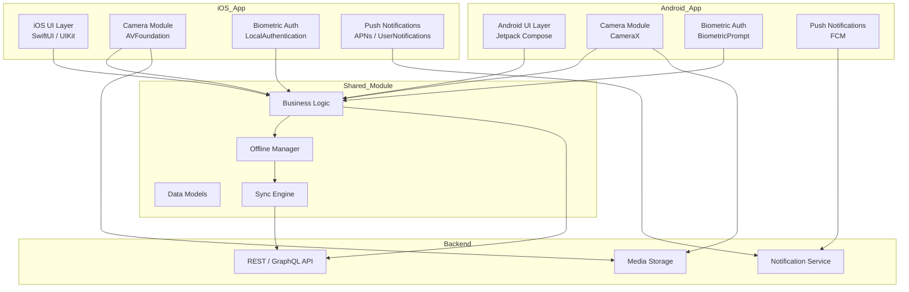

# Design Document

## Overview

The advanced-mobile-app feature delivers native iOS and Android applications sharing a common business logic layer. The architecture separates platform-specific UI and system integrations (camera, biometrics, push notifications) from shared data models, sync logic, and offline management. Both apps target modern OS versions (iOS 15+, Android 8.0+) and are optimized for 60 fps performance, sub-3-second launch times, and resilient offline operation.

Key design goals:
- Maximize code reuse through a `Shared_Module` while keeping platform-specific code idiomatic
- Provide seamless offline-first experience with automatic background sync
- Secure biometric authentication using OS-level APIs only (no raw biometric data stored)
- Efficient media handling with compression and duration limits before upload

---

## Architecture



The architecture follows a layered approach:

1. **Platform Layer** — Native UI, camera, biometrics, and push notification integrations per platform
2. **Shared Module** — Business logic, data models, offline manager, and sync engine shared across platforms
3. **Backend** — REST/GraphQL API, notification service, and media storage

---

## Components and Interfaces

### Shared Module

The shared module is written in Kotlin Multiplatform (KMP), targeting iOS (via Kotlin/Native) and Android. It exposes platform-agnostic interfaces consumed by each native layer.

```kotlin
// Offline Manager interface
interface OfflineManager {
    fun getCachedContent(key: String): CachedContent?
    fun enqueueWrite(operation: WriteOperation)
    fun getCacheAge(key: String): Duration
    fun clearExpiredCache(maxAge: Duration = 7.days)
}

// Sync Engine interface
interface SyncEngine {
    fun syncPendingOperations(): Flow<SyncResult>
    fun resolveConflict(local: WriteOperation, remote: WriteOperation): WriteOperation
}

// Business Logic facade
interface AppRepository {
    fun getContent(id: String): Flow<Content>
    fun saveContent(content: Content): Flow<SaveResult>
}
```

### iOS Platform Layer

- **UI**: SwiftUI with UIKit fallbacks for complex interactions
- **Camera**: `AVFoundation` for capture; `PhotosUI` for library selection; image compression via `ImageIO`
- **Biometrics**: `LocalAuthentication` framework; credentials stored in iOS Keychain
- **Push**: APNs via `UserNotifications` framework; deep-link routing via `UNUserNotificationCenterDelegate`

### Android Platform Layer

- **UI**: Jetpack Compose with Material 3
- **Camera**: `CameraX` for capture; `ActivityResultContracts.PickVisualMedia` for library selection; compression via `Bitmap` API
- **Biometrics**: `BiometricPrompt` API; credentials stored in Android Keystore
- **Push**: Firebase Cloud Messaging (FCM); deep-link routing via `Intent` extras

### Push Notification Service

The backend notification service fans out to APNs (iOS) and FCM (Android). Device tokens are registered on permission grant and refreshed on token rotation.

```
POST /api/devices/register
{ "platform": "ios" | "android", "token": "<device_token>", "userId": "<user_id>" }
```

### Camera Module

Both platform implementations share the same constraints enforced in the Shared Module:
- Max photo size: 5 MB (compress before upload)
- Max video duration: 60 seconds
- Fallback to photo library if no camera hardware

---

## Data Models

### Content

```kotlin
data class Content(
    val id: String,
    val title: String,
    val body: String,
    val mediaUrls: List<String>,
    val createdAt: Instant,
    val updatedAt: Instant
)
```

### CachedContent

```kotlin
data class CachedContent(
    val content: Content,
    val cachedAt: Instant,
    val expiresAt: Instant  // cachedAt + 7 days
)
```

### WriteOperation

```kotlin
data class WriteOperation(
    val id: String,
    val type: OperationType,  // CREATE, UPDATE, DELETE
    val payload: String,      // JSON-serialized content
    val timestamp: Instant,
    val retryCount: Int = 0
)

enum class OperationType { CREATE, UPDATE, DELETE }
```

### SyncResult

```kotlin
sealed class SyncResult {
    data class Success(val syncedCount: Int) : SyncResult()
    data class Conflict(val local: WriteOperation, val remote: WriteOperation, val resolved: WriteOperation) : SyncResult()
    data class Failure(val error: Throwable, val retryAfter: Duration) : SyncResult()
}
```

### DeviceRegistration

```kotlin
data class DeviceRegistration(
    val userId: String,
    val platform: Platform,   // IOS, ANDROID
    val token: String,
    val registeredAt: Instant
)
```

### BiometricCredential

```kotlin
data class BiometricCredential(
    val userId: String,
    val credentialRef: String,  // Keychain/Keystore reference — no raw biometric data
    val enabledAt: Instant
)
```

---

## Correctness Properties

*A property is a characteristic or behavior that should hold true across all valid executions of a system — essentially, a formal statement about what the system should do. Properties serve as the bridge between human-readable specifications and machine-verifiable correctness guarantees.*

### Property 1: Unhandled exception produces recoverable state

*For any* unhandled exception thrown in either the iOS or Android app, the error handler must log the error details and transition the UI to a recoverable error screen rather than terminating the process.

**Validates: Requirements 1.5, 2.5**

---

### Property 2: Offline cache read round-trip

*For any* content item that has been cached by the Offline_Manager, querying that item while the device is offline must return the same content that was originally cached.

**Validates: Requirements 3.1**

---

### Property 3: Offline write operations are queued

*For any* write operation performed while the device has no network connection, that operation must appear in the Offline_Manager's pending queue and must not be silently dropped.

**Validates: Requirements 3.2**

---

### Property 4: Last-write-wins conflict resolution

*For any* pair of conflicting WriteOperations (one local, one remote) with different timestamps, the Sync_Engine's conflict resolver must return the operation with the later timestamp as the winner.

**Validates: Requirements 3.4**

---

### Property 5: Cache retention for 7 days

*For any* cached content item, the Offline_Manager must not mark it as expired until at least 7 days have elapsed since it was cached.

**Validates: Requirements 3.5**

---

### Property 6: Sync retry respects exponential backoff and max attempts

*For any* sequence of server errors during synchronization, the Sync_Engine must not exceed 5 retry attempts, and each successive retry delay must be at least double the previous delay.

**Validates: Requirements 3.6**

---

### Property 7: Device token registration on permission grant

*For any* device token produced after a user grants notification permission, that token must be present in the backend's registered device list for that user.

**Validates: Requirements 4.1**

---

### Property 8: Foreground notification triggers in-app banner

*For any* push notification payload received while the app is in the foreground (on either platform), the app must display an in-app notification banner.

**Validates: Requirements 4.2, 4.3**

---

### Property 9: Notification tap navigates to correct content

*For any* push notification payload containing a content ID, tapping that notification must navigate the user to the screen associated with that content ID.

**Validates: Requirements 4.4, 4.5**

---

### Property 10: Camera permission requested before capture

*For any* camera capture initiation where permission has not been previously granted, the Camera_Module must issue a system permission request before attempting to open the camera.

**Validates: Requirements 5.1**

---

### Property 11: Photo compression enforces 5 MB limit

*For any* photo captured by the Camera_Module, the compressed output file size must be less than or equal to 5 MB.

**Validates: Requirements 5.3**

---

### Property 12: Video recording duration limit

*For any* video recording session, the Camera_Module must stop recording at or before 60 seconds of elapsed time.

**Validates: Requirements 5.4**

---

### Property 13: Biometric credential enable/disable round-trip

*For any* user who enables biometric authentication and then disables it, the credential reference must be present in the keychain/keystore after enabling and must be absent after disabling.

**Validates: Requirements 6.1, 6.7**

---

### Property 14: Biometric prompt shown on login when enabled

*For any* login attempt where biometric authentication is enabled for the user, the Biometric_Auth component must present a biometric verification prompt before granting access.

**Validates: Requirements 6.2**

---

### Property 15: Biometric fallback after 3 consecutive failures

*For any* sequence of exactly 3 consecutive biometric verification failures, the Biometric_Auth component must transition to password-based authentication and must not allow further biometric attempts in that session.

**Validates: Requirements 6.4**

---

### Property 16: No raw biometric data stored

*For any* biometric enrollment, the data stored in the keychain or keystore must be a credential reference string only — it must not contain raw biometric data (fingerprint templates, face geometry, etc.).

**Validates: Requirements 6.6**

---

## Error Handling

### Network Errors

- All API calls are wrapped with a result type (`Success` / `Failure`); failures are surfaced to the UI as non-fatal banners unless they block a critical flow
- The Sync_Engine uses exponential backoff (initial delay 1 s, multiplier 2×, max 5 retries) before surfacing a persistent sync failure notification

### Unhandled Exceptions

- Both platforms install a global exception/crash handler at startup
- iOS: `NSSetUncaughtExceptionHandler` + signal handlers
- Android: `Thread.setDefaultUncaughtExceptionHandler`
- On catch: log to the crash reporting service (e.g., Firebase Crashlytics), then navigate to a `RecoverableErrorScreen` that offers "Retry" and "Restart App" actions

### Permission Denials

- Camera denied: show `PermissionDeniedView` with a deep-link to app settings
- Notification denied: show an in-app prompt explaining value; provide a settings deep-link
- Biometric unavailable: hide biometric UI elements entirely; fall back to password-only flow

### Sync Conflicts

- Last-write-wins is applied automatically
- A non-blocking conflict notification is shown to the user (e.g., "Some changes were overwritten by a newer version")
- Conflict details are logged for debugging

### Media Errors

- If compression fails, the upload is aborted and the user is shown an error with a retry option
- If the device has no camera, camera capture buttons are hidden; only library selection is shown

---

## Testing Strategy

### Dual Testing Approach

Both unit tests and property-based tests are required. They are complementary:
- **Unit tests** cover specific examples, integration points, and edge cases
- **Property-based tests** verify universal correctness across randomized inputs

### Property-Based Testing

**Library selection:**
- iOS: [SwiftCheck](https://github.com/typelift/SwiftCheck)
- Android / Shared (KMP): [Kotest Property Testing](https://kotest.io/docs/proptest/property-based-testing.html)

Each property test must run a minimum of **100 iterations**.

Each test must include a comment tag in the format:
```
// Feature: advanced-mobile-app, Property <N>: <property_text>
```

Mapping of design properties to tests:

| Property | Test Description |
|---|---|
| 1 | Generate random `Throwable` instances; verify error handler logs and returns `RecoverableErrorScreen` state |
| 2 | Generate random `Content` objects; cache them; simulate offline; verify retrieval returns same content |
| 3 | Generate random `WriteOperation` values while offline; verify each appears in the pending queue |
| 4 | Generate pairs of `WriteOperation` with random timestamps; verify resolver returns the later one |
| 5 | Generate cached items with random cache times; verify expiry is not set before 7 days |
| 6 | Simulate server errors; verify retry count ≤ 5 and delays follow 2× backoff |
| 7 | Generate random device tokens; simulate permission grant; verify token in registered list |
| 8 | Generate random notification payloads; deliver in foreground; verify banner is shown |
| 9 | Generate random notification payloads with content IDs; simulate tap; verify navigation target matches content ID |
| 10 | Simulate capture initiation without permission; verify permission request is issued |
| 11 | Generate random image data; compress; verify output ≤ 5 MB |
| 12 | Simulate recording sessions; verify stop is triggered at or before 60 s |
| 13 | Generate random users; enable then disable biometrics; verify credential present then absent |
| 14 | Generate random login attempts with biometrics enabled; verify biometric prompt is shown |
| 15 | Generate sequences of 3 consecutive failures; verify fallback to password auth |
| 16 | Generate biometric enrollments; verify stored value is a reference string, not raw biometric data |

### Unit Tests

Focus unit tests on:
- Specific launch-time examples (verify main interface renders within 3 s on a mocked clock)
- Notification permission denied → in-app prompt appears (iOS and Android)
- Camera permission denied → explanatory message and settings link shown
- Device without camera → camera capture disabled, library selection shown
- Device without biometric support → biometric options hidden
- Biometric verification success → access granted (example with mocked OS API)
- Sync triggered within 30 s of connectivity restoration (mocked network monitor + clock)

### Integration Tests

- End-to-end offline → sync flow: write while offline, restore connectivity, verify server receives operations
- Push notification deep-link routing: inject notification payload, verify correct screen is rendered
- Camera capture → compress → upload pipeline
