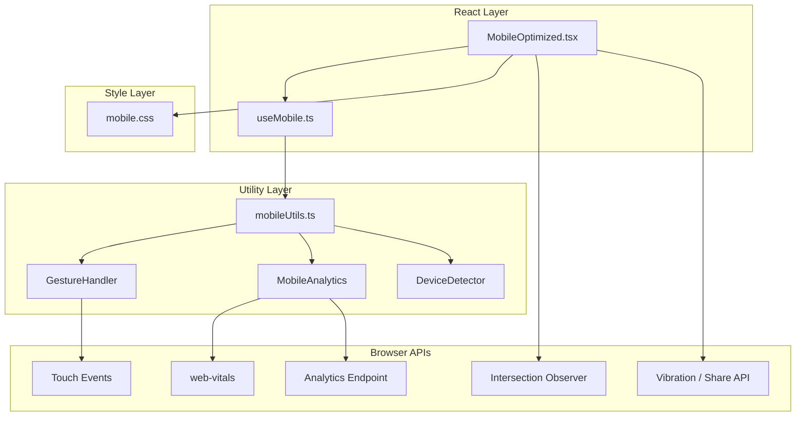

# Design Document: Advanced Mobile Optimization

## Overview

This feature delivers a comprehensive mobile optimization layer for the frontend application. It is implemented across four files: `MobileOptimized.tsx` (the primary React component), `useMobile.ts` (the state/capability hook), `mobileUtils.ts` (gesture handling, device detection, analytics), and `mobile.css` (touch and layout styles).

The design targets a native-feeling mobile experience by addressing touch responsiveness, adaptive layouts, performance budgets, gesture recognition, device-capability detection, and analytics collection — all without introducing new runtime dependencies beyond `web-vitals` (already a standard Next.js companion).

The stack is Next.js 15 / React 19 / TypeScript / Tailwind CSS 4. Property-based tests use `fast-check`, which will be added as a dev dependency.

---

## Architecture



Data flows in one direction: browser APIs feed into utility functions, which are consumed by the hook, which drives the component. Analytics events are fire-and-forget side effects that do not affect render state.

---

## Components and Interfaces

### `useMobile` hook

```typescript
interface DeviceProfile {
  isTouchDevice: boolean;
  pixelRatio: number;
  viewportWidth: number;
  viewportHeight: number;
  os: 'ios' | 'android' | 'other';
  hasFinePointer: boolean;
}

interface UseMobileReturn {
  deviceProfile: DeviceProfile;
  isStandalone: boolean;
  orientation: 'portrait' | 'landscape';
  breakpoint: 'xs' | 'sm' | 'md' | 'lg' | 'xl';
}
```

The hook subscribes to `resize` and `orientationchange` events (debounced at 16ms via `mobileUtils.debounce`) and updates state within one animation frame using `requestAnimationFrame`.

### `GestureHandler` (in `mobileUtils.ts`)

```typescript
type GestureType = 'tap' | 'long-press' | 'swipe-left' | 'swipe-right' | 'swipe-up' | 'swipe-down' | 'pinch';

interface GestureEvent {
  type: GestureType;
  targetId: string;
  velocity?: number;      // px/ms, for swipes
  scale?: number;         // ratio, for pinch
  timestamp: number;
}

interface GestureHandlerOptions {
  onGesture: (event: GestureEvent) => void;
  element: HTMLElement;
}

function attachGestureHandler(options: GestureHandlerOptions): () => void;
// returns a cleanup function that removes all listeners
```

Gesture recognition logic:
- Swipe: displacement ≥ 50px AND duration ≤ 300ms AND velocity ≥ 0.3 px/ms
- Long-press: touch held ≥ 500ms without movement > 10px
- Pinch: two simultaneous touches; scale = finalDistance / initialDistance
- Multi-touch start cancels any in-progress single-touch gesture

### `MobileAnalytics` (in `mobileUtils.ts`)

```typescript
interface AnalyticsEvent {
  name: string;
  payload: Record<string, string | number | boolean>;
  timestamp: number;
}

interface MobileAnalyticsConfig {
  endpoint: string;
  flushIntervalMs?: number;   // default 10_000
  maxBatchSize?: number;      // default 20
  maxRetries?: number;        // default 3
}

function createMobileAnalytics(config: MobileAnalyticsConfig): {
  record(event: AnalyticsEvent): void;
  flush(): Promise<void>;
  destroy(): void;
};
```

Batching: events accumulate in memory. A `setInterval` fires every 10 seconds; the batch also flushes immediately when it reaches 20 events. On flush failure, exponential backoff retries at 1s, 2s, 4s before dropping the batch.

### `MobileOptimized` component

```typescript
interface MobileOptimizedProps {
  children: React.ReactNode;
  analyticsEndpoint?: string;
  gestureHandlers?: Partial<Record<GestureType, (e: GestureEvent) => void>>;
  enableHaptics?: boolean;
  enableShare?: boolean;
}
```

Responsibilities:
- Wraps children in a layout container that applies responsive column rules
- Attaches `GestureHandler` to the root element via `useEffect`
- Manages lazy-loading via `IntersectionObserver` for `` and deferred components
- Applies safe-area insets on iOS
- Exposes share and haptic actions to children via context

---

## Data Models

### `DeviceProfile`

| Field | Type | Source |
|---|---|---|
| `isTouchDevice` | `boolean` | `'ontouchstart' in window` |
| `pixelRatio` | `number` | `window.devicePixelRatio` |
| `viewportWidth` | `number` | `window.innerWidth` |
| `viewportHeight` | `number` | `window.innerHeight` |
| `os` | `'ios' \| 'android' \| 'other'` | `navigator.userAgent` parsing |
| `hasFinePointer` | `boolean` | `matchMedia('(pointer: fine)')` |

OS detection rules (applied in order):
1. `/iphone|ipad|ipod/i` → `'ios'`
2. `/android/i` → `'android'`
3. Otherwise → `'other'`

### Analytics Event Payload

All analytics events are plain objects with no PII. The `target` field is the element's `data-analytics-id` attribute (a developer-assigned string), never user-generated content.

```typescript
// touch_interaction
{ gesture: GestureType; targetId: string; timestamp: number }

// viewport_change
{ width: number; height: number; orientation: 'portrait' | 'landscape'; timestamp: number }

// web_vitals (LCP, CLS, FID, INP)
{ metric: string; value: number; timestamp: number }

// performance_budget_exceeded
{ metric: 'LCP' | 'CLS'; value: number; threshold: number; timestamp: number }
```

### Breakpoint Map

| Name | Min width | Layout |
|---|---|---|
| `xs` | 320px | single-column |
| `sm` | 480px | single-column |
| `md` | 768px | two-column |
| `lg` | 1024px | full desktop |
| `xl` | 1280px | full desktop |

---

## Correctness Properties

*A property is a characteristic or behavior that should hold true across all valid executions of a system — essentially, a formal statement about what the system should do. Properties serve as the bridge between human-readable specifications and machine-verifiable correctness guarantees.*

### Property 1: Long-press event dispatch

*For any* interactive element with a gesture handler attached, when a touch is held for 500ms or more without movement exceeding 10px, the GestureHandler SHALL dispatch exactly one `long-press` event.

**Validates: Requirements 1.2**

---

### Property 2: Touch target minimum size

*For any* interactive element whose rendered width or height is less than 44px, the computed hit-area dimensions exposed by MobileOptimized SHALL be at least 44px in both dimensions.

**Validates: Requirements 1.3**

---

### Property 3: Prevent default on interactive controls

*For any* interactive element with custom touch handling registered, when a TouchEvent fires on that element, `preventDefault()` SHALL have been called on the event before it reaches the document root.

**Validates: Requirements 1.5**

---

### Property 4: Breakpoint-to-layout mapping

*For any* viewport width value, the layout returned by `ResponsiveLayout` SHALL be:
- single-column for widths in [320, 767]
- two-column for widths in [768, 1023]
- full desktop for widths ≥ 1024

**Validates: Requirements 2.2, 2.3, 2.4**

---

### Property 5: Animation reduction on low-concurrency devices

*For any* device where `navigator.hardwareConcurrency` is 4 or fewer, `MobileUtils.shouldReduceAnimations()` SHALL return `true`, and for any device where it is 5 or greater, it SHALL return `false`.

**Validates: Requirements 3.2**

---

### Property 6: Virtualized list rendering threshold

*For any* list with more than 50 items, the number of DOM nodes rendered by MobileOptimized SHALL not exceed the count of items that fit within 1.5× the current viewport height, plus a small overscan buffer.

**Validates: Requirements 3.5**

---

### Property 7: Debounce correctness

*For any* sequence of scroll or resize events fired within a 16ms window, the debounced handler SHALL be invoked at most once per 16ms interval, regardless of how many events were fired.

**Validates: Requirements 3.6**

---

### Property 8: inputmode attribute correctness

*For any* form input element of type `tel`, `email`, or `number` rendered by MobileOptimized, the element SHALL have an `inputmode` attribute set to the appropriate value (`tel`, `email`, or `numeric` respectively).

**Validates: Requirements 4.3**

---

### Property 9: Swipe dispatch with direction and velocity

*For any* touch sequence where the displacement is ≥ 50px in a primary axis, the duration is ≤ 300ms, and the velocity is ≥ 0.3 px/ms, the GestureHandler SHALL dispatch a swipe event with the correct direction (`swipe-left`, `swipe-right`, `swipe-up`, or `swipe-down`) and a `velocity` value equal to displacement divided by duration.

**Validates: Requirements 5.1, 5.2**

---

### Property 10: Pinch scale calculation

*For any* two-finger pinch gesture, the `scale` value in the dispatched `pinch` event SHALL equal the Euclidean distance between the two touch points at gesture end divided by the distance at gesture start.

**Validates: Requirements 5.3**

---

### Property 11: Gesture propagation to ancestor

*For any* gesture event dispatched on an element that has no registered handler for that gesture type, the event SHALL be delivered to the nearest ancestor element that does have a registered handler for that gesture type.

**Validates: Requirements 5.4**

---

### Property 12: Velocity threshold prevents swipe

*For any* touch sequence where the velocity is less than 0.3 px/ms, the GestureHandler SHALL NOT dispatch any swipe event, regardless of displacement or duration.

**Validates: Requirements 5.5**

---

### Property 13: Multi-touch cancels in-progress single-touch gesture

*For any* element with an in-progress single-touch gesture (tap, long-press, or swipe tracking), when a second touch point is added, the single-touch gesture SHALL be cancelled and no single-touch event SHALL be dispatched for that interaction.

**Validates: Requirements 5.6**

---

### Property 14: High-DPI image srcset

*For any* image rendered by MobileOptimized on a device where `DeviceProfile.pixelRatio` is 2 or greater, the `` element SHALL have a `srcset` attribute containing a 2x descriptor entry.

**Validates: Requirements 6.2**

---

### Property 15: Hover state conditional on hasFinePointer

*For any* interactive element rendered by MobileOptimized, hover CSS classes SHALL be present if and only if `DeviceProfile.hasFinePointer` is `true`.

**Validates: Requirements 6.3, 6.4**

---

### Property 16: OS detection from userAgent

*For any* userAgent string containing `/iphone|ipad|ipod/i`, `detectOS()` SHALL return `'ios'`; for any string containing `/android/i` (and not matching iOS), it SHALL return `'android'`; for all other strings it SHALL return `'other'`.

**Validates: Requirements 6.5**

---

### Property 17: touch_interaction analytics event completeness

*For any* gesture (tap, swipe, or long-press) processed by GestureHandler, MobileAnalytics SHALL record exactly one `touch_interaction` event containing `gesture`, `targetId`, and `timestamp` fields.

**Validates: Requirements 7.1**

---

### Property 18: viewport_change analytics event completeness

*For any* change in viewport width or height, MobileAnalytics SHALL record exactly one `viewport_change` event containing `width`, `height`, `orientation`, and `timestamp` fields.

**Validates: Requirements 7.2**

---

### Property 19: Performance budget exceeded event

*For any* Web Vitals metric where LCP > 2500ms or CLS > 0.1, MobileAnalytics SHALL record a `performance_budget_exceeded` event containing the `metric` name, the measured `value`, and the `threshold`.

**Validates: Requirements 7.4**

---

### Property 20: Batch flush at event count threshold

*For any* sequence of analytics events, when the 20th event is added to the batch, MobileAnalytics SHALL flush the batch to the endpoint immediately without waiting for the 10-second timer.

**Validates: Requirements 7.5**

---

### Property 21: Retry on non-2xx response

*For any* analytics batch flush where the endpoint returns a non-2xx HTTP status, MobileAnalytics SHALL retry the request up to 3 times with delays of 1s, 2s, and 4s respectively, and SHALL NOT retry a 4th time.

**Validates: Requirements 7.6**

---

### Property 22: No PII in analytics payloads

*For any* analytics event recorded by MobileAnalytics, the serialized payload SHALL NOT contain any field named or valued as a known PII identifier (e.g., `email`, `name`, `phone`, `userId`, `ip`).

**Validates: Requirements 7.7**

---

## Error Handling

| Scenario | Handling |
|---|---|
| `navigator.share` not available | Share button is hidden; no error thrown |
| `navigator.vibrate` not available | Haptic call is a no-op; no error thrown |
| `IntersectionObserver` not available | Images load eagerly as fallback |
| Analytics endpoint unreachable | Retry with exponential backoff (3 attempts); batch dropped after final failure; error logged to console in dev |
| `web-vitals` metric callback never fires | No event recorded; no timeout error |
| Touch events on non-touch device | GestureHandler attaches no listeners; mouse events handled separately |
| Invalid `userAgent` string | `detectOS` returns `'other'` |
| Viewport width below 320px | Treated as 320px (minimum supported width) |
| Multi-touch on element with no pinch handler | Gesture is ignored; no error |

All public utility functions are wrapped in try/catch. Errors in analytics recording are swallowed silently in production (to avoid disrupting the user experience) and logged in development.

---

## Testing Strategy

### Dual Testing Approach

Both unit tests and property-based tests are required. They are complementary:
- Unit tests cover specific examples, integration points, and edge cases
- Property tests verify universal correctness across randomized inputs

### Property-Based Testing

Library: **`fast-check`** (added as a dev dependency).

Each property test runs a minimum of **100 iterations**. Each test is tagged with a comment in the format:

```
// Feature: advanced-mobile-optimization, Property N: <property text>
```

Each correctness property defined above maps to exactly one property-based test.

Example structure:

```typescript
import fc from 'fast-check';
import { detectOS } from '../utils/mobileUtils';

// Feature: advanced-mobile-optimization, Property 16: OS detection from userAgent
test('detectOS returns ios for iOS userAgent strings', () => {
  fc.assert(
    fc.property(
      fc.constantFrom('Mozilla/5.0 (iPhone; CPU iPhone OS 17_0)', 'iPad/...', 'iPod/...'),
      (ua) => detectOS(ua) === 'ios'
    ),
    { numRuns: 100 }
  );
});
```

### Unit Tests

Unit tests cover:
- Breakpoint configuration values (Req 2.1)
- IntersectionObserver rootMargin is `'200px'` (Req 3.1)
- Web Share API invocation (Req 4.1)
- Haptic vibration call with value `10` (Req 4.2)
- `isStandalone` boolean derivation (Req 4.4)
- Safe-area inset CSS applied on iOS (Req 4.5)
- `DeviceProfile` shape and field types (Req 6.1)
- Hover state CSS applied when `hasFinePointer` is true (Req 6.3)
- Hover state CSS absent when `hasFinePointer` is false (Req 6.4)
- Web Vitals events recorded via mocked `web-vitals` (Req 7.3)

### Test File Locations

| Test file | Covers |
|---|---|
| `frontend/__tests__/mobileUtils.test.ts` | GestureHandler, DeviceDetector, debounce, OS detection |
| `frontend/__tests__/mobileAnalytics.test.ts` | MobileAnalytics batching, retry, PII checks |
| `frontend/__tests__/useMobile.test.ts` | Hook state, DeviceProfile, orientation updates |
| `frontend/__tests__/MobileOptimized.test.tsx` | Component rendering, layout, touch targets, inputmode |
