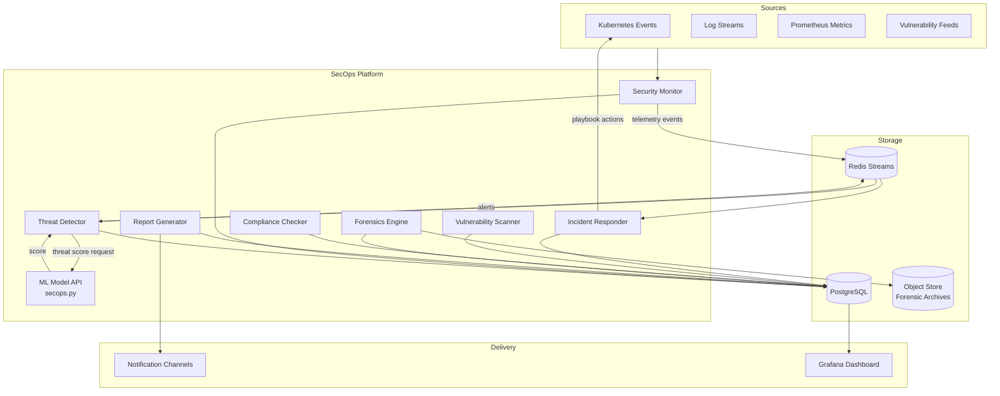

# Design Document: Advanced Security Operations

## Overview

The Advanced Security Operations (SecOps) platform is a unified security lifecycle system built on top of the existing FlavorSnap infrastructure. It integrates with the Kubernetes cluster (`k8s/security/`), the ML model API (`ml-model-api/secops.py`), and automation scripts (`scripts/security/`) to deliver real-time threat detection, automated incident response, continuous monitoring, vulnerability management, compliance checking, forensics, and structured reporting.

The platform is designed as a set of loosely coupled Python services deployed as Kubernetes workloads in a dedicated `secops` namespace. Each component exposes a well-defined internal API and shares a common event bus (Redis Streams) and a PostgreSQL-backed persistence layer. The existing Prometheus/Grafana monitoring stack is extended to cover all SecOps metrics.

### Key Design Decisions

- **Event-driven architecture**: Components communicate via Redis Streams rather than direct HTTP calls, enabling decoupling and replay.
- **ML-augmented detection**: The `ML_Model_API` (`ml-model-api/secops.py`) provides threat scoring; rule-based detection acts as a fallback.
- **Immutable audit trail**: All state changes are append-only; forensic archives use content-addressed storage with SHA-256 verification.
- **Policy-as-code**: Compliance policies are versioned YAML files evaluated by an OPA (Open Policy Agent) sidecar.
- **Dual testing**: Unit tests cover specific examples and edge cases; property-based tests (Hypothesis) verify universal invariants.

---

## Architecture



### Deployment Layout

```
k8s/security/
  namespace.yaml          # secops namespace
  threat-detector.yaml    # Deployment + Service
  incident-responder.yaml
  security-monitor.yaml
  vulnerability-scanner.yaml
  compliance-checker.yaml
  forensics-engine.yaml
  report-generator.yaml
  rbac.yaml               # ServiceAccount, Roles, RoleBindings
  configmap.yaml          # shared configuration
  secrets.yaml            # sealed secrets

security-operations/
  threat_detector.py
  incident_responder.py
  security_monitor.py
  vulnerability_scanner.py
  compliance_checker.py
  forensics_engine.py
  report_generator.py
  models.py               # shared data models
  event_bus.py            # Redis Streams wrapper
  db.py                   # SQLAlchemy session factory

ml-model-api/
  secops.py               # ML inference endpoint for threat scoring

scripts/security/
  run_scan.py             # CLI wrapper for Vulnerability_Scanner
  run_compliance.py       # CLI wrapper for Compliance_Checker
  collect_forensics.py    # CLI wrapper for Forensics_Engine
  generate_report.py      # CLI wrapper for Report_Generator
```

---

## Components and Interfaces

### Security Monitor

Collects telemetry from registered sources on a configurable interval (≤60 s). Emits raw telemetry events to the `secops.telemetry` Redis Stream and connectivity alerts when a source is unreachable.

```python
class SecurityMonitor:
    def register_source(self, source: TelemetrySource) -> None: ...
    def collect_all(self) -> list[TelemetryRecord]: ...
    def get_health(self) -> dict[str, SourceStatus]: ...  # GET /secops/monitor/health
```

### Threat Detector

Consumes `secops.telemetry` events, evaluates them against active detection rules, and optionally calls `ML_Model_API` for a threat score. Produces `Alert` records with deduplication within a 60-second window.

```python
class ThreatDetector:
    def evaluate(self, event: TelemetryRecord) -> list[Alert]: ...
    def reload_rules(self) -> None: ...          # hot-reload without restart
    def set_ml_threshold(self, threshold: float) -> None: ...
```

### Incident Responder

Consumes `secops.alerts` stream. Opens `Incident` records for Critical/High alerts within 30 s, executes playbooks, records actions, retries with exponential backoff, and prevents duplicate incidents.

```python
class IncidentResponder:
    def handle_alert(self, alert: Alert) -> Incident | None: ...
    def execute_playbook(self, incident: Incident) -> list[ActionRecord]: ...
    def manual_override(self, incident_id: str, action: OverrideAction, operator: str) -> None: ...
```

### Vulnerability Scanner

Scans a target's software inventory against CVE feeds. Assigns CVSS-based severity, creates alerts for Critical/High findings, supports scheduled and on-demand scans.

```python
class VulnerabilityScanner:
    def scan(self, target: ScanTarget) -> ScanResult: ...
    def schedule(self, target: ScanTarget, cron: str) -> None: ...
```

### Compliance Checker

Evaluates a target system against a versioned Policy (YAML). Uses OPA for rule evaluation. Returns structured results with per-rule pass/fail/inconclusive outcomes and remediation guidance.

```python
class ComplianceChecker:
    def check(self, target: ComplianceTarget, policy: Policy) -> ComplianceResult: ...
    def load_policy(self, path: str) -> Policy: ...
```

### Forensics Engine

Collects artifacts from an affected resource, computes SHA-256 hashes, preserves original timestamps, produces a collection manifest, and enforces RBAC on archive access.

```python
class ForensicsEngine:
    def collect(self, incident: Incident, collector_identity: str) -> ForensicsManifest: ...
    def get_artifact(self, artifact_id: str, requester: str) -> bytes: ...  # RBAC enforced
```

### Report Generator

Aggregates data from PostgreSQL, renders PDF and JSON reports, delivers to notification channels, and retains reports for ≥1 year.

```python
class ReportGenerator:
    def generate(self, period: ReportPeriod, fmt: ReportFormat) -> Report: ...
    def schedule(self, cron: str, channels: list[NotificationChannel]) -> None: ...
```

### ML Model API — secops.py

New module in `ml-model-api/` that exposes a `/secops/score` endpoint. Accepts a normalized event payload and returns a `threat_score` (0.0–1.0) and a `model_version` string.

```python
@app.route('/secops/score', methods=['POST'])
def score_event() -> dict:
    # Returns: {"threat_score": float, "model_version": str}
```

---

## Data Models

```python
from dataclasses import dataclass, field
from datetime import datetime
from enum import Enum
from typing import Optional

class Severity(str, Enum):
    CRITICAL = "Critical"
    HIGH     = "High"
    MEDIUM   = "Medium"
    LOW      = "Low"

class IncidentStatus(str, Enum):
    OPEN     = "Open"
    CLOSED   = "Closed"
    ESCALATED = "Escalated"

@dataclass
class Alert:
    id: str
    rule_id: str
    affected_resource: str
    severity: Severity
    timestamp: datetime
    detection_source: str          # "ml" | "rule"
    threat_score: Optional[float]  # None when rule-only

@dataclass
class Incident:
    id: str
    alert_id: str
    rule_id: str
    affected_resource: str
    severity: Severity
    status: IncidentStatus
    opened_at: datetime
    actions: list["ActionRecord"] = field(default_factory=list)

@dataclass
class ActionRecord:
    action_type: str
    executor: str
    timestamp: datetime
    outcome: str                   # "success" | "failed" | "retrying"
    attempt: int

@dataclass
class TelemetryRecord:
    source_id: str
    collected_at: datetime         # UTC
    payload: dict

@dataclass
class ScanResult:
    target: str
    scan_id: str
    started_at: datetime
    completed_at: Optional[datetime]
    findings: list["VulnFinding"]
    status: str                    # "completed" | "failed" | "partial"

@dataclass
class VulnFinding:
    cve_id: str
    cvss_score: float
    severity: Severity
    affected_component: str
    remediation: str

@dataclass
class Policy:
    name: str
    version: str
    framework: str                 # "CIS" | "NIST-800-53" | "SOC2"
    rules: list["PolicyRule"]

@dataclass
class PolicyRule:
    id: str
    description: str
    remediation: str

@dataclass
class ComplianceResult:
    policy_name: str
    policy_version: str
    evaluated_at: datetime
    outcomes: list["RuleOutcome"]

@dataclass
class RuleOutcome:
    rule_id: str
    result: str                    # "pass" | "fail" | "inconclusive"
    error_message: Optional[str]
    remediation: Optional[str]

@dataclass
class Artifact:
    id: str
    path: str
    sha256: str
    collected_at: datetime
    original_mtime: datetime
    source_id: str

@dataclass
class ForensicsManifest:
    incident_id: str
    collected_by: str
    collection_started_at: datetime
    collection_completed_at: datetime
    artifacts: list[Artifact]
    failures: list[dict]           # {"path": str, "reason": str}

@dataclass
class Report:
    id: str
    period_start: datetime
    period_end: datetime
    generated_at: datetime
    format: str                    # "pdf" | "json"
    alert_counts: dict[Severity, int]
    incident_counts: dict[IncidentStatus, int]
    vuln_summary: dict[Severity, int]
    compliance_pass_rates: dict[str, float]
    content: bytes
```

### CVSS → Severity Mapping

| CVSS Range | Severity |
|---|---|
| 9.0 – 10.0 | Critical |
| 7.0 – 8.9  | High |
| 4.0 – 6.9  | Medium |
| 0.1 – 3.9  | Low |

---

## Correctness Properties

*A property is a characteristic or behavior that should hold true across all valid executions of a system — essentially, a formal statement about what the system should do. Properties serve as the bridge between human-readable specifications and machine-verifiable correctness guarantees.*

### Property 1: Threat evaluation covers all active rules

*For any* ingested security event and any set of active detection rules, the set of rule IDs referenced in the evaluation result must equal the set of active rule IDs.

**Validates: Requirements 1.1**

---

### Property 2: ML-triggered alerts contain all required fields

*For any* security event where the ML_Model_API returns a threat score above the configured threshold, the generated Alert must contain a non-null Severity, timestamp, affected_resource, and rule_id.

**Validates: Requirements 1.2**

---

### Property 3: Alert deduplication within 60-second window

*For any* sequence of matching events sharing the same rule_id and affected_resource that all arrive within a 60-second window, the Threat_Detector must produce exactly one Alert.

**Validates: Requirements 1.3**

---

### Property 4: Hot-reload applies new rules immediately

*For any* detection rule added after `reload_rules()` is called, the next evaluated event must be checked against that rule without a service restart.

**Validates: Requirements 1.5**

---

### Property 5: Critical and High alerts always open an Incident

*For any* Alert with Severity Critical or High, calling `handle_alert` must return a non-None Incident record.

**Validates: Requirements 2.1**

---

### Property 6: Playbook executed matches alert rule

*For any* opened Incident, the playbook that is executed must be the one associated with the Alert's rule_id.

**Validates: Requirements 2.2**

---

### Property 7: Action records contain all required fields

*For any* executed containment action, the resulting ActionRecord must contain a non-null action_type, executor, timestamp, and outcome.

**Validates: Requirements 2.3**

---

### Property 8: Failed actions are retried exactly 3 times before escalation

*For any* containment action that always fails, the total number of recorded attempts must be exactly 3 and the final outcome must be "failed".

**Validates: Requirements 2.4**

---

### Property 9: No duplicate Incidents for the same open resource+rule

*For any* sequence of Critical or High alerts with the same affected_resource and rule_id while an Incident is in the Open state, exactly one Incident record must exist for that resource+rule combination.

**Validates: Requirements 2.5**

---

### Property 10: Every registered source appears in collection results

*For any* set of registered telemetry sources, `collect_all()` must return at least one TelemetryRecord per registered source (or a connectivity Alert if the source is unreachable).

**Validates: Requirements 3.1**

---

### Property 11: Telemetry records contain UTC timestamp and source identifier

*For any* TelemetryRecord produced by a collection cycle, the `collected_at` field must be a valid UTC datetime and `source_id` must be non-empty.

**Validates: Requirements 3.2**

---

### Property 12: Threshold crossing forwards event to Threat Detector

*For any* metric value that crosses the configured threshold, the Security_Monitor must emit an event to the `secops.telemetry` stream destined for the Threat_Detector.

**Validates: Requirements 3.5**

---

### Property 13: Health endpoint covers all registered sources

*For any* set of registered sources, the health endpoint response must contain a status entry for every registered source.

**Validates: Requirements 3.6**

---

### Property 14: Scan results contain findings for all known CVEs

*For any* scan target with a known software inventory, the ScanResult must contain a VulnFinding for every CVE that affects a component in that inventory.

**Validates: Requirements 4.1**

---

### Property 15: Vulnerability findings contain all required fields

*For any* identified CVE, the VulnFinding must contain a non-null cve_id, cvss_score, affected_component, and remediation.

**Validates: Requirements 4.2**

---

### Property 16: CVSS score maps to correct Severity

*For any* CVSS score in [0.1, 10.0], the assigned Severity must satisfy: score ∈ [9.0, 10.0] → Critical, [7.0, 8.9] → High, [4.0, 6.9] → Medium, [0.1, 3.9] → Low.

**Validates: Requirements 4.3**

---

### Property 17: Critical and High vulnerabilities generate Alerts

*For any* VulnFinding with Severity Critical or High, an Alert must be created with the affected_resource field set to the finding's affected_component.

**Validates: Requirements 4.4**

---

### Property 18: Compliance result covers all policy rules with required fields

*For any* Policy with N rules, the ComplianceResult must contain exactly N RuleOutcomes, and the result must include the policy_name, policy_version, and evaluated_at fields.

**Validates: Requirements 5.1, 5.3**

---

### Property 19: Policy serialization round-trip

*For any* valid Policy object, serializing it to a YAML file and loading it back must produce an equivalent Policy (same name, version, framework, and rules).

**Validates: Requirements 5.2**

---

### Property 20: Failing rules include remediation guidance

*For any* RuleOutcome with result "fail", the remediation field must be non-empty.

**Validates: Requirements 5.6**

---

### Property 21: Forensic artifact integrity and manifest completeness

*For any* completed forensic collection, every Artifact in the manifest must be retrievable, and `sha256(artifact_content)` must equal the recorded SHA-256 hash. The manifest must include the artifact path, hash, collection timestamp, and source identifier for every collected artifact.

**Validates: Requirements 6.1, 6.2, 6.4**

---

### Property 22: Original artifact timestamps are preserved

*For any* collected Artifact, the `original_mtime` recorded in the Artifact model must equal the actual file modification time at the moment of collection.

**Validates: Requirements 6.3**

---

### Property 23: Unauthorized access to forensic archives is rejected

*For any* call to `get_artifact` with a requester identity that does not hold the `forensics-investigator` role, the call must raise an authorization error and return no artifact content.

**Validates: Requirements 6.6**

---

### Property 24: Generated reports contain all required summary fields

*For any* generated Report, the object must contain non-null values for period_start, period_end, alert_counts (keyed by all Severity values), incident_counts (keyed by all IncidentStatus values), vuln_summary, and compliance_pass_rates.

**Validates: Requirements 7.2**

---

### Property 25: Report delivery reaches all configured channels

*For any* scheduled report generation with N configured notification channels, delivery must be attempted to all N channels.

**Validates: Requirements 7.4**

---

## Error Handling

| Component | Failure Mode | Behavior |
|---|---|---|
| Threat_Detector | ML_Model_API unavailable | Fall back to rule-based detection; log `degraded_mode=true` |
| Threat_Detector | Rule file parse error on reload | Retain previous rule set; log error; do not crash |
| Incident_Responder | Playbook action fails | Retry up to 3× with exponential backoff (1s, 2s, 4s); escalate on final failure |
| Incident_Responder | Duplicate incident attempt | Return existing open Incident; do not create a new record |
| Security_Monitor | Source unreachable | Emit connectivity Alert; continue polling at configured interval |
| Vulnerability_Scanner | Target unreachable | Record scan as `status="failed"` with timestamp and reason; retry at next scheduled interval |
| Compliance_Checker | Rule evaluation error | Mark RuleOutcome as `inconclusive`; record rule_id and error_message; continue remaining rules |
| Forensics_Engine | Artifact access denied | Log path and reason; continue collecting remaining artifacts; record failure in manifest |
| Report_Generator | Generation failure | Log failure with timestamp and reason; retry once within 10 minutes |
| Any component | Database unavailable | Surface error to caller; emit health alert; do not silently drop data |

All components emit structured JSON logs with fields: `timestamp`, `component`, `level`, `event`, and `context`. Errors are also emitted as Prometheus counters for alerting.

---

## Testing Strategy

### Dual Testing Approach

Both unit tests and property-based tests are required. They are complementary:

- **Unit tests** cover specific examples, integration points, and edge cases (ML unavailability, unreachable targets, access-denied artifacts, error rule evaluation).
- **Property-based tests** verify universal invariants across randomly generated inputs, catching edge cases that hand-written examples miss.

### Property-Based Testing

**Library**: [Hypothesis](https://hypothesis.readthedocs.io/) (Python)

**Configuration**: Each property test must run a minimum of 100 examples (`@settings(max_examples=100)`).

**Tag format**: Each test must include a comment:
```
# Feature: advanced-security-operations, Property <N>: <property_text>
```

Each correctness property above maps to exactly one Hypothesis test. Key strategies:

- `st.floats(min_value=0.1, max_value=10.0)` for CVSS scores (Property 16)
- `st.lists(st.builds(PolicyRule, ...))` for policy rule sets (Properties 18, 19)
- `st.lists(st.builds(Alert, ...), min_size=1)` for alert sequences (Properties 3, 9)
- `st.binary()` for artifact content (Property 21)
- `st.builds(TelemetryRecord, ...)` for telemetry records (Properties 11, 12)

### Unit Tests

Unit tests focus on:

- **Specific examples**: Known CVE mappings, known playbook associations, specific CVSS boundary values (0.1, 3.9, 4.0, 6.9, 7.0, 8.9, 9.0, 10.0)
- **Edge cases**: ML API unavailability (Property 1.4), unreachable scan targets (4.6), access-denied artifacts (6.5), rule evaluation errors (5.4), report generation failure (7.5)
- **Integration points**: Redis Stream publish/consume, PostgreSQL persistence, OPA policy evaluation, SHA-256 hash computation

### Test Layout

```
tests/
  unit/
    secops/
      test_threat_detector.py
      test_incident_responder.py
      test_security_monitor.py
      test_vulnerability_scanner.py
      test_compliance_checker.py
      test_forensics_engine.py
      test_report_generator.py
  property/
    secops/
      test_threat_detector_props.py
      test_incident_responder_props.py
      test_security_monitor_props.py
      test_vulnerability_scanner_props.py
      test_compliance_checker_props.py
      test_forensics_engine_props.py
      test_report_generator_props.py
  integration/
    secops/
      test_alert_to_incident_flow.py
      test_scan_to_alert_flow.py
      test_report_generation_flow.py
```
