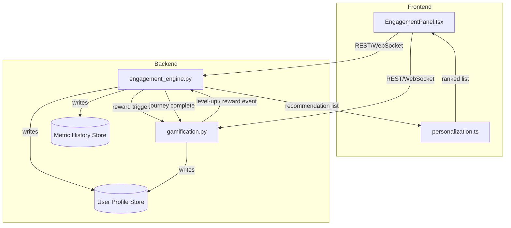

# Design Document: Advanced User Engagement

## Overview

The Advanced User Engagement feature adds a layered engagement system to the platform, combining gamification, personalization, journey tracking, analytics, rewards, social features, and performance monitoring. It spans two layers:

- **Frontend** (`frontend/components/EngagementPanel.tsx`, `frontend/utils/personalization.ts`): Renders engagement state, applies personalization, and surfaces notifications.
- **Backend** (`ml-model-api/engagement_engine.py`, `ml-model-api/gamification.py`): Computes recommendations, tracks journeys, manages gamification state, and exposes REST APIs.

The system is designed around an event-driven model: user actions produce events that flow through the Engagement_Engine and Gamification_Service, updating persistent state and triggering notifications back to the frontend.

---

## Architecture



Key design decisions:
- **Event-driven updates**: Actions emit events; the engine processes them asynchronously within SLA bounds (points within 1s, recommendations within 5s, leaderboard within 10s).
- **Single User_Profile record**: Both services read/write a shared User_Profile store to avoid duplication.
- **WebSocket push for real-time notifications**: Level-up and reward events are pushed to the frontend rather than polled, enabling the ≤500ms display requirement.
- **Metric aggregation on a scheduled job**: Engagement metrics are pre-aggregated on a ≤1-hour cadence and stored in a time-series metric history, making analytics queries fast.

---

## Components and Interfaces

### engagement_engine.py

Responsibilities: personalization, journey tracking, analytics, performance monitoring.

```python
# POST /engine/recommendations
# Body: { user_id, limit? }
# Returns: { recommendations: [{ content_id, score, category }] }

# POST /engine/interactions
# Body: { user_id, content_id, action: "view"|"dismiss"|"click" }
# Returns: { status: "ok" }

# POST /engine/preferences
# Body: { user_id, interests: [str], opt_outs: [str] }
# Returns: { status: "ok" }

# GET /engine/journey/{user_id}
# Returns: { journey_id, completed_milestones: [str], next_milestone: str, completion_pct: float }

# POST /engine/journey/milestone
# Body: { user_id, milestone_id }
# Returns: { status: "ok"|"duplicate" }

# GET /engine/analytics?start=YYYY-MM-DD&end=YYYY-MM-DD
# Returns: { dau: int, avg_engagement_score: float, points_per_day: float, badge_grant_rate: float }
# Error: 400 { error: str } on invalid range

# GET /engine/health
# Returns: { status: "ok"|"degraded", p95_latency_ms: float, error_rate_pct: float }
```

### gamification.py

Responsibilities: points, levels, badges, rewards, leaderboard.

```python
# POST /gamification/action
# Body: { user_id, action_type }
# Returns: { points_awarded: int, new_total: int, level_up: bool, new_level?: int }

# GET /gamification/profile/{user_id}
# Returns: { user_id, points: int, level: int, badges: [BadgeRecord], unlocked_features: [str] }

# POST /gamification/reward/trigger
# Body: { user_id, trigger_event }
# Returns: { granted: bool, reward?: RewardRecord }

# GET /gamification/leaderboard?scope=global|friends|period&period_id?=str
# Returns: { entries: [{ rank, user_id, display_name, score }], requesting_user_rank: int }
```

### EngagementPanel.tsx

Responsibilities: render gamification state, journey progress, leaderboard, analytics summary, health indicator, notifications.

Key props / state:
- `userId: string`
- `isOperator: boolean`
- Fetches profile, journey, leaderboard, analytics (if operator), health on mount
- Subscribes to WebSocket channel for real-time events (level-up, reward, achievement)

### personalization.ts

Responsibilities: apply ranked recommendation list to content ordering, handle dismissals.

```typescript
// rankContent(items: ContentItem[], recommendations: Recommendation[]): ContentItem[]
// reportDismissal(userId: string, contentId: string): Promise<void>
```

---

## Data Models

### UserProfile

```python
@dataclass
class UserProfile:
    user_id: str
    points: int
    level: int
    badges: list[BadgeRecord]
    unlocked_features: list[str]
    journey_states: dict[str, JourneyState]   # journey_id -> state
    preferences: UserPreferences
    is_private: bool
```

### BadgeRecord

```python
@dataclass
class BadgeRecord:
    badge_id: str
    awarded_at: datetime
```

### JourneyState

```python
@dataclass
class JourneyState:
    journey_id: str
    completed_milestones: list[str]
    completed_at: datetime | None
```

### JourneyDefinition

```python
@dataclass
class JourneyDefinition:
    journey_id: str
    milestones: list[MilestoneDefinition]   # ordered

@dataclass
class MilestoneDefinition:
    milestone_id: str
    completion_condition: str
    reward_id: str | None
```

### RewardDefinition

```python
@dataclass
class RewardDefinition:
    reward_id: str
    reward_type: Literal["badge", "points_bonus", "feature_unlock"]
    trigger_condition: str
    value: str | int
    repeatable: bool
```

### RewardRecord

```python
@dataclass
class RewardRecord:
    reward_id: str
    granted_at: datetime
```

### EngagementMetricSnapshot

```python
@dataclass
class EngagementMetricSnapshot:
    snapshot_date: date
    dau: int
    avg_engagement_score: float
    points_per_day: float
    badge_grant_rate: float
```

### Recommendation

```typescript
interface Recommendation {
  content_id: string;
  score: number;
  category: string;
}
```

### ContentItem

```typescript
interface ContentItem {
  id: string;
  category: string;
  [key: string]: unknown;
}
```

---

## Correctness Properties

*A property is a characteristic or behavior that should hold true across all valid executions of a system — essentially, a formal statement about what the system should do. Properties serve as the bridge between human-readable specifications and machine-verifiable correctness guarantees.*

### Property 1: User Profile structural invariant

*For any* user, the User_Profile returned by the Gamification_Service shall always contain a non-negative integer point total, a positive integer level, and a list of badge records (which may be empty).

**Validates: Requirements 1.1**

---

### Property 2: Action awards correct points

*For any* user and any valid action type, after the Gamification_Service processes that action, the user's point total shall increase by exactly the configured point value for that action type.

**Validates: Requirements 1.2**

---

### Property 3: Level advances when threshold crossed

*For any* user whose point total is just below a level threshold, after awarding enough points to cross that threshold, the user's level shall be exactly one higher than before and a level-up event shall have been emitted.

**Validates: Requirements 1.3**

---

### Property 4: Badge grant is idempotent

*For any* user and any badge, granting that badge once and granting it a second time shall produce identical User_Profile state — the badge appears exactly once in the badge list with the timestamp from the first grant.

**Validates: Requirements 1.4, 1.5**

---

### Property 5: Recommendation list is ordered by score descending

*For any* user with interaction history and preferences, the ranked recommendation list returned by the Engagement_Engine shall be sorted in descending order by score, and `rankContent` in Personalization_Util shall preserve that ordering when applied to a content list.

**Validates: Requirements 2.1, 2.3**

---

### Property 6: Dismissed items are excluded from displayed list

*For any* recommendation list and any item in that list, after the user dismisses that item, it shall not appear in the subsequently displayed content list.

**Validates: Requirements 2.4**

---

### Property 7: Opt-out preferences filter recommendations

*For any* user who has opted out of a category, subsequent recommendation lists returned by the Engagement_Engine shall contain no items from that opted-out category.

**Validates: Requirements 2.5**

---

### Property 8: Journey state API returns consistent completion data

*For any* user with an active journey, the journey state API response shall satisfy: `completion_pct == len(completed_milestones) / len(total_milestones) * 100`, `next_milestone` is the first milestone not in `completed_milestones`, and all completed milestone IDs are valid milestone IDs for that journey.

**Validates: Requirements 3.1, 3.2, 3.3**

---

### Property 9: Milestone completion is idempotent

*For any* user and any milestone already marked complete in their journey state, submitting a second completion event for that milestone shall leave the journey state unchanged.

**Validates: Requirements 3.5**

---

### Property 10: Journey completion triggers reward and records timestamp

*For any* journey where all milestones are completed, the journey state shall be marked complete with a non-null completion timestamp, and a reward trigger event shall have been emitted to the Gamification_Service for any associated reward.

**Validates: Requirements 3.4**

---

### Property 11: Analytics query returns all required metric fields

*For any* valid time range (start ≤ end), the analytics API shall return a response containing `dau`, `avg_engagement_score`, `points_per_day`, and `badge_grant_rate` as numeric values.

**Validates: Requirements 4.1, 4.2**

---

### Property 12: Invalid time range returns HTTP 400

*For any* analytics query where start date is strictly after end date, the Engagement_Engine shall return HTTP 400 with a non-empty error message string.

**Validates: Requirements 4.4**

---

### Property 13: Metric history retained for 90 days

*For any* metric snapshot recorded more than 0 days ago and at most 90 days ago, that snapshot shall still be retrievable from the metric history store.

**Validates: Requirements 4.5**

---

### Property 14: Reward grant is recorded with all required fields and feature unlocks propagate

*For any* user and any reward whose trigger condition is met, after the Gamification_Service processes the trigger: (a) the reward record shall appear in the User_Profile with the correct reward ID and a non-null grant timestamp; (b) if the reward type is `feature_unlock`, the feature identifier shall appear in `unlocked_features`.

**Validates: Requirements 5.2, 5.3, 5.4**

---

### Property 15: Non-repeatable reward grant is idempotent

*For any* user and any non-repeatable reward already granted to that user, a second grant attempt shall return a no-op response and leave the User_Profile unchanged.

**Validates: Requirements 5.6**

---

### Property 16: Leaderboard is sorted by Engagement_Score descending and excludes private users

*For any* leaderboard query, the returned entries shall be sorted in descending order by Engagement_Score, and no entry in the list shall correspond to a user whose profile is marked private.

**Validates: Requirements 6.1, 6.6**

---

### Property 17: Leaderboard reflects updated scores

*For any* user whose Engagement_Score changes, a subsequent leaderboard query shall reflect the updated score in that user's entry.

**Validates: Requirements 6.2**

---

### Property 18: Achievement event contains required fields

*For any* badge grant or journey completion event, the generated shareable achievement event shall contain a non-empty `display_name`, a non-empty `achievement_type`, and a valid `timestamp`.

**Validates: Requirements 6.4**

---

### Property 19: Every request produces a metric record

*For any* request to any Engagement_Engine API endpoint, after the request completes, a latency and error-status record for that request shall exist in the metrics store.

**Validates: Requirements 7.1**

---

### Property 20: Health check response contains all required fields

*For any* call to the health check endpoint, the response shall contain `status` (one of "ok" or "degraded"), `p95_latency_ms` (non-negative float), and `error_rate_pct` (float in [0, 100]).

**Validates: Requirements 7.2**

---

### Property 21: Performance alerts emitted when thresholds exceeded

*For any* 5-minute window where p95 latency exceeds 2000ms for any endpoint, a performance alert event shall be emitted; and for any 5-minute window where error rate exceeds 5% for any endpoint, an error rate alert event shall be emitted.

**Validates: Requirements 7.3, 7.4**

---

## Error Handling

| Scenario | Component | Behavior |
|---|---|---|
| Invalid action type submitted | gamification.py | Return HTTP 400 with error detail |
| User not found | Both services | Return HTTP 404 |
| Duplicate badge grant | gamification.py | Silently ignore, return current profile |
| Duplicate milestone completion | engagement_engine.py | Return `{ status: "duplicate" }`, no state change |
| Reversed analytics time range | engagement_engine.py | Return HTTP 400 with descriptive message |
| No recommendations available | engagement_engine.py | Return empty list; frontend falls back to default content |
| Health endpoint unreachable | EngagementPanel.tsx | Display degraded indicator, log connectivity failure |
| Reward condition not met | gamification.py | Return `{ granted: false }`, no profile change |
| Non-repeatable reward re-grant | gamification.py | Return no-op response, no profile change |
| WebSocket disconnection | EngagementPanel.tsx | Attempt reconnect with exponential backoff; fall back to polling |

---

## Testing Strategy

### Dual Testing Approach

Both unit tests and property-based tests are required. They are complementary:
- Unit tests cover specific examples, integration points, and edge cases.
- Property tests verify universal correctness across randomized inputs.

### Unit Tests

Focus areas:
- Specific examples of point award calculations for each action type
- Badge grant and duplicate-grant behavior with concrete badge IDs
- Journey completion flow end-to-end with a fixed journey definition
- Analytics API with a known dataset and known time range
- Leaderboard ordering with a small fixed set of users
- Health check response structure
- EngagementPanel rendering with mock data (profile, journey, leaderboard, analytics)
- Personalization_Util `rankContent` with a fixed recommendation list
- Error responses: 400 on reversed time range, 404 on unknown user

### Property-Based Tests

Library choices:
- **Python (backend)**: [Hypothesis](https://hypothesis.readthedocs.io/)
- **TypeScript (frontend)**: [fast-check](https://fast-check.dev/)

Each property test must run a minimum of **100 iterations**.

Each test must include a comment tag in the format:
`# Feature: advanced-user-engagement, Property N: <property_text>`

| Property | Test Description |
|---|---|
| Property 1 | Generate random users; verify profile always has valid points/level/badges |
| Property 2 | Generate random users + action types; verify point delta equals configured value |
| Property 3 | Generate users near level thresholds; verify level increments and event emitted |
| Property 4 | Generate users + badges; grant twice; verify badge appears once with original timestamp |
| Property 5 | Generate random content + recommendation lists; verify rankContent output is sorted descending |
| Property 6 | Generate recommendation lists; dismiss random item; verify item absent from result |
| Property 7 | Generate users with opt-outs; verify no opted-out category in recommendations |
| Property 8 | Generate journey definitions + completion sequences; verify completion_pct formula holds |
| Property 9 | Generate journeys with completed milestones; submit duplicate; verify state unchanged |
| Property 10 | Generate journeys; complete all milestones; verify completion timestamp set and reward triggered |
| Property 11 | Generate valid date ranges; verify all four metric fields present and numeric |
| Property 12 | Generate reversed date ranges (start > end); verify HTTP 400 returned |
| Property 13 | Generate snapshots at various ages ≤90 days; verify all retrievable |
| Property 14 | Generate users + rewards with met conditions; verify record in profile with timestamp and feature unlock |
| Property 15 | Generate users + non-repeatable rewards; grant twice; verify profile unchanged after second grant |
| Property 16 | Generate user sets with mixed private flags; verify leaderboard sorted and no private users present |
| Property 17 | Generate score updates; verify leaderboard entry reflects new score |
| Property 18 | Generate badge grants and journey completions; verify achievement event has all required fields |
| Property 19 | Generate requests to any endpoint; verify metric record exists after each |
| Property 20 | Generate health check calls under various conditions; verify response has all three required fields |
| Property 21 | Generate metric windows exceeding thresholds; verify correct alert events emitted |
