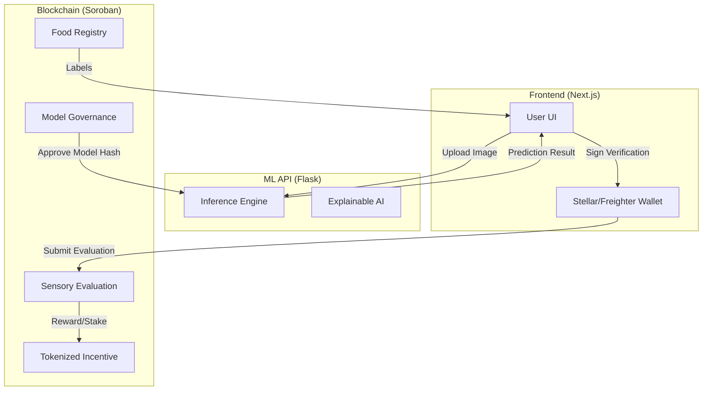

# 🛡️ FlavorSnap Blockchain Architecture

FlavorSnap integrates the Stellar network and Soroban smart contracts to decentralize AI food classification governance and incentive systems. This document provides a deep dive into the blockchain layer, its components, and its role within the larger application ecosystem.

## 📋 Table of Contents

- [🚀 Why Blockchain?](#-why-blockchain)
- [🏗️ Technical Stack](#️-technical-stack)
- [⛓️ Smart Contract Ecosystem](#️-smart-contract-ecosystem)
  - [FlavorSnap Food Registry](#flavorsnap-food-registry)
  - [Model Governance](#model-governance)
  - [Tokenized Incentive](#tokenized-incentive)
  - [Sensory Evaluation](#sensory-evaluation)
- [🔗 System Integration](#-system-integration)
- [🧩 Governance Model](#-governance-model)
- [💰 Tokenomics & Incentivization](#-tokenomics--incentivization)
- [🔒 Security & Trust Model](#-security--trust-model)

## 🚀 Why Blockchain?

Conventional AI classification services suffer from three primary issues:

1.  **Centralization of Accuracy**: The service provider alone determines if a classification is correct.
2.  **Incentive Misalignment**: Users provide data for training but don't share in the value created.
3.  **Lack of Transparency**: Model updates happen "behind closed doors," with no record of validation.

FlavorSnap solves these by decentralizing the **verification** and **governance** layers on the Stellar network.

## 🏗️ Technical Stack

-   **Network**: [Stellar](https://stellar.org) (Low-cost, high-speed, environmentally friendly).
-   **Smart Contract Platform**: [Soroban](https://soroban.stellar.org) (Rust-based, WASM-ready, efficient).
-   **SDKs**: Soroban Rust SDK for contracts, Stellar JS SDK for the frontend.
-   **Storage**: On-chain persistent storage for metadata, balances, and governance state.

## ⛓️ Smart Contract Ecosystem

### FlavorSnap Food Registry (`flavorsnap-food-registry/`)
A decentralized, verifiable database of food categories and their associated metadata. This acts as the "Source of Truth" for the classification labels used by the ML model.

### Model Governance (`contracts/model-governance/`)
Ensures that every update to the ResNet18 model used in production is transparently proposed and community-voted.

-   **Proposal Lifecycle**: Submission → Voting Period → Quorum Check → Evaluation → (Optional) Execution.
-   **Weighting**: Voting power is derived from the user's token balance (reputation-weighted).

### Tokenized Incentive (`contracts/tokenized-incentive/`)
Provides a programmable reward layer for users who contribute high-quality data or validate classifications.

-   **Vested Rewards**: Long-term contributors receive tokens through vesting schedules.
-   **Multi-sig Security**: Minting and burning tokens require multiple admin signatures.

### Sensory Evaluation (`contracts/sensory-evaluation/`)
The "decentralized oracle" of FlavorSnap. Users stake tokens to vouch for classification accuracy (e.g., "Is this really a Pizza?").

-   **Incentive Loop**: Correct evaluators earn tokens; incorrect ones lose their stake.
-   **Feedback**: Results are fed back into the training dataset for future RLHF (Reinforcement Learning from Human Feedback) cycles.

## 🔗 System Integration

## 🧩 Governance Model

FlavorSnap implements a **Liquid Democracy** approach (pre-alpha) where:

1.  **Quorum**: Proposals require a minimum percentage of total token supply to participate (e.g., 50%).
2.  **Proposer Stake**: A minimum amount of tokens must be staked to submit a new model proposal, preventing spam.
3.  **Active Monitoring**: Admins can cancel malicious proposals before they are executed.

## 💰 Tokenomics & Incentivization

Tokens are the fuel for the FlavorSnap ecosystem:

| Action | Reward (%) | Unlock Schedule |
|--------|------------|-----------------|
| Dataset Contribution | 40% | Immediately |
| Verification Staking | 30% | Post-Verification (7 days) |
| Model Improvement | 20% | 6-month Vesting |
| Governance Participation | 10% | Immediately |

## 🔒 Security & Trust Model

1.  **Admin Multisig**: No single admin can mint tokens unilaterally. All `Mint` and `Burn` actions in `TokenizedIncentive` are stored in an `AdminApprovals` state until the threshold is met.
2.  **Identity**: Users are identified by their Stellar account addresses.
3.  **Transparency**: Every state change (token transfer, vote cast, model update) is recorded on the Stellar ledger, auditable via any block explorer.

---

*Last updated: March 2026*
*For setup instructions, see [docs/installation.md](installation.md).*
